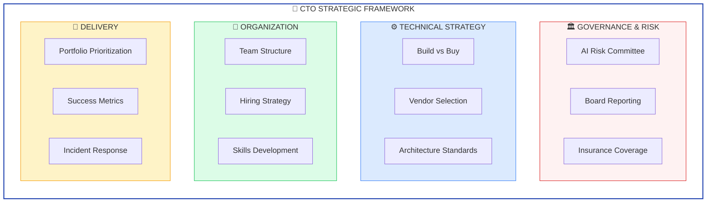
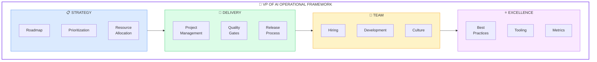
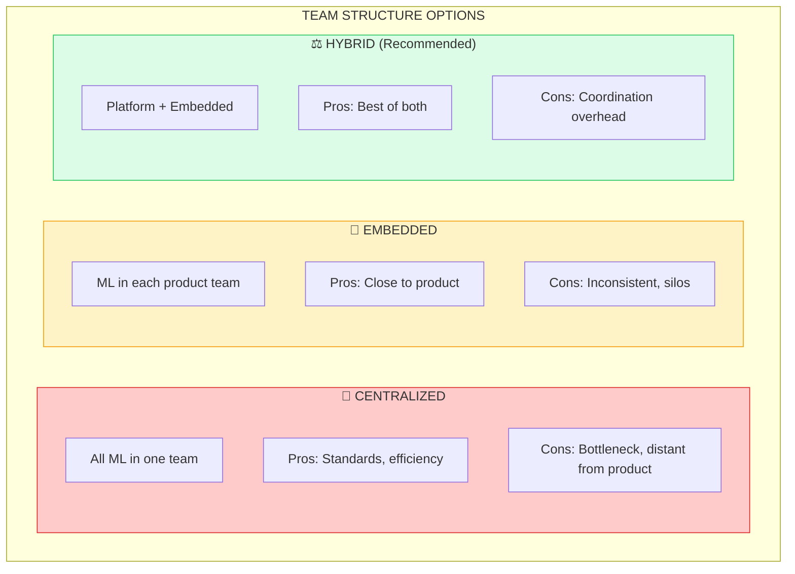
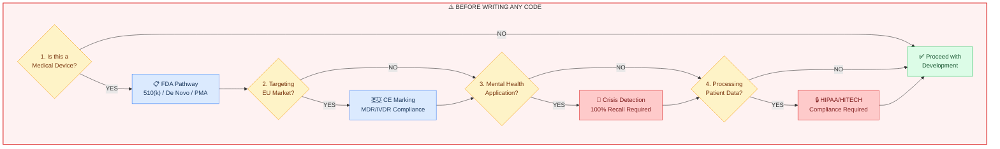
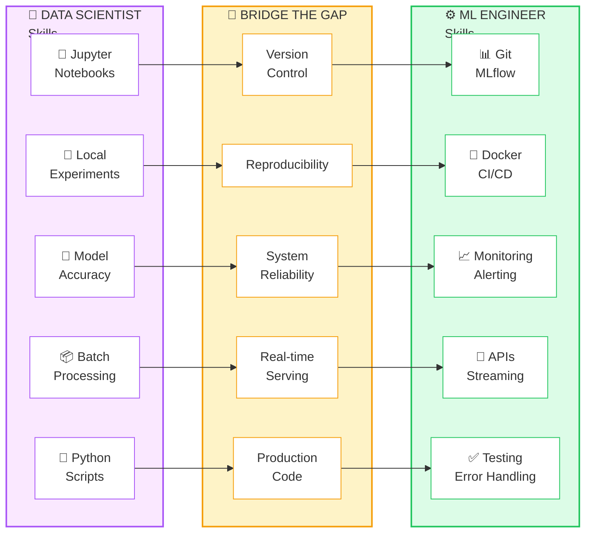
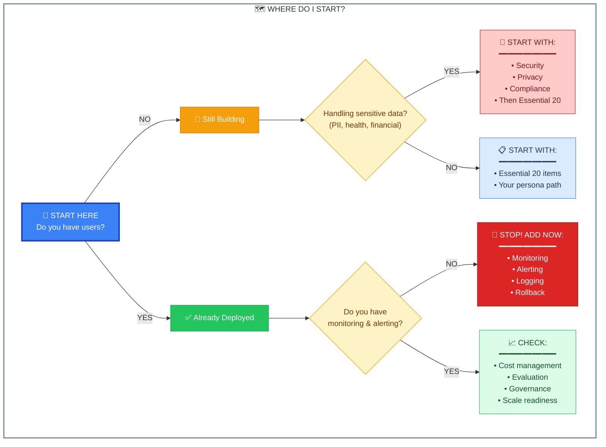
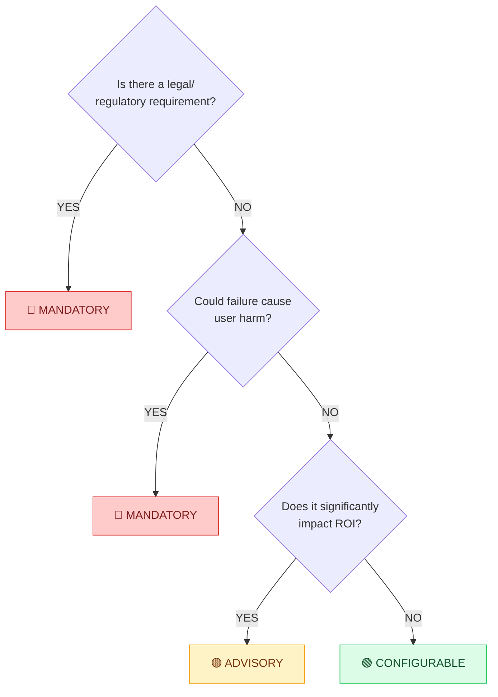

<div align="center">

# 🚀 AI Production Readiness Checklist

### MLOps • LLMOps • GenAI • Agentic RAG • AI Governance • Enterprise AI Safety

**The Complete Guide to Production AI: From 87% Failure Rate to Deployment Success**

<!--
SEO Keywords: MLOps, LLMOps, RAG, Agentic RAG, AI Agents, ReAct Pattern, Multi-Agent Systems,
MCP, Model Context Protocol, AI Governance, AI Safety, Healthcare AI, IEC 61508, FDA De Novo,
WAI-AI, EU AI Act, OWASP LLM Top 10, CTO AI Strategy, VP of AI, Head of ML, AI Team Leadership,
ML Engineering, AI Production Checklist, Enterprise AI Architecture, Startup AI, FinOps AI,
LLM Deployment, GenAI Production, AI Risk Management, Machine Learning Operations,
AI Compliance, HIPAA AI, SOC 2 AI, AI Security, Prompt Injection Prevention, AI Monitoring,
AI Observability, Vector Database, Embedding Models, AI Cost Optimization, GPU Optimization
-->

[](CONTRIBUTING.md)
[](LICENSE-MIT)
[](LICENSE-CC-BY-4.0)
[](https://github.com/asq-sheriff/AI-Production-Checklist/stargazers)

**480+ Production Checklist Items** • **20 Domains** • **CRISP-DM Based** • **Enterprise Ready**

[📥 **Download Interactive Checklist**](ai-production-checklist.html) • [📊 **Download CSV Template**](AI-Production-Checklist-Template.csv) • [🏗️ **View Architecture**](#-ai-production-architecture)

</div>

---

**A battle-tested checklist built from 27 years of enterprise experience and analysis of $15B+ in AI failures** (IBM Watson, Zillow, Babylon Health, Character.AI). Avoid the mistakes that killed billion-dollar AI projects.

---

## ⚡ Quick Start

<table>
<tr>
<td width="50%">

**🎯 New to this checklist?**

1. [**Download the HTML Checklist**](ai-production-checklist.html)
2. Start with [🔴 Critical sections](#-section-overview)
3. Use the [Priority Order](#priority-order-recommended) as your guide

</td>
<td width="50%">

**📊 Know what you need?**

Jump to: [Architecture](#-architecture--design) | [Security](#-security--compliance) | [Monitoring](#-monitoring--observability) | [Healthcare AI](#-healthcare--mental-health-ai-safety)

</td>
</tr>
</table>

<p align="right"><a href="#-ai-production-readiness-checklist">⬆️ Top</a> · <a href="#why-this-checklist-exists">Next: Why This Checklist ➡️</a></p>

---

## Why This Checklist Exists

After 27 years of building enterprise systems and analyzing why AI projects fail in production, I've compiled this checklist of everything you need to consider before deploying AI to real users.

**This checklist helps you avoid:**
- 💸 **Financial disasters** like Zillow's $500M+ algorithmic trading collapse
- ⚠️ **Safety failures** like Character.AI's crisis mishandling leading to teen suicide
- 🏥 **Clinical harm** like IBM Watson's unsafe treatment recommendations
- 📉 **Business failures** like Babylon Health's $4.2B → $0 collapse
- ⚖️ **Legal liability** from EU AI Act violations, HIPAA breaches, or bias lawsuits

<details>
<summary><h2>📈 The Reality of AI in Production (2025) — Click to Expand</h2></summary>

| Metric | Value | Source |
|--------|-------|--------|
| ML projects failing to reach production | **87%** | Industry research |
| Companies with full operational AI integration | **1%** | McKinsey |
| Organizations planning to increase AI investment (2025) | **92%** | Gartner |
| Organizations using AI agents in production | **79%** | Industry survey |
| Enterprises with 50+ generative AI use cases in pipeline | **80%** | Enterprise survey |
| Organizations actively managing AI spending (2x from 2024) | **63%** | FinOps Foundation |
| Faster model deployment with comprehensive MLOps | **60%** | MLOps research |
| Reduction in production incidents with proper governance | **40%** | Governance studies |

**Market Growth:**
- AI agents market: $5.4B → $7.6B (2024→2025)
- Enterprise LLM market: $5.9B → $71.1B projected by 2035

</details>

<p align="right"><a href="#-quick-start">⬆️ Quick Start</a> · <a href="#-ai-production-architecture">Next: Architecture ➡️</a></p>

---

## 🏗️ AI Production Architecture


<p align="right"><a href="#why-this-checklist-exists">⬅️ Why This Checklist</a> · <a href="#-how-to-use-this-checklist">Next: How to Use ➡️</a></p>

---

## 📖 How to Use This Checklist

### Purpose
This checklist helps you systematically evaluate your AI system's readiness for production deployment. Each section addresses a critical aspect of enterprise AI operations—skip any section at your own risk.

### Step-by-Step Guide

1. **Assess Current State** - Go through each section and check items you've already completed
2. **Identify Gaps** - Unchecked items represent potential risks or missing capabilities
3. **Prioritize by Risk** - Focus on Security, Safety, and Monitoring first—these prevent disasters
4. **Filter by Stage** - Use lifecycle stage filters to focus on items relevant to your current phase
5. **Create Action Plan** - Turn unchecked items into tasks with owners and deadlines
6. **Track Progress** - Use the [interactive HTML checklist](ai-production-checklist.html) with auto-save and dark mode support

### Priority Order (Recommended)

| Priority | Sections | Why |
|----------|----------|-----|
| 🔴 **Critical** | Security & Compliance, Safety & Ethics, Assured Intelligence | Legal liability, user safety, quantified uncertainty |
| 🟠 **High** | Monitoring & Observability, Cost Management, Data Quality | You can't fix what you can't see; costs can explode |
| 🟡 **Important** | Red Teaming, Governance, Evaluation, Metric Alignment | Prevent attacks, ensure compliance, maintain quality |
| 🟢 **Foundation** | Architecture, Agentic AI, Performance | Long-term scalability and maintainability |
| 🔵 **Enablers** | Prompt Engineering, Strategy, Team | Operational excellence and continuous improvement |

### Scoring Your Readiness

| Score | Level | What It Means |
|-------|-------|---------------|
| 0-20% | 🔴 **Prototype** | Demo only—not ready for any real users |
| 21-40% | 🟠 **Alpha** | Internal testing only with technical users |
| 41-60% | 🟡 **Beta** | Limited external users with clear warnings |
| 61-80% | 🟢 **Production Ready** | Ready for general availability |
| 81-100% | 🏆 **Enterprise Grade** | Mission-critical deployment ready |

### Section Overview

| Section | What It Covers | Key Risk If Skipped |
|---------|----------------|---------------------|
| **Architecture & Design** | Data pipelines, model infrastructure, system design | Technical debt, scaling failures |
| **🔬 Data Quality & Statistical Validity** | Training-serving skew, data leakage, drift detection | **Silent failures, "optimism trap," model degradation** |
| **Agentic AI & MAS** | Multi-agent patterns, orchestration, collaboration | Coordination failures, unpredictable behavior |
| **Security & Compliance** | Auth, encryption, privacy, industry standards | Data breaches, legal penalties |
| **Red Teaming & LLM Security** | OWASP vulnerabilities, adversarial testing | Prompt injection, data leakage |
| **Performance & Scale** | Latency, throughput, parallelism | Poor user experience, outages |
| **Cost Management & FinOps** | Token tracking, budgets, optimization | Unexpected bills, budget overruns |
| **Safety & Ethics** | Input/output safety, bias, responsible AI | Harmful outputs, reputation damage |
| **Monitoring & Observability** | Metrics, alerting, dashboards | Blind to issues, slow incident response |
| **Operations & Maintenance** | Deployment, model management, DR | Downtime, data loss |
| **🔧 Technical Debt & System Integrity** | CACE principle, pipeline jungles, feedback loops | **Brittle systems, cascading failures, stagnation** |
| **AI Governance** | Regulatory compliance, EU AI Act, audit trails | Fines, legal action, failed audits |
| **LLM Evaluation & Testing** | Quality metrics, testing types, benchmarks | Degraded quality, hallucinations |
| **📐 Metric Alignment & Evaluation** | Proxy problems, Goodhart's Law, online evaluation | **Business-destructive "optimized" models** |
| **🔬 Assured Intelligence & Quantitative Safety** | Conformal prediction, calibration, causal inference, zero-FN | **Overconfident wrong predictions, unquantified risk, proxy discrimination** |
| **Prompt Engineering** | Design principles, version control, CI/CD | Inconsistent outputs, maintenance chaos |
| **AI Strategy & Transformation** | Roadmap, implementation phases, change management | Failed adoption, wasted investment |
| **Team & Process** | Documentation, training, organizational readiness | Knowledge silos, operational failures |
| **🏥 Healthcare & Mental Health AI** | Crisis detection, clinical validation, ethics | **Patient harm, deaths, lawsuits** |
| **⚠️ Anti-Patterns & Case Studies** | Zillow, Amazon, Epic failure analysis | **Repeating billion-dollar mistakes** |

<p align="right"><a href="#-ai-production-architecture">⬅️ Architecture</a> · <a href="#-tldr-the-essential-20">Next: Essential 20 ➡️</a></p>

---

## ⚡ TL;DR: The Essential 20

> **Don't have time for 400+ items?** Start here. These 20 items are non-negotiable for ANY AI project going to production. Complete these first, then expand based on your [persona path](#-choose-your-path-persona-based-guides).

### The Absolute Minimum (Do These or Don't Ship)

| # | Item | Why It's Critical | Section |
|---|------|-------------------|---------|
| 1 | **Authentication (JWT/OAuth)** | No auth = anyone can abuse your API | Security |
| 2 | **Rate limiting per user** | Prevents cost explosions and abuse | Security |
| 3 | **Prompt injection detection** | #1 LLM vulnerability (OWASP LLM01) | Red Teaming |
| 4 | **Output toxicity filtering** | Prevents harmful/offensive outputs | Safety |
| 5 | **PII detection and masking** | Legal requirement (GDPR, HIPAA) | Privacy |
| 6 | **Error handling with fallbacks** | Graceful degradation, not crashes | Architecture |
| 7 | **Basic monitoring (latency, errors)** | You can't fix what you can't see | Monitoring |
| 8 | **Cost alerts and hard limits** | Prevents $100K surprise bills | FinOps |
| 9 | **Rollback procedure documented** | Quick recovery from bad deployments | Operations |
| 10 | **Human escalation path defined** | When AI fails, humans must intervene | Safety |
| 11 | **Golden test dataset (~50 prompts)** | Catch regressions before users do | Evaluation |
| 12 | **Model/prompt version control** | Know what's deployed, enable rollback | MLOps |
| 13 | **TLS encryption (data in transit)** | Basic security requirement | Security |
| 14 | **Backup strategy (3-2-1 rule)** | Recover from disasters | DR |
| 15 | **API documentation** | Others can use and maintain it | Team |
| 16 | **Hallucination rate tracking** | Know how often your AI lies | Evaluation |
| 17 | **Clear scope boundaries** | Users know what AI can/can't do | Safety |
| 18 | **Audit logging** | Forensics when things go wrong | Compliance |
| 19 | **Bias testing completed** | Avoid discrimination lawsuits | Ethics |
| 20 | **Kill switch / disable capability** | Emergency shutdown when needed | Operations |

**Completed all 20?** You're at ~40% readiness (Alpha stage). Now pick your [persona path](#-choose-your-path-persona-based-guides) to reach production.

<p align="right"><a href="#-quick-start">⬆️ Back to Top</a> · <a href="#-choose-your-path-persona-based-guides">Next: Persona Paths ➡️</a></p>

---

## 🎯 Choose Your Path: Persona-Based Guides

> **Different roles need different priorities.** Find your persona below and follow the customized path to production readiness.

### Quick Persona Finder

| I am a... | My main concern is... | Jump to |
|-----------|----------------------|---------|
| **CTO / Technical Executive** | Technical strategy, team scaling, risk | [CTO Path](#-cto--technical-executive) |
| **VP of AI / Head of ML** | AI roadmap, team leadership, delivery | [VP AI Path](#-vp-of-ai--head-of-ml) |
| **Startup Founder** | Ship fast without disasters | [Startup Path](#-startup-founder--early-stage) |
| **Enterprise Architect** | Scale, compliance, integration | [Enterprise Path](#-enterprise-architect) |
| **Solo Developer** | Side project / learning | [Solo Path](#-solo-developer--side-project) |
| **Healthcare/Medical** | Patient safety, FDA, HIPAA | [Healthcare Path](#-healthcare--medical-ai) |
| **Financial Services** | Fraud, compliance, audit | [FinServ Path](#-financial-services) |
| **Data Scientist** | Transitioning to ML Engineering | [DS→MLE Path](#-data-scientist--ml-engineer) |
| **Platform Team** | Infrastructure, MLOps | [Platform Path](#-platform--infrastructure-team) |
| **Compliance/Legal** | Risk, regulations, audit | [Compliance Path](#-compliance--legal--risk) |
| **Agency/Consultancy** | Building for clients | [Agency Path](#-agency--consultancy) |
| **Government/Public Sector** | Transparency, FedRAMP, citizens | [Government Path](#-government--public-sector) |

---

### 👔 CTO / Technical Executive

**Your Reality:** Board accountability, budget ownership, team scaling, technical risk across the organization, vendor relationships, security posture.

**Your Risk Profile:** Career-defining decisions. AI failures become your failures. Must balance innovation speed with enterprise risk.

#### Your Strategic Priorities



#### Phase 1: Strategic Foundation (Month 1)
| Priority | Decision | Key Questions |
|----------|----------|---------------|
| 🔴 **Week 1** | AI Risk Assessment | What's our risk appetite? What could kill the company? |
| 🔴 **Week 2** | Build vs Buy Strategy | Core competency or commodity? Vendor lock-in risks? |
| 🟠 **Week 3** | Team & Budget | Do we have the talent? What's realistic budget? |
| 🟠 **Week 4** | Governance Model | Who approves AI projects? What are the gates? |

#### Phase 2: Organizational Setup (Month 2-3)
- [ ] AI steering committee formed (you + CEO + Legal + Product)
- [ ] AI ethics guidelines published internally
- [ ] Vendor evaluation criteria established
- [ ] Security review process for AI tools defined
- [ ] Budget allocation and tracking system
- [ ] Success metrics defined (business outcomes, not just technical)

#### Phase 3: Operational Excellence (Month 4-6)
- [ ] Incident response plan for AI failures
- [ ] Board reporting dashboard created
- [ ] Insurance coverage reviewed for AI-specific risks
- [ ] Regulatory compliance roadmap (EU AI Act, etc.)
- [ ] Technical debt management process
- [ ] Knowledge sharing across AI teams

#### Key Decisions Only You Can Make

| Decision | Options | Consider |
|----------|---------|----------|
| **Build vs Buy** | Internal team vs Vendors vs Hybrid | Core IP, time-to-market, talent availability |
| **Model Strategy** | Proprietary vs Open Source vs API | Cost, control, compliance, capabilities |
| **Risk Tolerance** | Conservative vs Aggressive | Industry, stage, competition, regulation |
| **Team Structure** | Centralized vs Federated vs Hybrid | Company size, culture, use case diversity |
| **Vendor Selection** | OpenAI vs Anthropic vs Google vs OSS | Cost, features, data residency, reliability |

#### Your Dashboard Metrics

| Metric | Why It Matters | Target |
|--------|----------------|--------|
| **AI Project ROI** | Justify investment to board | >3x within 18 months |
| **Time to Production** | Measure team velocity | <90 days for typical project |
| **Incident Rate** | Operational excellence | <1 P1 per quarter |
| **Cost per Inference** | Unit economics | Decreasing trend |
| **Compliance Score** | Risk management | 100% mandatory items |
| **Team Retention** | Talent strategy | >85% annual retention |

#### Board Reporting Template
Present these quarterly:
1. **Portfolio Status** - Projects, stages, blockers
2. **Risk Register** - Top 5 AI risks and mitigations
3. **Financial** - Spend vs budget, ROI by project
4. **Compliance** - Regulatory status, audit findings
5. **Competitive** - How we compare to industry

#### Sections to Own (Delegate Details)
1. [AI Governance](#-ai-governance) — Own the framework, delegate implementation
2. [AI Strategy & Transformation](#-ai-strategy--transformation) — Your primary section
3. [Security & Compliance](#-security--compliance) — Ensure coverage, don't implement
4. [Cost Management & FinOps](#-cost-management--finops) — Budget accountability

#### What to Delegate
- Technical implementation → VP of AI / Engineering leads
- Day-to-day operations → Platform team
- Compliance details → Legal / Compliance team
- Vendor negotiations → Procurement (with your input)

<p align="right"><a href="#-choose-your-path-persona-based-guides">⬆️ Back to Personas</a> · <a href="#-vp-of-ai--head-of-ml">Next: VP of AI ➡️</a></p>

---

### 🎯 VP of AI / Head of ML

**Your Reality:** Translating strategy into execution, managing ML teams, delivering AI products, balancing research vs production, hiring and retaining talent.

**Your Risk Profile:** Accountable for AI delivery. Must ship while maintaining quality. Team success = your success.

#### Your Operational Focus



#### Phase 1: Team & Process Foundation (Month 1-2)
| Priority | Action | Outcome |
|----------|--------|---------|
| 🔴 **Week 1-2** | Assess current team capabilities | Skills matrix, gap analysis |
| 🔴 **Week 2-3** | Establish project intake process | Clear prioritization criteria |
| 🟠 **Week 3-4** | Define quality gates | Stage-gate process adopted |
| 🟠 **Month 2** | Set up MLOps foundations | CI/CD, monitoring, versioning |

#### Phase 2: Delivery Excellence (Month 2-4)
- [ ] Project portfolio dashboard created
- [ ] Sprint/iteration cadence established
- [ ] Code review and ML review process defined
- [ ] Experiment tracking system implemented
- [ ] Model registry and versioning in place
- [ ] Evaluation framework standardized

#### Phase 3: Scale & Optimize (Month 4-6)
- [ ] Self-service ML platform capabilities
- [ ] Reusable components library
- [ ] Cross-team knowledge sharing (ML guild)
- [ ] Continuous improvement retrospectives
- [ ] Career ladders and growth paths defined
- [ ] On-call rotation and incident management

#### Team Structure Options



#### Your Weekly Rhythm

| Day | Focus | Activities |
|-----|-------|------------|
| **Monday** | Planning | Project status, blocker resolution, priority alignment |
| **Tuesday** | Technical | Architecture reviews, technical debt discussions |
| **Wednesday** | People | 1:1s, hiring interviews, career conversations |
| **Thursday** | Delivery | Demo reviews, quality gate checks, release planning |
| **Friday** | Strategy | Roadmap refinement, stakeholder alignment, learning |

#### Key Metrics to Track

| Category | Metric | Target |
|----------|--------|--------|
| **Delivery** | Projects on schedule | >80% |
| **Quality** | Models meeting accuracy targets | >90% |
| **Velocity** | Time from idea to production | <60 days |
| **Reliability** | Model uptime | >99.5% |
| **Efficiency** | Model retraining frequency | As needed, <monthly |
| **Team** | Engineer satisfaction (eNPS) | >40 |
| **Cost** | Cost per prediction | Decreasing |

#### Common Failure Patterns to Avoid

| Anti-Pattern | Symptoms | Solution |
|--------------|----------|----------|
| **Research Trap** | Always experimenting, never shipping | Time-box research, define "good enough" |
| **Hero Culture** | 1-2 people know everything | Documentation, pair programming, rotation |
| **Technical Debt Spiral** | Shipping fast, breaking often | Dedicated debt sprints, quality gates |
| **Evaluation Theater** | Good offline metrics, bad production | Real-world validation, shadow deployments |
| **Scope Creep** | Projects never finish | Clear success criteria, MVP mindset |

#### Hiring Guide

| Role | When to Hire | Key Skills |
|------|--------------|------------|
| **ML Engineer** | First hire after you | Production systems, software engineering |
| **Data Scientist** | When you have data | Statistics, experimentation, modeling |
| **MLOps Engineer** | At scale | Infrastructure, automation, monitoring |
| **Research Scientist** | Competitive advantage needed | Novel methods, publications not required |
| **ML Manager** | Team > 6 people | Leadership, project management, technical |

#### Sections to Own
1. [LLM Evaluation & Testing](#-llm-evaluation--testing) — Quality is your responsibility
2. [Operations & Maintenance](#%EF%B8%8F-operations--maintenance) — Delivery excellence
3. [Monitoring & Observability](#-monitoring--observability) — See problems early
4. [Agentic AI & Multi-Agent Systems](#-agentic-ai--multi-agent-systems-mas) — Architecture patterns
5. [Technical Debt & System Integrity](#-technical-debt--system-integrity) — Keep systems healthy

#### Stakeholder Management

| Stakeholder | They Care About | Give Them |
|-------------|-----------------|-----------|
| **CTO** | Risk, budget, strategy | Monthly exec summary, risk register |
| **Product** | Features, timelines | Roadmap alignment, trade-off discussions |
| **Engineering** | Integration, reliability | API contracts, SLAs, documentation |
| **Data** | Quality, access | Data requirements, feedback loops |
| **Business** | ROI, capabilities | Business impact metrics, demos |

<p align="right"><a href="#-choose-your-path-persona-based-guides">⬆️ Back to Personas</a> · <a href="#-cto--technical-executive">⬅️ CTO</a> · <a href="#-startup-founder--early-stage">Next: Startup ➡️</a></p>

---

### 🚀 Startup Founder / Early-Stage

**Your Reality:** Limited resources, need to ship fast, can't afford disasters, investors watching.

**Your Risk Profile:** High speed, medium-high risk tolerance, but one bad incident could kill the company.

#### Phase 1: Pre-Launch Essentials (Week 1-2)
Focus on items that prevent company-killing incidents:

| Priority | Items | Why |
|----------|-------|-----|
| 🔴 **Day 1** | Authentication, Rate Limiting, Cost Limits | Prevent abuse and bankruptcy |
| 🔴 **Day 2-3** | Prompt Injection Protection, Output Filtering | Prevent PR disasters |
| 🟠 **Day 4-5** | Basic Monitoring, Error Handling, Logging | Know when things break |
| 🟠 **Week 2** | Golden Test Set, Rollback Procedure, Kill Switch | Catch issues, recover fast |

#### Phase 2: Growth Mode (Month 1-3)
As you get users, add:
- [ ] User feedback collection
- [ ] A/B testing framework
- [ ] Hallucination tracking
- [ ] Basic bias testing
- [ ] Privacy policy & ToS

#### Phase 3: Scale Preparation (Month 3-6)
Before Series A or major growth:
- [ ] SOC 2 Type I preparation
- [ ] GDPR compliance (if EU users)
- [ ] Comprehensive monitoring
- [ ] Incident response runbook
- [ ] On-call rotation

#### Sections to Prioritize
1. [Security & Compliance](#-security--compliance) (auth, rate limiting)
2. [Safety & Ethics](#%EF%B8%8F-safety--ethics) (output filtering)
3. [Cost Management](#-cost-management--finops) (prevent bill shock)
4. [Monitoring](#-monitoring--observability) (basic observability)

#### Sections to Defer
- Assured Intelligence (add after product-market fit)
- Full Governance (add when preparing for enterprise sales)
- Scale & Parallelism (premature optimization)

<p align="right"><a href="#-choose-your-path-persona-based-guides">⬆️ Back to Personas</a> · <a href="#-enterprise-architect">Next: Enterprise ➡️</a></p>

---

### 🏢 Enterprise Architect

**Your Reality:** Complex stakeholder landscape, existing systems to integrate, compliance requirements, long procurement cycles.

**Your Risk Profile:** Low risk tolerance, high scrutiny, failures are career-limiting.

#### Phase 1: Foundation & Approval (Month 1-2)
Get organizational buy-in with proper governance:

| Priority | Items | Why |
|----------|-------|-----|
| 🔴 **Week 1-2** | AI Vision, Use Case Prioritization, Cross-functional Team | Align stakeholders |
| 🔴 **Week 2-3** | EU AI Act Mapping, Risk Classification, Legal Review | Regulatory compliance |
| 🟠 **Week 3-4** | Security Architecture, Zero-Trust Design, RBAC | Enterprise security |
| 🟠 **Month 2** | Data Governance, Lineage, Contracts | Data foundation |

#### Phase 2: Controlled Pilot (Month 2-4)
- [ ] Shadow mode deployment
- [ ] A/B testing with internal users
- [ ] Full audit trail implementation
- [ ] Integration with existing SIEM/monitoring
- [ ] Vendor risk assessment (if using third-party LLMs)

#### Phase 3: Production Rollout (Month 4-6)
- [ ] Blue-green deployment capability
- [ ] Multi-region failover
- [ ] SOC 2 Type II audit
- [ ] Full incident response procedures
- [ ] Executive dashboards

#### Phase 4: Scale & Optimize (Month 6+)
- [ ] FinOps optimization
- [ ] Model registry and versioning
- [ ] Automated retraining pipelines
- [ ] Advanced monitoring (drift, bias)

#### Sections to Prioritize (In Order)
1. [AI Governance](#-ai-governance) — Start here
2. [Security & Compliance](#-security--compliance)
3. [Architecture & Design](#-architecture--design)
4. [Monitoring & Observability](#-monitoring--observability)
5. [Technical Debt & System Integrity](#-technical-debt--system-integrity)

#### Enterprise-Specific Considerations
- **Procurement:** Add LLM vendor to approved vendor list
- **Legal:** AI-specific terms in vendor contracts
- **HR:** AI usage policies for employees
- **Finance:** FinOps integration with existing cost centers

<p align="right"><a href="#-choose-your-path-persona-based-guides">⬆️ Back to Personas</a> · <a href="#-startup-founder--early-stage">⬅️ Startup</a> · <a href="#-solo-developer--side-project">Next: Solo Dev ➡️</a></p>

---

### 👤 Solo Developer / Side Project

**Your Reality:** Learning, limited time, no budget, acceptable if it breaks.

**Your Risk Profile:** High risk tolerance for yourself, but still need basics.

#### The Solo Developer Minimum (Do This Weekend)

| # | Item | Time | Why |
|---|------|------|-----|
| 1 | API key in environment variables (not code) | 5 min | Basic security |
| 2 | Rate limiting (even basic) | 30 min | Prevent abuse |
| 3 | Cost alerts on your LLM provider | 10 min | Avoid surprise bills |
| 4 | Basic input validation | 1 hour | Prevent injection |
| 5 | Error handling with user-friendly messages | 1 hour | Better UX |
| 6 | Simple logging (console or file) | 30 min | Debug issues |
| 7 | README with setup instructions | 30 min | Future you will thank you |
| 8 | Git repository with .gitignore (no secrets!) | 15 min | Version control basics |

**Total time: ~4 hours for a solid foundation**

#### When to Level Up
Upgrade to [Startup Path](#-startup-founder--early-stage) when:
- You have real users (not just friends)
- Processing any PII or sensitive data
- Charging money for the service
- Storing conversation history

#### Tools for Solo Developers
- **Free monitoring:** Sentry free tier, simple uptime checks
- **Free LLM:** Ollama locally, or free tiers of commercial APIs
- **Free hosting:** Vercel, Railway, Fly.io free tiers
- **Cost control:** Set hard spending limits on all API providers

<p align="right"><a href="#-choose-your-path-persona-based-guides">⬆️ Back to Personas</a> · <a href="#-enterprise-architect">⬅️ Enterprise</a> · <a href="#-healthcare--medical-ai">Next: Healthcare ➡️</a></p>

---

### 🏥 Healthcare / Medical AI

**Your Reality:** Lives at stake, heavy regulation, long validation cycles, clinical workflows.

**Your Risk Profile:** ZERO tolerance for safety failures. One death can end the company.

> ⚠️ **Critical:** Healthcare AI has unique requirements. The [Healthcare & Mental Health AI](#-healthcare--mental-health-ai-safety) section is MANDATORY, not optional.

#### Regulatory Pathway First



#### Phase 1: Regulatory & Safety Foundation (Month 1-3)
| Priority | Items | Why |
|----------|-------|-----|
| 🔴 **Week 1** | FDA SaMD Classification, Regulatory Strategy | Determines everything else |
| 🔴 **Week 2-4** | IEC 62304 Software Lifecycle, ISO 13485 QMS | Required for FDA |
| 🔴 **Month 2** | Safety-Critical Architecture (IEC 61508) | Formal safety invariants |
| 🔴 **Month 2-3** | Crisis Detection System (if mental health) | 100% recall, <1s response |

#### Phase 2: Clinical Validation (Month 3-6)
- [ ] IRB approval for clinical studies
- [ ] Independent third-party validation
- [ ] Geographic validation (all target regions)
- [ ] Demographic validation (all patient groups)
- [ ] Clinician workflow integration testing

#### Phase 3: Pre-Submission (Month 6-9)
- [ ] Clinical evidence package
- [ ] Risk management file (ISO 14971)
- [ ] Software documentation package
- [ ] Cybersecurity documentation
- [ ] Human factors validation

#### Phase 4: Post-Market (Ongoing)
- [ ] Adverse event reporting system
- [ ] Post-market surveillance
- [ ] Continuous clinical monitoring
- [ ] Model performance tracking
- [ ] Regulatory update monitoring

#### Sections to Prioritize (Mandatory Order)
1. [Healthcare & Mental Health AI Safety](#-healthcare--mental-health-ai-safety) — **START HERE**
2. [Assured Intelligence](#-assured-intelligence--quantitative-safety) — Uncertainty quantification
3. [AI Governance](#-ai-governance) — Regulatory compliance
4. [Safety & Ethics](#%EF%B8%8F-safety--ethics) — Output safety
5. [Security & Compliance](#-security--compliance) — HIPAA compliance

#### Healthcare-Specific Metrics
| Metric | Target | Why |
|--------|--------|-----|
| Crisis detection recall | **100%** | Zero false negatives for safety |
| Crisis response latency | **<1 second** | Immediate intervention |
| False positive rate | **<5%** | Minimize alert fatigue |
| Clinician override availability | **Always** | Humans must be able to intervene |

<p align="right"><a href="#-choose-your-path-persona-based-guides">⬆️ Back to Personas</a> · <a href="#-solo-developer--side-project">⬅️ Solo Dev</a> · <a href="#-financial-services">Next: FinServ ➡️</a></p>

---

### 💰 Financial Services

**Your Reality:** Regulated industry, fraud concerns, audit requirements, model explainability mandates.

**Your Risk Profile:** Low tolerance, regulators watching, fiduciary duty.

#### Regulatory Framework First
- **US:** OCC, Fed, CFPB guidance on AI/ML in banking
- **EU:** EBA guidelines on ICT risk, DORA, AI Act
- **Global:** Basel Committee principles for AI
- **Fair Lending:** ECOA, Fair Housing Act (explainability required)

#### Phase 1: Compliance Foundation (Month 1-2)
| Priority | Items | Why |
|----------|-------|-----|
| 🔴 **Week 1-2** | Model Risk Management (SR 11-7) | Federal Reserve requirement |
| 🔴 **Week 2-3** | Fair Lending Analysis, Disparate Impact Testing | Avoid discrimination claims |
| 🔴 **Week 3-4** | Explainability Requirements, Adverse Action Notices | Regulatory mandate |
| 🟠 **Month 2** | Audit Trail, Model Lineage, Version Control | Examination readiness |

#### Phase 2: Model Governance (Month 2-4)
- [ ] Model inventory and tiering
- [ ] Independent model validation (second line)
- [ ] Model performance monitoring
- [ ] Champion/challenger framework
- [ ] Model documentation standards

#### Phase 3: Production Controls (Month 4-6)
- [ ] Real-time fraud detection integration
- [ ] Transaction monitoring
- [ ] Suspicious activity reporting
- [ ] Customer complaint tracking
- [ ] Regulatory reporting automation

#### Sections to Prioritize
1. [AI Governance](#-ai-governance) — Model risk management
2. [Metric Alignment & Evaluation](#-metric-alignment--evaluation-integrity) — Avoid Goodhart's Law
3. [Assured Intelligence](#-assured-intelligence--quantitative-safety) — Calibration, uncertainty
4. [Anti-Patterns: Case Studies](#%EF%B8%8F-anti-patterns-case-studies) — Learn from Zillow
5. [Technical Debt & System Integrity](#-technical-debt--system-integrity) — CACE principle

#### FinServ-Specific Requirements
- **Explainability:** Every decision must be explainable to regulators and customers
- **Audit:** Complete audit trail for all model decisions
- **Fairness:** Regular disparate impact analysis across protected classes
- **Stress Testing:** Model performance under adverse economic conditions

<p align="right"><a href="#-choose-your-path-persona-based-guides">⬆️ Back to Personas</a> · <a href="#-healthcare--medical-ai">⬅️ Healthcare</a> · <a href="#-data-scientist--ml-engineer">Next: DS→MLE ➡️</a></p>

---

### 🔬 Data Scientist → ML Engineer

**Your Reality:** Strong in modeling, learning production skills, bridging the gap.

**Your Risk Profile:** Learning curve, need to understand ops and infrastructure.

#### Your Learning Path



#### Phase 1: Production Fundamentals (Week 1-4)
| Priority | Items | Why |
|----------|-------|-----|
| 🔴 **Week 1** | Version Control (prompts, models, data) | Reproducibility |
| 🔴 **Week 2** | CI/CD Basics, Automated Testing | Quality gates |
| 🟠 **Week 3** | Containerization (Docker), Environment Management | Consistency |
| 🟠 **Week 4** | API Design, Error Handling | Production serving |

#### Phase 2: Observability & Operations (Week 5-8)
- [ ] Monitoring dashboards (Grafana, DataDog)
- [ ] Alerting and on-call basics
- [ ] Log aggregation and analysis
- [ ] Performance profiling
- [ ] Cost tracking per experiment

#### Phase 3: MLOps Maturity (Month 2-3)
- [ ] Feature stores
- [ ] Model registry
- [ ] A/B testing framework
- [ ] Drift detection
- [ ] Automated retraining triggers

#### Sections to Study (Learning Order)
1. [Operations & Maintenance](#%EF%B8%8F-operations--maintenance) — Deployment basics
2. [Monitoring & Observability](#-monitoring--observability) — See what's happening
3. [Data Quality & Statistical Validity](#-data-quality--statistical-validity) — Training-serving skew
4. [LLM Evaluation & Testing](#-llm-evaluation--testing) — Production evaluation
5. [Technical Debt & System Integrity](#-technical-debt--system-integrity) — Avoid ML-specific debt

#### Resources for the Transition
- **Book:** "Designing Machine Learning Systems" by Chip Huyen
- **Course:** "Made With ML" (free, production-focused)
- **Practice:** Take a notebook project and deploy it end-to-end

<p align="right"><a href="#-choose-your-path-persona-based-guides">⬆️ Back to Personas</a> · <a href="#-financial-services">⬅️ FinServ</a> · <a href="#️-platform--infrastructure-team">Next: Platform ➡️</a></p>

---

### 🛠️ Platform / Infrastructure Team

**Your Reality:** Supporting multiple ML teams, standardization, self-service, scale.

**Your Risk Profile:** Reliability is your product. Downtime affects everyone.

#### Your Mission
Build the internal platform that makes ML teams successful.

#### Phase 1: Foundation Layer (Month 1-2)
| Priority | Items | Why |
|----------|-------|-----|
| 🔴 **Week 1-2** | Kubernetes + GPU Operators | Compute foundation |
| 🔴 **Week 2-3** | Model Serving Infrastructure (vLLM, Triton) | Inference platform |
| 🟠 **Week 3-4** | Secrets Management, KMS | Security foundation |
| 🟠 **Month 2** | Observability Stack (metrics, logs, traces) | Platform monitoring |

#### Phase 2: MLOps Platform (Month 2-4)
- [ ] Model registry (MLflow, Weights & Biases)
- [ ] Feature store (Feast, Tecton)
- [ ] Experiment tracking
- [ ] CI/CD pipelines for ML
- [ ] A/B testing infrastructure

#### Phase 3: Self-Service & Governance (Month 4-6)
- [ ] Developer portal / documentation
- [ ] Cost allocation and showback
- [ ] Quota management
- [ ] Audit logging
- [ ] Policy-as-code guardrails

#### Sections to Own
1. [Architecture & Design](#-architecture--design) — Infrastructure patterns
2. [Performance & Scale](#%EF%B8%8F-performance--scale) — Latency, throughput
3. [Cost Management & FinOps](#-cost-management--finops) — Platform economics
4. [Operations & Maintenance](#%EF%B8%8F-operations--maintenance) — Reliability
5. [Monitoring & Observability](#-monitoring--observability) — Platform health

#### Platform Team Metrics
| Metric | Target | Why |
|--------|--------|-----|
| Model deployment time | **<1 hour** | Self-service goal |
| Platform availability | **99.9%** | Reliability target |
| Cost per inference | **Track & optimize** | FinOps |
| Time to first experiment | **<1 day** | Developer experience |

<p align="right"><a href="#-choose-your-path-persona-based-guides">⬆️ Back to Personas</a> · <a href="#-data-scientist--ml-engineer">⬅️ DS→MLE</a> · <a href="#️-compliance--legal--risk">Next: Compliance ➡️</a></p>

---

### ⚖️ Compliance / Legal / Risk

**Your Reality:** Protect the organization, manage liability, ensure regulatory compliance.

**Your Risk Profile:** Your job is to identify and mitigate risks others miss.

#### Your Checklist for AI Projects

##### Pre-Deployment Review
- [ ] Data provenance and licensing verified
- [ ] Training data consent/rights confirmed
- [ ] Output ownership/IP determined
- [ ] Liability allocation documented
- [ ] Insurance coverage reviewed

##### Regulatory Compliance
- [ ] EU AI Act risk classification completed
- [ ] Prohibited use cases verified (social scoring, etc.)
- [ ] High-risk requirements mapped (if applicable)
- [ ] GDPR/privacy impact assessment done
- [ ] Industry-specific regulations addressed

##### Contractual Considerations
- [ ] AI-specific terms in vendor contracts
- [ ] Indemnification clauses reviewed
- [ ] SLA requirements defined
- [ ] Audit rights preserved
- [ ] Data processing agreements updated

##### Governance Framework
- [ ] AI ethics policy published
- [ ] Incident response procedure documented
- [ ] Escalation paths defined
- [ ] Board/executive reporting established
- [ ] External audit schedule set

#### Sections to Review (Priority Order)
1. [AI Governance](#-ai-governance) — Regulatory frameworks
2. [Security & Compliance](#-security--compliance) — Data protection
3. [Safety & Ethics](#%EF%B8%8F-safety--ethics) — Responsible AI
4. [Anti-Patterns: Case Studies](#%EF%B8%8F-anti-patterns-case-studies) — Learn from failures
5. [Healthcare & Mental Health AI](#-healthcare--mental-health-ai-safety) — If applicable

#### Key Questions to Ask Engineering
1. How do we know the model isn't discriminating?
2. What happens when the model is wrong?
3. Can we explain decisions to regulators/customers?
4. How quickly can we disable the AI if needed?
5. What's our audit trail look like?

<p align="right"><a href="#-choose-your-path-persona-based-guides">⬆️ Back to Personas</a> · <a href="#️-platform--infrastructure-team">⬅️ Platform</a> · <a href="#️-agency--consultancy">Next: Agency ➡️</a></p>

---

### 🏗️ Agency / Consultancy

**Your Reality:** Building for clients, varied requirements, handoff considerations, repeatable processes.

**Your Risk Profile:** Client's risk becomes your risk. Reputation is everything.

#### Client Onboarding Checklist
Before starting any AI project, clarify:

| Question | Why It Matters |
|----------|----------------|
| Who owns the trained model? | IP and liability |
| What data can we use for training? | Legal rights |
| What are the regulatory requirements? | Compliance scope |
| Who operates it post-handoff? | Documentation needs |
| What's the budget for ongoing costs? | FinOps planning |

#### Reusable Project Template

##### Phase 1: Discovery & Planning (Week 1-2)
- [ ] Requirements documentation
- [ ] Risk assessment
- [ ] Architecture design
- [ ] Cost estimation
- [ ] Timeline and milestones

##### Phase 2: Development (Week 3-8)
- [ ] Environment setup (reproducible)
- [ ] Core functionality
- [ ] Testing suite
- [ ] Documentation (client-facing)
- [ ] Security review

##### Phase 3: Handoff & Training (Week 9-10)
- [ ] Operations runbook
- [ ] Monitoring dashboards
- [ ] Training sessions
- [ ] Support transition plan
- [ ] Sign-off documentation

#### Sections to Standardize
1. [Architecture & Design](#-architecture--design) — Reusable patterns
2. [Operations & Maintenance](#%EF%B8%8F-operations--maintenance) — Handoff docs
3. [Team & Process](#-team--process) — Documentation standards
4. [Cost Management & FinOps](#-cost-management--finops) — Client cost clarity

#### Agency Best Practices
- **Template everything:** Reusable monitoring, CI/CD, documentation
- **Document decisions:** Client sign-off on architecture choices
- **Clear handoff:** Runbooks, training, support transition
- **Cost transparency:** Show clients ongoing operational costs

<p align="right"><a href="#-choose-your-path-persona-based-guides">⬆️ Back to Personas</a> · <a href="#️-compliance--legal--risk">⬅️ Compliance</a> · <a href="#️-government--public-sector">Next: Government ➡️</a></p>

---

### 🏛️ Government / Public Sector

**Your Reality:** Public accountability, transparency requirements, procurement rules, citizen impact.

**Your Risk Profile:** Public trust is paramount. Failures make headlines.

#### Public Sector Specific Requirements

##### Transparency & Accountability
- [ ] Algorithmic impact assessment published
- [ ] Public documentation of AI use cases
- [ ] Citizen appeal/challenge mechanism
- [ ] Regular public reporting on AI performance
- [ ] Freedom of Information considerations

##### Procurement & Vendors
- [ ] FedRAMP authorization (US federal)
- [ ] StateRAMP (US state/local)
- [ ] Vendor AI ethics assessment
- [ ] Source code escrow
- [ ] Data sovereignty requirements

##### Equity & Access
- [ ] Accessibility compliance (508/WCAG)
- [ ] Language access (LEP populations)
- [ ] Digital divide considerations
- [ ] Disparate impact analysis
- [ ] Community input process

#### Sections to Prioritize
1. [AI Governance](#-ai-governance) — Public sector accountability
2. [Safety & Ethics](#%EF%B8%8F-safety--ethics) — Equity and fairness
3. [Metric Alignment & Evaluation](#-metric-alignment--evaluation-integrity) — Avoid gaming
4. [Security & Compliance](#-security--compliance) — FedRAMP, FISMA
5. [Assured Intelligence](#-assured-intelligence--quantitative-safety) — Explainability

#### Government-Specific Metrics
| Metric | Requirement | Why |
|--------|-------------|-----|
| Explainability | **High** | Public accountability |
| Bias audits | **Regular, public** | Equity requirements |
| Uptime | **High** | Public service reliability |
| Data retention | **Per records laws** | Legal requirements |

<p align="right"><a href="#-choose-your-path-persona-based-guides">⬆️ Back to Personas</a> · <a href="#️-agency--consultancy">⬅️ Agency</a> · <a href="#️-decision-flowchart-where-do-i-start">Next: Flowchart ➡️</a></p>

---

## 🗺️ Decision Flowchart: Where Do I Start?



### Quick Decision Matrix

| Your Situation | Start With | Then Add |
|----------------|------------|----------|
| Side project, no users yet | [Essential 20](#-tldr-the-essential-20) | Nothing until you have users |
| Startup, pre-launch | [Essential 20](#-tldr-the-essential-20) → [Startup Path](#-startup-founder--early-stage) | Security, basic monitoring |
| Startup, have users | [Startup Path](#-startup-founder--early-stage) | Evaluation, cost management |
| Enterprise, new project | [Enterprise Path](#-enterprise-architect) | Full governance from start |
| Healthcare/Medical | [Healthcare Path](#-healthcare--medical-ai) | **Everything in Healthcare section is mandatory** |
| Financial services | [FinServ Path](#-financial-services) | Explainability, audit trails |
| Production with issues | [Monitoring](#-monitoring--observability) | Whatever is causing the issues |
| Scaling problems | [Performance & Scale](#%EF%B8%8F-performance--scale) | Cost management |
| Compliance audit coming | [AI Governance](#-ai-governance) | Security, documentation |

<p align="right"><a href="#-quick-start">⬆️ Back to Top</a> · <a href="#-choose-your-path-persona-based-guides">⬅️ Personas</a> · <a href="#-frequently-asked-questions">Next: FAQ ➡️</a></p>

---

## ❓ Frequently Asked Questions

<details>
<summary><b>Do I need to complete ALL 400+ items?</b></summary>

**No.** The checklist is comprehensive by design—it covers everything from startups to enterprise healthcare AI.

- **Minimum viable:** Complete the [Essential 20](#-tldr-the-essential-20) items
- **Production ready:** Complete items relevant to your [persona path](#-choose-your-path-persona-based-guides)
- **Enterprise grade:** Complete 80%+ of all applicable items

Many items are marked "Configurable" meaning they depend on your context.
</details>

<details>
<summary><b>What's the minimum for a POC/prototype?</b></summary>

For a POC that only YOU will use:
- API keys in environment variables (not code)
- Basic error handling
- Cost limits set on your LLM provider

For a POC that OTHERS will see:
- Add: Authentication, rate limiting, basic input validation
- Add: Clear "this is a prototype" disclaimers

For a POC with REAL DATA:
- Add: Everything in the [Essential 20](#-tldr-the-essential-20)
</details>

<details>
<summary><b>How long does it take to become production-ready?</b></summary>

It depends on your starting point and target:

| Starting Point | Target | Typical Effort |
|---------------|--------|----------------|
| Jupyter notebook | Internal tool | 2-4 weeks |
| Working prototype | Startup MVP | 4-8 weeks |
| MVP | Production | 2-3 months |
| Production | Enterprise-grade | 3-6 months |

Healthcare/Financial add 2-6 months for compliance.
</details>

<details>
<summary><b>What if I'm a small team (1-3 people)?</b></summary>

Focus on high-impact, low-effort items:

1. **Automate security basics:** Auth, rate limiting, input validation
2. **Use managed services:** Don't build monitoring from scratch
3. **Start with Essential 20:** This covers 80% of critical risks
4. **Skip scale sections:** Until you actually need to scale
5. **Use templates:** Don't write runbooks from scratch

See [Solo Developer Path](#-solo-developer--side-project) or [Startup Path](#-startup-founder--early-stage).
</details>

<details>
<summary><b>What items cause the most production incidents?</b></summary>

Based on industry data and case studies:

1. **Missing rate limiting** → Cost explosions, abuse
2. **No monitoring** → Hours/days to detect issues
3. **No rollback procedure** → Extended outages
4. **Prompt injection vulnerability** → Data leakage, jailbreaks
5. **Training-serving skew** → Silent model degradation
6. **Missing cost limits** → $10K+ surprise bills
7. **No golden test set** → Regressions reach users
8. **Hallucination without detection** → User trust erosion
</details>

<details>
<summary><b>Which items can I defer until later?</b></summary>

Safe to defer (until you need them):

| Item | When to Add |
|------|-------------|
| Multi-region failover | When you have users in multiple regions |
| Model parallelism | When single-GPU isn't enough |
| A/B testing framework | When you're optimizing, not building |
| Advanced FinOps | When costs exceed $10K/month |
| Formal verification | When in safety-critical domains |
| Full governance framework | When preparing for enterprise or compliance |

**Never defer:** Security, basic monitoring, cost limits, rollback capability
</details>

<details>
<summary><b>What's different about LLM/GenAI vs traditional ML?</b></summary>

Key differences this checklist addresses:

| Traditional ML | LLM/GenAI | Checklist Section |
|---------------|-----------|-------------------|
| Feature engineering | Prompt engineering | [Prompt Engineering](#-prompt-engineering) |
| Model accuracy | Hallucination rate | [LLM Evaluation](#-llm-evaluation--testing) |
| Batch inference | Real-time, streaming | [Performance](#%EF%B8%8F-performance--scale) |
| Model drift | Prompt injection | [Red Teaming](#-red-teaming--llm-security) |
| Fixed costs | Token-based costs | [Cost Management](#-cost-management--finops) |
| Input validation | Output safety | [Safety & Ethics](#%EF%B8%8F-safety--ethics) |
</details>

<details>
<summary><b>How do I convince my manager/team to use this checklist?</b></summary>

Show them the cost of NOT using it:

| Company | What Went Wrong | Cost |
|---------|-----------------|------|
| Zillow | Model overconfidence, no uncertainty quantification | $500M+ loss, 25% layoffs |
| IBM Watson | No clinical validation, unsafe recommendations | Killed the healthcare division |
| Character.AI | No crisis detection, inadequate safety | Teen suicide, lawsuits |
| Babylon Health | Overpromised, underdelivered on safety | $4.2B → $0 |

Then show them the [Essential 20](#-tldr-the-essential-20) takes ~2 weeks and prevents most disasters.
</details>

<details>
<summary><b>How often should I review the checklist?</b></summary>

- **Before major releases:** Full relevant sections
- **Monthly:** Monitoring and alerting effectiveness
- **Quarterly:** Security and compliance sections
- **Annually:** Full checklist review
- **After incidents:** Relevant sections that could have prevented it
- **When regulations change:** Governance sections
</details>

<details>
<summary><b>Is this checklist specific to any cloud provider or framework?</b></summary>

**No.** The checklist is cloud-agnostic and framework-agnostic. It works with:

- **Cloud:** AWS, Azure, GCP, or on-premise
- **LLM Providers:** OpenAI, Anthropic, Google, open-source models
- **Frameworks:** LangChain, LlamaIndex, custom implementations
- **MLOps:** MLflow, Weights & Biases, Kubeflow, custom solutions

The companion [Technology Selection Guide](docs/TECHNOLOGY-SELECTION-GUIDE.md) provides specific tool recommendations.
</details>

<p align="right"><a href="#-quick-start">⬆️ Back to Top</a> · <a href="#️-decision-flowchart-where-do-i-start">⬅️ Flowchart</a> · <a href="#-ai-production-lifecycle-stages">Next: Lifecycle Stages ➡️</a></p>

---

## 🔄 AI Production Lifecycle Stages

> **Why stage-based workflow matters:** Only 54% of AI projects transition from pilot to production (Gartner), and only 11% of companies unlock significant AI value (BCG). A structured stage-gate approach dramatically improves success rates by ensuring the right work happens at the right time.

### The 8-Stage Model

```mermaid
flowchart LR
    subgraph Planning["📋 PLANNING"]
        S1[💡 Ideation]
        S2[🔍 Discovery]
    end

    subgraph Development["🔨 DEVELOPMENT"]
        S3[🧪 POC]
        S4[🔧 MVP]
        S5[👥 Pilot]
    end

    subgraph Operations["⚙️ OPERATIONS"]
        S6[🚀 Production]
        S7[📈 Scale]
        S8[⚡ Optimize]
    end

    S1 -->|Business Approved| S2
    S2 -->|Feasible| S3
    S3 -->|Viable| S4
    S4 -->|Usable| S5
    S5 -->|Safe & Effective| S6
    S6 -->|Stable| S7
    S7 -->|SLAs Met| S8
    S8 -.->|Continuous Improvement| S1

    style S1 fill:#dbeafe,stroke:#3b82f6,color:#1e3a5f
    style S2 fill:#dbeafe,stroke:#3b82f6,color:#1e3a5f
    style S3 fill:#fae8ff,stroke:#a855f7,color:#581c87
    style S4 fill:#fae8ff,stroke:#a855f7,color:#581c87
    style S5 fill:#fef3c7,stroke:#f59e0b,color:#78350f
    style S6 fill:#dcfce7,stroke:#22c55e,color:#14532d
    style S7 fill:#dcfce7,stroke:#22c55e,color:#14532d
    style S8 fill:#dcfce7,stroke:#22c55e,color:#14532d

    style Planning fill:transparent,stroke:#3b82f6,stroke-width:2px,color:#1e3a5f
    style Development fill:transparent,stroke:#a855f7,stroke-width:2px,color:#581c87
    style Operations fill:transparent,stroke:#22c55e,stroke-width:2px,color:#14532d
```



<details>
<summary>📋 <b>Detailed Stage Breakdown</b> — Click to expand</summary>

| Stage | Key Activities | Exit Gate |
|-------|---------------|-----------|
| **1. Ideation** | Business case, use case ID, success metrics, stakeholder buy-in | Business Approval |
| **2. Discovery** | Data assessment, feasibility, risk assessment, resource plan | Technical Feasible? |
| **3. POC** | Technical feasibility, core algorithm, initial results | Viable? |
| **4. MVP** | Working prototype, basic UI, integration | Usable? |
| **5. Pilot** | Limited users, real-world test, feedback loops, safety validation | Safe & Effective? |
| **6. Production** | Full deployment, MLOps pipeline, monitoring, governance | Production Ready? |
| **7. Scale** | Multi-region, performance, cost optimize, team scaling | Scalable? |
| **8. Optimize** | Continuous improvement, retraining, innovation | ROI Met? |

</details>

<details>
<summary>📊 <b>Industry Standard Comparison: CRISP-DM Mapping</b> — Click to expand</summary>

> **Note:** [CRISP-DM](https://en.wikipedia.org/wiki/Cross-industry_standard_process_for_data_mining) (Cross-Industry Standard Process for Data Mining) is the **de-facto industry standard** for data science and ML projects, consistently ranking #1 in [KDnuggets polls over 12+ years](https://www.datascience-pm.com/crisp-dm-still-most-popular/). Our 8-stage model extends CRISP-DM to address modern AI/MLOps requirements.

#### How Our 8 Stages Map to CRISP-DM

| CRISP-DM Phase | Our Stage(s) | What We Add |
|----------------|--------------|-------------|
| **1. Business Understanding** | 1. Ideation | Explicit stakeholder buy-in, success metrics |
| **2. Data Understanding** | 2. Discovery | Risk assessment, resource planning |
| **3. Data Preparation** | 2. Discovery + 3. POC | Integrated into discovery and POC phases |
| **4. Modeling** | 3. POC + 4. MVP | Split into feasibility (POC) and prototype (MVP) |
| **5. Evaluation** | 4. MVP + 5. Pilot | Extended with real-world pilot validation |
| **6. Deployment** | 6. Production | Same focus on deployment |
| *(not covered)* | 7. Scale | **NEW:** Multi-region, performance optimization |
| *(not covered)* | 8. Optimize | **NEW:** Continuous improvement, retraining |

#### Why We Extended CRISP-DM

CRISP-DM was published in 1999 and, while still valuable, has [known limitations](https://www.datascience-pm.com/crisp-dm-2/) for modern AI systems:

| CRISP-DM Limitation | How Our Model Addresses It |
|---------------------|---------------------------|
| No MLOps/continuous training coverage | Stages 7-8 cover scaling and optimization |
| Designed for small teams | Gate system supports enterprise coordination |
| No pilot/validation phase | Stage 5 (Pilot) for real-world testing |
| Deployment is "done" | Stage 8 treats deployment as ongoing |
| Not AI-specific ([Cognilytica](https://www.techtarget.com/searchitchannel/blog/Channel-Marker/Cognilytica-expands-on-CRISP-DM-model-for-AI-project-management)) | Includes agentic AI, LLM, and safety considerations |

#### Other Industry Frameworks

| Framework | Stages | Best For | Reference |
|-----------|--------|----------|-----------|
| **CRISP-DM** | 6 phases | Traditional ML/analytics | [Wikipedia](https://en.wikipedia.org/wiki/Cross-industry_standard_process_for_data_mining) |
| **Microsoft TDSP** | 5 stages | Azure-based projects | [Microsoft Docs](https://learn.microsoft.com/en-us/azure/architecture/data-science-process/overview) |
| **Google MLOps** | 3 maturity levels | Automation-focused | [Google Cloud](https://cloud.google.com/architecture/mlops-continuous-delivery-and-automation-pipelines-in-machine-learning) |
| **CPMAI** | CRISP-DM + Agile | AI-specific projects | [Cognilytica](https://www.techtarget.com/searchitchannel/blog/Channel-Marker/Cognilytica-expands-on-CRISP-DM-model-for-AI-project-management) |

> **Best Practice:** "Data science teams that combine a loose implementation of CRISP-DM with overarching team-based agile project management approaches will likely see the best results." — [Data Science PM](https://www.datascience-pm.com/crisp-dm-2/)

</details>

### Gate Classification

Gates are classified into three categories based on risk:

| Type | Symbol | When Required | Rationale |
|------|--------|---------------|-----------|
| **Mandatory** | 🔴 | Always | Legal, safety, or existential risk—cannot proceed without |
| **Advisory** | 🟡 | Strongly recommended | Significantly improves success probability |
| **Configurable** | 🟢 | Organization decides | Depends on industry, user base, risk tolerance |

<details>
<summary>📋 <b>Gate Details by Type</b> — Click to expand</summary>

#### 🔴 Mandatory Gates (Cannot Proceed Without)

| Gate | Items | Why Mandatory |
|------|-------|---------------|
| **Any → Next** | Security vulnerabilities addressed | Legal liability, data breaches |
| **Pilot → Production** | Safety validation complete | User safety, especially Healthcare AI |
| **Pilot → Production** | Crisis detection tested (Healthcare) | Potential for fatal harm if missed |
| **Any Stage** | Data privacy compliance (GDPR/HIPAA) | Fines up to 4% of revenue |
| **Production → Scale** | Monitoring operational | Can't fix what you can't see |

#### 🟡 Advisory Gates (Strongly Recommended)

| Gate | Items | Why Advisory |
|------|-------|--------------|
| **Discovery → POC** | Risk assessment documented | Reduces surprises, but POC can surface unknowns |
| **POC → MVP** | Model accuracy targets defined | Important, but can refine in MVP |
| **MVP → Pilot** | Basic documentation complete | Helps users, but can iterate during pilot |
| **Any Stage** | Bias testing complete | Critical for fairness, depth varies by risk |

#### 🟢 Configurable Gates (Organization Decides)

| Gate | Items | Factors to Consider |
|------|-------|---------------------|
| **Any Stage** | External validation | Required for Healthcare, optional for internal tools |
| **POC → MVP** | Clinical advisor review | Required for Healthcare AI, optional otherwise |
| **Pilot → Production** | A/B testing complete | Critical for consumer apps, optional for internal |
| **Production → Scale** | Multi-region deployment | Required for global, optional for single-market |

</details>

### Gate Decision Framework



<details>
<summary>🏥 <b>Healthcare AI: FDA Regulatory Overlay</b> — Click to expand</summary>

When building Healthcare AI, enable this overlay to add FDA-specific requirements:

| Standard Stage | FDA Addition | Requirements |
|----------------|--------------|--------------|
| Stage 3: POC | + Pre-Submission | FDA feedback on regulatory pathway |
| Stage 4: MVP | + Analytical Validation | Technical performance verification |
| Stage 5: Pilot | + Clinical Validation | Real-world clinical testing |
| Stage 5→6 Gate | + Regulatory Submission | 510(k), De Novo, or PMA |
| Stage 6: Production | + Market Authorization | FDA clearance/approval required |
| Stage 8: Optimize | + Post-Market Surveillance | Ongoing safety monitoring |

**FDA Gate Requirements (All Mandatory):**
- [ ] Intended use clearly defined
- [ ] Risk classification determined (Class I, II, or III)
- [ ] Predicate device identified (for 510(k))
- [ ] Clinical evidence sufficient for risk level
- [ ] Quality Management System (QMS) established
- [ ] Post-market surveillance plan documented

</details>

> 📖 **Deep Dive:** See [docs/LIFECYCLE-STAGES.md](docs/LIFECYCLE-STAGES.md) for detailed stage requirements and checklists.

---

## 📋 Quick Navigation

| Core Foundations | Production Operations | Strategy & Governance |
|------------------|----------------------|----------------------|
| [🏗️ Architecture & Design](#-architecture--design) | [📊 Monitoring & Observability](#-monitoring--observability) | [📜 AI Governance](#-ai-governance) |
| [🔬 Data Quality & Statistical Validity](#-data-quality--statistical-validity) | [🔄 Operations & Maintenance](#-operations--maintenance) | [🧪 LLM Evaluation & Testing](#-llm-evaluation--testing) |
| [🤖 Agentic AI & Multi-Agent Systems](#-agentic-ai--multi-agent-systems) | [🔧 Technical Debt & System Integrity](#-technical-debt--system-integrity) | [📐 Metric Alignment & Evaluation](#-metric-alignment--evaluation-integrity) |
| [🔐 Security & Compliance](#-security--compliance) | [💰 Cost Management & FinOps](#-cost-management--finops) | [🔬 Assured Intelligence & Quantitative Safety](#-assured-intelligence--quantitative-safety) |
| [🛡️ Red Teaming & LLM Security](#️-red-teaming--llm-security) | [⚡ Performance & Scale](#-performance--scale) | [✍️ Prompt Engineering](#️-prompt-engineering) |
| [🛡️ Safety & Ethics](#️-safety--ethics) | [🏥 Healthcare & Mental Health AI](#-healthcare--mental-health-ai-safety) | [📈 AI Strategy & Transformation](#-ai-strategy--transformation) |
| | [⚠️ Anti-Patterns & Case Studies](#️-anti-patterns-lessons-from-catastrophic-failures) | [👥 Team & Process](#-team--process) |

---

## 🏗️ Architecture & Design

> [!IMPORTANT]
> **Why it matters:** Poor architecture decisions made early become expensive technical debt. A well-designed AI system separates concerns, enables scaling, and makes debugging possible. This section covers the foundational infrastructure that everything else builds upon.

### AI-Native Architecture Blueprint (10 Steps)
- [ ] **Foundation Layer**
  - [ ] Data lakehouse combining flexibility of data lakes with structure of warehouses
  - [ ] Governed data pipelines ensuring quality and compliance
  - [ ] Semantic layers for consistent definitions and access patterns

- [ ] **Model Infrastructure**
  - [ ] Specialized infrastructure for LLMs and prompt management
  - [ ] MLOps integration with CI/CD for models & prompts
  - [ ] Offline and online evaluation pipelines

- [ ] **Responsible AI Automation**
  - [ ] Bias checks and red-teaming processes
  - [ ] Explainability mechanisms
  - [ ] Policy-as-code implementation

- [ ] **Pre-production & Runtime**
  - [ ] Safety/quality gates and runtime guardrails
  - [ ] Prompts and model configs treated as versioned artifacts
  - [ ] Monitoring, drift detection, and outcome KPIs

- [ ] **Scalable Infrastructure**
  - [ ] Kubernetes with GPU operators
  - [ ] Autoscaling configured
  - [ ] Mixed precision training/inference

### Data Architecture
- [ ] **Data Pipeline Design**
  - [ ] Defined data ingestion strategy
  - [ ] Implemented data validation and quality checks
  - [ ] Set up data versioning system
  - [ ] Created data lineage tracking
  - [ ] Established data retention policies

  <details>
  <summary>💡 Implementation Tips</summary>

  - Use tools like Dagster or Airflow for orchestration
  - Implement Great Expectations for data quality
  - Consider using DVC for data versioning
  - Example from [MultiDB-Chatbot](https://github.com/asq-sheriff/MultiDB-Chatbot): Separate databases for different data types
  </details>

- [ ] **AI-Ready Pipeline Components**
  - [ ] Schema validation with real-time checks and evolution planning
  - [ ] Data enrichment (location, user-agent, IDs)
  - [ ] Feature engineering for ML transformations
  - [ ] Tiered storage (bronze/silver/gold)
  - [ ] Data contracts between producers/consumers

  <details>
  <summary>💡 Data Pipeline Patterns</summary>

  | Pattern | Use Case | Trade-offs |
  |---------|----------|------------|
  | Batch Processing | Lower-volume, non-real-time | Simple but delayed |
  | Stream Processing | Real-time decisions, IoT | Complex but immediate |
  | Lambda | Comprehensive view | Dual system complexity |
  | Kappa | Event-driven apps | Simplified, replay-based |
  | Data Lakehouse | Unified analytics + ML | Best of both worlds |
  | Data Mesh | Large enterprises | Autonomy vs. governance |
  </details>

### Model Architecture
- [ ] **Model Selection**
  - [ ] Evaluated multiple model options
  - [ ] Performed cost-benefit analysis
  - [ ] Tested fallback models
  - [ ] Documented model limitations
  - [ ] Created model cards

- [ ] **Edge/Small Model Deployment**
  - [ ] On-device inference requirements assessed (mobile, IoT, embedded)
  - [ ] Model quantization applied (INT4, INT8, FP16)
  - [ ] Context window fits device memory constraints
  - [ ] Offline capability tested (local vector store, cached responses)
  - [ ] Battery/power consumption profiled
  - [ ] Latency validated on target hardware (< 100ms for interactive)
  - [ ] Model fits deployment target (Jamba 3B: phones, Llama 4 Scout: single GPU)
  - [ ] Edge/cloud split ratio defined (e.g., 90% edge / 10% cloud fallback)
  - [ ] Cloud fallback triggers documented (complexity, safety, connectivity)
  - [ ] Total memory budget validated (≤8GB for consumer devices)

- [ ] **Retrieval Augmented Generation (RAG)**
  - [ ] Designed chunking strategy
  - [ ] Optimized embedding dimensions
  - [ ] Implemented hybrid search (vector + keyword)
  - [ ] Set up reranking pipeline
  - [ ] Configured context window management

### System Architecture
- [ ] **Modular Design Requirements**
  - [ ] Loose coupling: Agents operate as services/processes
  - [ ] Clear interfaces: APIs, event buses, message queues
  - [ ] Policy-driven control: Guardrails define permissions, escalation, auditing
  - [ ] Observability: All actions monitored and logged
  - [ ] Zero-trust security for agent communications
  - [ ] Versioning & rollback: Tag releases, automate rollbacks on failure

- [ ] **Microservices Design**
  - [ ] Separated inference from business logic
  - [ ] Implemented API gateway
  - [ ] Designed for horizontal scaling
  - [ ] Created service mesh
  - [ ] Established circuit breakers

- [ ] **Database Strategy**
  - [ ] Selected appropriate databases for each workload
  - [ ] Implemented connection pooling
  - [ ] Set up read replicas
  - [ ] Configured automated backups
  - [ ] Tested disaster recovery

  <details>
  <summary>💡 Architecture Patterns Comparison</summary>

  | Pattern | Use Case | Trade-offs |
  |---------|----------|------------|
  | Modular Systems | Independent components | Flexibility vs. coordination overhead |
  | Centralized Platforms | Multiple use cases | Consistency vs. single point of failure |
  | Decentralized | Department-managed AI | Autonomy vs. governance challenges |
  | Federated Learning | Distributed data sources | Privacy vs. communication costs |
  </details>

<p align="right"><a href="#-quick-navigation">⬆️ Navigation</a> · <a href="#-ai-production-lifecycle-stages">⬅️ Lifecycle</a> · <a href="#-data-quality--statistical-validity">Next: Data Quality ➡️</a></p>

---

## 🔬 Data Quality & Statistical Validity

> [!IMPORTANT]
> **Why it matters:** Research reveals that 80%+ of AI failures trace to data issues, not model complexity. Training-Serving Skew is a "silent failure"—models output garbage predictions with high confidence without crashing. Data leakage creates an "optimism trap" where prototype metrics are artificially inflated. This section addresses the primary technical determinant of production success.

### Training-Serving Skew Prevention

> ⚠️ "This skew acts as a 'silent failure'; the model does not crash or throw exceptions. It simply outputs garbage predictions with high confidence."

- [ ] **Single Pipeline Architecture**: Feature engineering code identical between training and inference (no dual-pipeline anti-pattern)
- [ ] **Feature Store Implemented**: Centralized repository ensures feature calculation consistency across environments
- [ ] **Schema Enforcement**: Input schemas validated at inference time match training schemas exactly
- [ ] **Numerical Precision Parity**: Training (Python/Pandas) and serving (Java/Go/C++) use identical numerical precision
- [ ] **Time Zone Handling**: Temporal features calculated identically (UTC normalization enforced)
- [ ] **Missing Value Strategy**: Imputation logic production-identical (not notebook-specific hacks)
- [ ] **Shadow Mode Validation**: New models run in parallel with existing, comparing outputs before promotion

<details>
<summary>💡 Anti-Pattern Alert</summary>

The "dual-pipeline" pattern (Data Scientists in Python → Engineers rewrite in Java) is a primary source of skew. Use Feature Stores (Feast, Tecton, Featureform) to structurally eliminate this risk.
</details>

### Data Leakage Prevention

> ⚠️ "Leakage artificially inflates evaluation metrics during the PoC, creating a false sense of security that evaporates upon deployment."

- [ ] **Target Leakage Audit**: All features verified to be causally available BEFORE prediction timestamp
- [ ] **Train-Test Contamination Check**: No global preprocessing (normalization, scaling) performed before data split
- [ ] **Temporal Discipline**: Time-series data split chronologically, never randomly
- [ ] **Feature Provenance Documentation**: Each feature's data source, calculation logic, and temporal availability documented
- [ ] **Leakage Detection Tests**: Automated tests flag suspiciously high-performing features (>0.95 correlation with target)
- [ ] **Cross-Validation Strategy**: Appropriate CV method for data type (TimeSeriesSplit for temporal, GroupKFold for hierarchical)

<details>
<summary>💡 The Antibiotic Example</summary>

A pneumonia prediction model learned `took_antibiotic=True` predicts pneumonia perfectly—in historical data. In production, this feature is unknown at prediction time. The model fails catastrophically because it trained on leaked future information.
</details>

### Distribution Drift Detection

> ⚠️ "The fundamental assumption that training and test data are IID (Independent and Identically Distributed) is rarely true in enterprise environments."

| Drift Type | Definition | Detection Method | Trigger Action |
|------------|------------|------------------|----------------|
| **Covariate Shift** | P(X) changes | KS-test, PSI on inputs | Alert + investigate |
| **Concept Drift** | P(Y\|X) changes | Performance degradation | Immediate retraining |
| **Label Shift** | P(Y) changes | Prior probability monitoring | Recalibration |

- [ ] **Covariate Shift Monitoring**: Statistical tests (Kolmogorov-Smirnov, Population Stability Index) on input feature distributions
- [ ] **Concept Drift Detection**: Ground truth feedback loops to detect P(Y|X) relationship changes
- [ ] **Label Shift Tracking**: Target variable distribution (base rates) monitored over time
- [ ] **Automated Retraining Triggers**: Drift thresholds trigger retraining pipelines (not just alerts)
- [ ] **Windowed Performance Tracking**: Rolling accuracy/precision calculated by time window (daily, weekly)
- [ ] **Seasonality Accounting**: Known cyclical patterns (holidays, quarters, fiscal years) factored into drift calculations

### External Validation Requirements

> ⚠️ "The Epic Sepsis Model claimed AUC of 0.76-0.83 internally; external validation found AUC as low as 0.63."

- [ ] **Multi-Source Validation**: Model tested on data from at least 2 independent sources/environments
- [ ] **Demographic Stratification**: Performance validated and documented across demographic segments
- [ ] **Geographic Validation**: If applicable, tested across all deployment regions/sites
- [ ] **Temporal Holdout**: Validated on data from a future time period (not random split)
- [ ] **Site-Specific Calibration Plan**: Strategy for adapting model to local deployment conditions
- [ ] **Model Card with External Results**: External validation results documented in public model card

<p align="right"><a href="#-quick-navigation">⬆️ Navigation</a> · <a href="#-architecture--design">⬅️ Architecture</a> · <a href="#-agentic-ai--multi-agent-systems">Next: Agentic AI ➡️</a></p>

---

## 🤖 Agentic AI & Multi-Agent Systems

> [!IMPORTANT]
> **Why it matters:** 79% of organizations are already using AI agents in production. Agentic systems can handle complex workflows autonomously, but without proper design patterns they become unpredictable and unreliable. This section covers proven enterprise patterns for building agents that work together effectively.

### Agentic AI Design Patterns
- [ ] **Task-Oriented Agents**
  - [ ] Clear success criteria defined
  - [ ] Error handling and retry logic implemented
  - [ ] High reliability for repeatable operations
  - [ ] Best for: Data entry, scheduling, document classification

- [ ] **Multi-Agent Collaboration**
  - [ ] Communication patterns established (sequential, hierarchical, bi-directional)
  - [ ] Cross-check outputs to reduce hallucinations
  - [ ] Conflict resolution mechanisms
  - [ ] Distributed expertise coordination

- [ ] **Self-Improving Agents**
  - [ ] Feedback loops configured
  - [ ] Performance monitoring active
  - [ ] Drift detection implemented
  - [ ] Continuous learning from interactions
  - [ ] External reflection preferred over self-critique (code execution, tool validation)
  - [ ] Environment feedback used to verify reasoning

- [ ] **RAG Agents**
  - [ ] Knowledge retrieval connected to reasoning
  - [ ] Responses grounded in factual, up-to-date information
  - [ ] Critical for document-heavy domains and compliance

- [ ] **Orchestrator Agents**
  - [ ] End-to-end workflow management
  - [ ] Task distribution across specialized agents
  - [ ] Failure handling with rerouting/fallback strategies
  - [ ] Loose coupling and separation of concerns

- [ ] **ReAct Pattern (Reason + Act)**
  - [ ] Thought → Action → Observation loop implemented
  - [ ] Tool failures handled in observation step with retry/fallback logic
  - [ ] Reasoning traces logged for debugging and audit
  - [ ] Dynamic re-planning when observations invalidate current plan

  <details>
  <summary>💡 Academic vs Enterprise Patterns</summary>

  | Academic Patterns | Enterprise Patterns |
  |-------------------|---------------------|
  | Reflection | Task-Oriented |
  | Tool Use | Multi-Agent Collaboration |
  | ReAct | Self-Improving |
  | Planning | RAG Agents |
  | Multi-Agent | Orchestrator Agents |

  **Tip:** Start with task-oriented pattern (lowest complexity, fastest time to value), then progress to sequential orchestration, then advanced patterns.
  </details>

### Multi-Agent Systems (MAS) Architecture
- [ ] **Core Components**
  - [ ] Agents with distinct roles, personas, specific contexts
  - [ ] Agent management for collaboration patterns
  - [ ] Human-in-the-loop for reliability in critical scenarios
  - [ ] Specialized tools (web search, document processing, code)
  - [ ] LLM backbone for processing and inference
  - [ ] Context management with prompts enabling intent identification
  - [ ] Memory systems (shared or individual) for context retention

- [ ] **MAS Design Best Practices**
  - [ ] Clearly defined agent roles and responsibilities
  - [ ] Communication protocols for data sharing
  - [ ] Adaptive decision-making capabilities
  - [ ] Scalable architecture from the start
  - [ ] Comprehensive monitoring framework
  - [ ] Strong security (encryption, secure data handling)
  - [ ] Regular audits for bias and fairness
  - [ ] Error propagation prevention through data governance

  <details>
  <summary>💡 MAS vs Single-Agent Comparison</summary>

  | Aspect | Single-Agent | Multi-Agent |
  |--------|--------------|-------------|
  | Architecture | Monolithic | Distributed |
  | Fault Tolerance | Single point of failure | Resilient—others continue |
  | Scalability | Limited | Add agents at runtime |
  | Hallucination | Higher risk | Cross-checking reduces errors |
  | Context Windows | Limited | Distribute across agents |
  </details>

- [ ] **Multi-Agent Frameworks Evaluated**
  - [ ] AutoGen (Microsoft): Dynamic agent interactions
  - [ ] Semantic Kernel (Microsoft): Modular, bridges traditional programming and AI
  - [ ] LlamaIndex: Knowledge-driven applications
  - [ ] LangChain: Comprehensive orchestration
  - [ ] CrewAI: Task-oriented multi-agent coordination

<p align="right"><a href="#-quick-navigation">⬆️ Navigation</a> · <a href="#-data-quality--statistical-validity">⬅️ Data Quality</a> · <a href="#-security--compliance">Next: Security ➡️</a></p>

---

## 🔐 Security & Compliance

> [!IMPORTANT]
> **Why it matters:** AI systems handle sensitive data and make decisions that affect users. A security breach can expose PII, leak proprietary models, or allow prompt injection attacks. Compliance failures result in fines (GDPR: up to 4% of global revenue) and reputational damage. This is non-negotiable for production.

### Authentication & Authorization
- [ ] **Access Control**
  - [ ] Implemented JWT/OAuth 2.0
  - [ ] Set up API key management
  - [ ] Created role-based access control (RBAC)
  - [ ] Implemented rate limiting per user/tier
  - [ ] Added IP allowlisting capabilities

### Data Security
- [ ] **Encryption**
  - [ ] TLS 1.3+ for data in transit
  - [ ] AES-256 for data at rest
  - [ ] Encrypted model weights storage
  - [ ] Secure key management (KMS)
  - [ ] Implemented secrets rotation

- [ ] **Privacy**
  - [ ] PII detection and masking
  - [ ] GDPR compliance (right to deletion)
  - [ ] Data residency controls
  - [ ] Audit logging for all data access
  - [ ] Consent management system

### Compliance Requirements
- [ ] **Industry Standards**
  - [ ] HIPAA (healthcare)
  - [ ] PCI DSS (payments)
  - [ ] SOC 2 Type II
  - [ ] ISO 27001
  - [ ] FedRAMP (government)

<p align="right"><a href="#-quick-navigation">⬆️ Navigation</a> · <a href="#-agentic-ai--multi-agent-systems">⬅️ Agentic AI</a> · <a href="#️-red-teaming--llm-security">Next: Red Teaming ➡️</a></p>

---

## 🛡️ Red Teaming & LLM Security

> [!IMPORTANT]
> **Why it matters:** LLMs have unique vulnerabilities that traditional security doesn't cover. Prompt injection can bypass all your safety measures. NVIDIA's red team found that insecure RAG permissions and unsanitized outputs are the top attack vectors. Proactive adversarial testing catches these before attackers do.

### OWASP LLM Top 10 (2025)
- [ ] **Vulnerability Assessment**
  - [ ] LLM01: Prompt Injection - tested and mitigated
  - [ ] LLM02: Sensitive Data Leakage - prevention in place
  - [ ] LLM07: System Prompt Leakage - protected
  - [ ] Model theft prevention
  - [ ] Bias detection and mitigation
  - [ ] Data poisoning prevention
  - [ ] RAG exploitation protection
  - [ ] API abuse prevention

### Red Teaming Framework
- [ ] **Planning Phase**
  - [ ] Scope defined
  - [ ] Diverse team assembled (benign and adversarial mindsets)
  - [ ] Domain experts included (healthcare, legal, etc.)
  - [ ] Goals and success criteria set

- [ ] **Attack Design & Execution**
  - [ ] Adversarial inputs created
  - [ ] Attack scenarios designed
  - [ ] Production-like environment testing
  - [ ] Testing at multiple layers (base model, RAG, application)

- [ ] **Analysis & Remediation**
  - [ ] Outputs scored systematically
  - [ ] Vulnerabilities identified and documented
  - [ ] Guardrails implemented
  - [ ] Retraining if needed
  - [ ] Regression testing after fixes
  - [ ] CI/CD integration for continuous testing

### Vulnerability Categories Tested
- [ ] **Content & Behavior**
  - [ ] Harmful content generation (offensive)
  - [ ] Stereotypes and discrimination (bias)
  - [ ] Data leakage (PII exposure)
  - [ ] Non-robust responses (inconsistency)
  - [ ] Prompt injection (user input manipulation)
  - [ ] Jailbreaking (bypassing safety filters)

### LLM Output Security (NVIDIA Findings)
- [ ] **Critical Mitigations**
  - [ ] Sanitize all LLM output (remove markdown, HTML, URLs)
  - [ ] Image content security policies implemented
  - [ ] Display entire links to users before connecting
  - [ ] Active content disabled where appropriate
  - [ ] Secure permissions on RAG data stores
  - [ ] LLM-generated code execution sandboxed

  <details>
  <summary>💡 Red Teaming Tools (2025)</summary>

  - **Promptfoo**: Open-source LLM red teaming framework
  - **DeepTeam**: Built on DeepEval for safety testing
  - **AutoRTAI (HiddenLayer)**: Agent-based automated red teaming
  - **Mindgard DAST-AI**: Dynamic application security testing for AI
  - **Adversa**: Continuous red teaming for LLMs
  </details>

<p align="right"><a href="#-quick-navigation">⬆️ Navigation</a> · <a href="#-security--compliance">⬅️ Security</a> · <a href="#-performance--scale">Next: Performance ➡️</a></p>

---

## ⚡ Performance & Scale

> [!IMPORTANT]
> **Why it matters:** Users abandon AI applications that feel slow—every 100ms of latency reduces engagement. LLM inference is expensive; poor optimization wastes GPU resources. At scale, the difference between 100ms and 500ms response time is the difference between delighted users and churned customers.

### Latency Optimization
- [ ] **Response Time Targets**
  - [ ] Time to First Token (TTFT) < 350ms
  - [ ] Time to Incremental Token (TTIT) < 25ms
  - [ ] P50 latency < 200ms
  - [ ] P99 latency < 1s
  - [ ] Implemented caching strategy
  - [ ] Prompt/context caching enabled (reduces TTFT up to 70%)
  - [ ] Optimized model serving
  - [ ] Set up CDN for static assets
  - [ ] Intermediate status shown to users ("Searching...", "Analyzing...")
  - [ ] Non-LLM operations identified (use code instead of LLM calls where possible)

### Scalability
- [ ] **Load Handling**
  - [ ] Tested with expected peak load
  - [ ] Implemented auto-scaling policies
  - [ ] Set up load balancing
  - [ ] Configured queue management
  - [ ] Established back-pressure mechanisms

- [ ] **Concurrency**
  - [ ] Async request handling
  - [ ] Connection pooling
  - [ ] Worker pool management
  - [ ] Batch inference capabilities
  - [ ] Stream processing for real-time

### Resource Optimization
- [ ] **Compute Efficiency**
  - [ ] Model quantization implemented
  - [ ] GPU utilization monitoring (aim for near 100%)
  - [ ] CPU/Memory profiling
  - [ ] Container right-sizing
  - [ ] Spot instance usage

### LLM Parallelism Techniques
- [ ] **Scaling Strategies**
  - [ ] Data parallelism: Replicate model, distribute data
  - [ ] Model parallelism: Split model across devices
  - [ ] Tensor parallelism: Distribute tensor operations
  - [ ] Pipeline parallelism: Sequential stages across devices
  - [ ] Context parallelism: Distribute long context processing

  <details>
  <summary>💡 Deployment Options</summary>

  | Option | Pros | Cons |
  |--------|------|------|
  | Cloud | Flexible, scalable, pay-as-you-go | Data privacy concerns |
  | On-Premises | Data control, security | High upfront cost |
  | Hybrid | Best of both, cost optimization | Complexity |
  | Edge | Low latency, data residency | Limited compute |
  </details>

  <details>
  <summary>💡 Serving Frameworks (2025)</summary>

  - **vLLM**: High-throughput, paged attention
  - **TensorRT-LLM**: NVIDIA optimized inference
  - **Ray Serve**: Distributed serving, LangChain integration
  - **Triton Inference Server**: Multi-model, dynamic batching
  - **llm-d**: Kubernetes-native distributed inference
  </details>

<p align="right"><a href="#-quick-navigation">⬆️ Navigation</a> · <a href="#️-red-teaming--llm-security">⬅️ Red Teaming</a> · <a href="#-cost-management--finops">Next: Cost ➡️</a></p>

---

## 💰 Cost Management & FinOps

> [!IMPORTANT]
> **Why it matters:** AI costs can spiral out of control overnight. A single misconfigured prompt can 10x your token usage. 63% of organizations are now actively managing AI spending (doubled from 2024). Without proper FinOps, that "free tier" experiment becomes a $50K monthly bill.

### AI-Specific Cost Drivers
- [ ] **Cost Tracking**
  - [ ] Token usage (input/output tokens processed)
  - [ ] GPU compute (training and inference)
  - [ ] Model training costs (initial and fine-tuning)
  - [ ] Infrastructure (storage, network)
  - [ ] API calls (third-party model usage)

### Key FinOps Metrics
- [ ] **AI Cost Metrics**
  - [ ] Cost Per Token: Total cost / tokens processed
  - [ ] Cost Per Inference: Total cost / inference requests
  - [ ] Cost Per Unit of Work: e.g., cost per 100k words
  - [ ] GPU Utilization: Aim for near 100%
  - [ ] Training Cost Efficiency: Cost / model accuracy

### Usage Tracking
- [ ] **Metering**
  - [ ] Token counting per request
  - [ ] API call tracking
  - [ ] Storage usage monitoring
  - [ ] Compute hour tracking
  - [ ] Bandwidth monitoring

### Cost Controls
- [ ] **Budget Management**
  - [ ] Set spending alerts
  - [ ] Implemented hard limits
  - [ ] Created usage quotas
  - [ ] Automated cost reports
  - [ ] Chargeback/showback system for teams
  - [ ] Weekly/monthly forecasting cadence

### Optimization Strategies
- [ ] **Model Selection**
  - [ ] Choose appropriate model size for task complexity
  - [ ] Use smaller models for simple tasks
  - [ ] Consider fine-tuned smaller models vs. large general models

- [ ] **Infrastructure Optimization**
  - [ ] Autoscaling based on demand
  - [ ] Spot instances for non-critical workloads
  - [ ] Mixed precision training/inference
  - [ ] Edge computing for latency-sensitive applications

- [ ] **Operational Optimization**
  - [ ] Prompt engineering ("be concise" reduces tokens 15-25%)
  - [ ] Response caching for repeated queries
  - [ ] Request batching
  - [ ] Smart LLM routing (route to appropriate model)
  - [ ] Build shared infrastructure (centralized vector stores)

<p align="right"><a href="#-quick-navigation">⬆️ Navigation</a> · <a href="#-performance--scale">⬅️ Performance</a> · <a href="#️-safety--ethics">Next: Safety ➡️</a></p>

---

## 🛡️ Safety & Ethics

> [!IMPORTANT]
> **Why it matters:** LLMs can generate harmful, biased, or factually wrong content. One toxic output can go viral and destroy your brand. Organizations with ethical AI design report higher success rates. This section ensures your AI helps users without causing harm.

### Content Safety
- [ ] **Input Validation**
  - [ ] Prompt injection detection
  - [ ] Malicious input filtering
  - [ ] Size limits enforcement
  - [ ] Format validation
  - [ ] Rate limiting by content type

- [ ] **Output Safety**
  - [ ] Toxicity filtering
  - [ ] Bias detection
  - [ ] Factuality checking
  - [ ] Copyright detection
  - [ ] PII scrubbing

### Ethical Considerations
- [ ] **Responsible AI**
  - [ ] Bias testing completed
  - [ ] Fairness metrics defined
  - [ ] Transparency documentation
  - [ ] Human-in-the-loop options
  - [ ] Opt-out mechanisms

<p align="right"><a href="#-quick-navigation">⬆️ Navigation</a> · <a href="#-cost-management--finops">⬅️ Cost</a> · <a href="#-monitoring--observability">Next: Monitoring ➡️</a></p>

---

## 📊 Monitoring & Observability

> [!IMPORTANT]
> **Why it matters:** You can't fix what you can't see. AI systems degrade silently—model drift, data quality issues, and hallucination rates creep up over time. Without proper monitoring, you'll learn about problems from angry users, not dashboards. This is how you maintain quality post-launch.

### System Monitoring
- [ ] **Infrastructure Metrics**
  - [ ] CPU/Memory/Disk usage
  - [ ] Network latency
  - [ ] Queue depths
  - [ ] Error rates
  - [ ] Service health checks

### Application Monitoring
- [ ] **AI-Specific Metrics**
  - [ ] Model inference time
  - [ ] Token usage per request
  - [ ] Cache hit rates
  - [ ] Embedding generation time
  - [ ] Context retrieval accuracy

### Business Metrics
- [ ] **KPI Tracking**
  - [ ] User satisfaction scores
  - [ ] Task completion rates
  - [ ] Revenue per user
  - [ ] Cost per request
  - [ ] Feature adoption rates

### Alerting
- [ ] **Incident Detection**
  - [ ] Anomaly detection
  - [ ] Threshold-based alerts
  - [ ] Escalation policies
  - [ ] On-call rotation
  - [ ] Incident response runbooks

<p align="right"><a href="#-quick-navigation">⬆️ Navigation</a> · <a href="#️-safety--ethics">⬅️ Safety</a> · <a href="#-operations--maintenance">Next: Operations ➡️</a></p>

---

## 🔄 Operations & Maintenance

> [!IMPORTANT]
> **Why it matters:** Production AI requires continuous care. Models need updates, prompts need tuning, and systems fail. Without proper deployment strategies (blue-green, canary), one bad release takes down production. Without disaster recovery, one outage becomes permanent data loss.

### Deployment Strategy
- [ ] **Release Management**
  - [ ] Blue-green deployments
  - [ ] Canary releases
  - [ ] Feature flags
  - [ ] Rollback procedures
  - [ ] Database migration strategy

### Model Management
- [ ] **Lifecycle Management**
  - [ ] Model versioning system
  - [ ] A/B testing framework
  - [ ] Model registry
  - [ ] Performance tracking
  - [ ] Retraining pipeline

### Disaster Recovery
- [ ] **Business Continuity**
  - [ ] Backup strategy (3-2-1 rule)
  - [ ] Recovery time objective (RTO)
  - [ ] Recovery point objective (RPO)
  - [ ] Failover procedures
  - [ ] Regular DR drills

<p align="right"><a href="#-quick-navigation">⬆️ Navigation</a> · <a href="#-monitoring--observability">⬅️ Monitoring</a> · <a href="#-technical-debt--system-integrity">Next: Tech Debt ➡️</a></p>

---

## 🔧 Technical Debt & System Integrity

> [!IMPORTANT]
> **Why it matters:** ML systems have a unique capacity to incur massive, invisible maintenance costs. The CACE principle (Changing Anything Changes Everything) means small upstream changes can catastrophically break downstream models. This debt compounds silently during prototyping and surfaces explosively in production.

### The CACE Principle (Changing Anything Changes Everything)

> ⚠️ "In an ML model, altering one input feature can change the optimal weights for all others, making systems incredibly brittle."

- [ ] **Feature Dependency Map**: Documented which features are correlated/entangled with each other
- [ ] **Upstream Change Notifications**: Automated alerts when data sources change schemas or distributions
- [ ] **Full Retraining Policy**: Clear policy for when to retrain entire model vs. incremental update
- [ ] **Hyperparameter Sensitivity Analysis**: Documented which hyperparameters are sensitive to data changes
- [ ] **Model-Data Version Binding**: Model versions explicitly tied to specific data snapshots
- [ ] **Impact Analysis Process**: Before any change, assess downstream impact on model performance

### Pipeline Jungle Prevention

> ⚠️ "A failure in an upstream data source can propagate silently through the pipeline, corrupting training data without triggering an error."

- [ ] **Pipeline DAG Visualization**: Data lineage visualized from raw source to model input
- [ ] **Data Contracts Enforced**: Producer-consumer contracts for data schemas with automated validation
- [ ] **Intermediate Checkpoints**: Data quality checks at each pipeline stage (not just ingestion and output)
- [ ] **Glue Code Elimination**: Research/notebook code abstracted into testable modules (not copy-pasted)
- [ ] **Pipeline Unit Tests**: Transformation logic has unit tests with expected input/output pairs
- [ ] **Null Propagation Alerts**: Explicit handling and alerting for null/missing values at every stage
- [ ] **Idempotency Guaranteed**: Pipeline can be re-run safely without side effects

### Feedback Loop Management

- [ ] **Direct Feedback Loops Cataloged**: Cases where model output directly becomes training data
- [ ] **Hidden Feedback Loops Identified**: Indirect influence paths (model → world → data)
- [ ] **Loop Damping Mechanisms**: Strategies to prevent runaway self-reinforcement
- [ ] **Exploration Budget**: System allocates capacity to explore beyond model recommendations
- [ ] **Counterfactual Data Collection**: Mechanisms to gather data on actions not taken

### Undeclared Consumer Management

> ⚠️ "Any change or improvement can inadvertently break critical downstream processes, creating fear of updating and model stagnation."

- [ ] **Consumer Registry**: All systems consuming model outputs documented and maintained
- [ ] **Deprecation Policy**: Formal process for notifying consumers of model changes
- [ ] **Output Schema Versioning**: Model outputs versioned with backward compatibility guarantees
- [ ] **Contract Testing**: Downstream systems tested when model interface changes
- [ ] **Threshold Documentation**: Any hard-coded thresholds on model outputs documented with owners
- [ ] **Breaking Change Protocol**: Process for coordinating breaking changes across consumers

<p align="right"><a href="#-quick-navigation">⬆️ Navigation</a> · <a href="#-operations--maintenance">⬅️ Operations</a> · <a href="#-ai-governance">Next: Governance ➡️</a></p>

---

## 📜 AI Governance

> [!IMPORTANT]
> **Why it matters:** The EU AI Act is now law. NIST and ISO 42001 are becoming enterprise requirements. Organizations that ignore governance face fines, failed audits, and banned products. Only 33% of organizations have embedded AI governance—being compliant is a competitive advantage.

### Major Governance Frameworks
- [ ] **Regulatory Compliance Mapping**
  - [ ] EU AI Act: Risk-based classification, mandatory compliance
  - [ ] NIST AI RMF: Risk management guidelines
  - [ ] ISO 42001: International AI management standards
  - [ ] OECD AI Principles: Ethical/human-centered guidelines
  - [ ] Regional frameworks (UK Pro-Innovation, etc.)

### EU AI Act: Prohibited Practices (Effective February 2025)

> ⚠️ CRITICAL: A technically successful prototype may be ILLEGAL to deploy. These practices result in immediate project termination.

**Absolutely Prohibited (No Exceptions):**
- [ ] **Social Scoring Ban**: System does NOT evaluate/classify natural persons based on social behavior or personality traits leading to detrimental treatment
- [ ] **Emotion Recognition Ban (Workplace/Education)**: System does NOT infer emotions of individuals in workplaces or educational institutions
- [ ] **Real-Time Biometric ID Ban**: System does NOT use real-time remote biometric identification in publicly accessible spaces (narrow law enforcement exceptions)
- [ ] **Subliminal Manipulation Ban**: System does NOT deploy subliminal techniques beyond consciousness to distort behavior
- [ ] **Vulnerability Exploitation Ban**: System does NOT exploit vulnerabilities of specific groups (age, disability, social/economic situation)
- [ ] **Biometric Categorization Ban**: System does NOT categorize individuals based on biometric data to infer race, political opinions, religious beliefs, sexual orientation
- [ ] **Untargeted Facial Recognition Scraping Ban**: System does NOT create facial recognition databases through untargeted scraping

**Risk Classification Completed:**
- [ ] System classified as: Prohibited / High-Risk / Limited Risk / Minimal Risk
- [ ] If High-Risk: Conformity assessment requirements identified
- [ ] If High-Risk: Quality management system documented
- [ ] Legal review completed for EU deployment

> ⛔ **STOP GATE**: If ANY prohibited practice applies to your system, EU deployment CANNOT proceed regardless of other readiness scores. Consult legal counsel immediately.

### Governance Implementation (5 Pillars)
- [ ] **AI Organization**
  - [ ] Governance embedded within broader strategy
  - [ ] Cross-functional team assembled
  - [ ] Roles & responsibilities assigned

- [ ] **Legal & Regulatory Compliance**
  - [ ] Risk assessment methodology defined
  - [ ] Regulatory mapping completed
  - [ ] Data protection measures implemented

- [ ] **Ethics & Responsible AI**
  - [ ] Fairness, transparency, accountability documented
  - [ ] Bias mitigation strategies identified
  - [ ] Ethical guidelines published

- [ ] **Technology & Data**
  - [ ] Data governance framework established
  - [ ] Model management policies defined
  - [ ] AI model lifecycle processes mapped

- [ ] **Operations & Monitoring**
  - [ ] Continuous oversight mechanisms
  - [ ] Audit trails implemented
  - [ ] Monitoring & review cadence established

  <details>
  <summary>💡 Governance Maturity Levels (PwC 2025)</summary>

  | Stage | Description | % of Organizations |
  |-------|-------------|-------------------|
  | Early | Building foundational policies | 18% |
  | Training | Developing structures & guidance | 21% |
  | Strategic | AI priorities defined & communicated | 28% |
  | Embedded | Integrated into core operations | 33% |
  </details>

<p align="right"><a href="#-quick-navigation">⬆️ Navigation</a> · <a href="#-technical-debt--system-integrity">⬅️ Tech Debt</a> · <a href="#-llm-evaluation--testing">Next: Evaluation ➡️</a></p>

---

## 🧪 LLM Evaluation & Testing

> [!IMPORTANT]
> **Why it matters:** "It works on my laptop" isn't good enough for AI. LLMs hallucinate, drift, and behave differently with different inputs. Without systematic evaluation using golden datasets and automated testing, you're guessing about quality. This section ensures you can measure and maintain AI performance.

### Evaluation Approaches
- [ ] **Multiple Evaluation Methods**
  - [ ] Multiple Choice: Benchmark-based Q&A (MMLU)
  - [ ] Verifiers: Code/logic verification
  - [ ] Leaderboards: User preference voting (LM Arena)
  - [ ] LLM-as-Judge: Automated evaluation at scale

### Functional Performance Metrics
- [ ] **Quality Metrics**
  - [ ] Accuracy (correctness of responses)
  - [ ] Relevancy (alignment with query intent)
  - [ ] Coherence (logical flow of output)
  - [ ] Faithfulness (grounded in provided context)
  - [ ] Hallucination rate (false/unsupported claims)

### Operational Performance Metrics
- [ ] **System Metrics**
  - [ ] Latency (response time)
  - [ ] Throughput (queries per second)
  - [ ] Token usage (cost tracking)
  - [ ] Error rates

### RAG-Specific Metrics
- [ ] **Retrieval Quality**
  - [ ] Context precision (retrieved chunks actually useful)
  - [ ] Context recall (relevant chunks retrieved)
  - [ ] Faithfulness (output grounded in retrieval)
  - [ ] Answer relevancy (concise, on-topic responses)

### Testing Types
- [ ] **Comprehensive Testing**
  - [ ] Functional testing: Task-specific capabilities (pre-deployment)
  - [ ] Regression testing: Same test cases across iterations
  - [ ] Adversarial testing: Edge cases and attacks (security validation)
  - [ ] A/B testing: Compare model/prompt variants (production)

### Evaluation Best Practices
- [ ] **Quality Assurance**
  - [ ] "Golden" datasets (~200 prompts) as quality checkpoint
  - [ ] Human review for failed or unclear judgments
  - [ ] Combine offline (development) and online (production) evaluation
  - [ ] Track metrics over time for drift detection
  - [ ] CI/CD integration for automated quality gates

  <details>
  <summary>💡 Evaluation Tools (2025)</summary>

  - **DeepEval**: Open-source, CI/CD integration, RAG support
  - **Arize Phoenix**: Production observability and evaluation
  - **Braintrust**: End-to-end evaluation platform
  - **LangSmith**: LangChain's evaluation framework
  - **RAGAS**: RAG-specific evaluation
  - **OpenAI Evals**: Open-source, community-driven
  </details>

### Holistic Agent Evaluation (Beyond Component Metrics)

> ⚠️ A system can have perfect crisis detection but still fail if responses feel robotic, inconsistent, or fail to build trust. Component metrics miss the full picture.

**The Evaluation Gap:**
| Component-Level (Current) | Agent-Level (Missing) |
|---------------------------|----------------------|
| Intent classification accuracy | Therapeutic guideline adherence |
| Response latency (<2s) | Persona/character consistency |
| Embedding similarity scores | Tone consistency across sessions |
| RAG retrieval precision | User satisfaction (CSAT) |
| Generation perplexity | Therapeutic alliance strength |

- [ ] **Multi-Dimensional Framework**
  - [ ] Therapeutic/guideline adherence score (>90% via LLM-as-Judge)
  - [ ] Persona consistency tracking (>85% alignment)
  - [ ] Tone stability across sessions (VAD drift <0.15)
  - [ ] User satisfaction (CSAT >80%)
  - [ ] Engagement metrics (session continuation rate >70%)

- [ ] **Working Alliance Inventory - AI Adapted (WAI-AI)**
  - [ ] Task Agreement: "AI helps me work on what I want to focus on"
  - [ ] Goal Agreement: "AI understands what I want to accomplish"
  - [ ] Bond: "I feel the AI cares about me / I trust the AI"
  - [ ] Target score: ≥4.0/5.0 on 12-item assessment
  - [ ] Weekly micro-surveys (2 random items) + monthly full assessment

- [ ] **LLM-as-Judge with Rubrics**
  - [ ] Evaluation rubric defined with weighted dimensions
  - [ ] Judge model selected (GPT-4/Claude for grading)
  - [ ] Weekly human calibration (50 LLM judgments vs expert ratings)
  - [ ] Alert on degradation (>5% drop week-over-week)

- [ ] **Behavioral Proxy Metrics**
  - [ ] Session length tracking
  - [ ] Return rate measurement
  - [ ] Disclosure depth scoring
  - [ ] Engagement pattern analysis

  <details>
  <summary>💡 Sample LLM-as-Judge Rubric</summary>

  ```python
  EVALUATION_RUBRIC = {
      "crisis_resources": {"weight": 1.0, "desc": "Provides crisis resources when risk present"},
      "professional_boundaries": {"weight": 0.9, "desc": "Recommends help appropriately"},
      "empathetic_language": {"weight": 0.8, "desc": "Warm, validating, appropriate tone"},
      "evidence_based": {"weight": 0.7, "desc": "Uses appropriate techniques"},
      "continuation": {"weight": 0.6, "desc": "Maintains engagement"},
      "factual_accuracy": {"weight": 0.9, "desc": "No hallucinations"}
  }
  ```
  </details>

<p align="right"><a href="#-quick-navigation">⬆️ Navigation</a> · <a href="#-ai-governance">⬅️ Governance</a> · <a href="#-metric-alignment--evaluation-integrity">Next: Metrics ➡️</a></p>

---

## 📐 Metric Alignment & Evaluation Integrity

> [!IMPORTANT]
> **Why it matters:** A model can be mathematically "optimal" according to its loss function while being "destructive" to the business. Goodhart's Law explains why metrics degrade when they become targets. This section ensures your evaluation actually predicts real-world success, not just offline performance.

### The Proxy Problem

> ⚠️ "Optimizing for proxy metrics like CTR can lead a recommender to promote clickbait, ultimately degrading user trust and long-term retention."

- [ ] **Metric Mapping Document**: Each offline metric explicitly mapped to corresponding business KPI
- [ ] **Negative Correlation Testing**: Verified that optimizing proxy metric doesn't hurt true business objective
- [ ] **Long-Term Impact Assessment**: Short-term metrics (CTR, engagement) validated against long-term outcomes (LTV, retention)
- [ ] **Multi-Objective Evaluation**: Primary metric + guardrail metrics defined (optimize X while Y stays above threshold)
- [ ] **Stakeholder Metric Sign-Off**: Business owners reviewed and approved proxy metric relevance

<details>
<summary>💡 The Recommender Trap</summary>

Netflix/Spotify research shows optimizing for clicks/streams often NEGATIVELY correlates with long-term satisfaction. Users click clickbait, hate it, then churn.
</details>

### Goodhart's Law Awareness

> ⚠️ "When a measure becomes a target, it ceases to be a good measure."

- [ ] **Adversarial Metric Analysis**: Documented how each metric could theoretically be "gamed"
- [ ] **Multi-Metric Dashboard**: No single metric used as sole success criterion
- [ ] **Human-in-Loop Reviews**: Regular qualitative review of outputs beyond automated metrics
- [ ] **Metric Validity Refresh**: Scheduled cadence for reviewing whether metrics remain valid proxies
- [ ] **Unintended Consequence Monitoring**: Active tracking of side effects from metric optimization

<details>
<summary>💡 Call Center Paradox</summary>

AI optimized for "Average Handling Time" learns that hanging up immediately = 0 seconds = perfect score. Metric gamed, customers furious.
</details>

### Counterfactual & Feedback Loop Awareness

> ⚠️ "The feedback signal is 'censored'... the model reinforces its own initial biases, creating a self-fulfilling prophecy."

- [ ] **Feedback Loop Identification**: All ways model output influences future training data documented
- [ ] **Hidden Loop Detection**: Indirect feedback paths identified (model → user behavior → data)
- [ ] **Exploration Strategy**: Model occasionally explores non-optimal actions to gather unbiased data
- [ ] **Off-Policy Evaluation Capability**: Can estimate performance of alternative policies from logged data
- [ ] **Censored Data Acknowledgment**: Known limitations documented (only observe outcomes for actions taken)
- [ ] **Debiasing Strategy**: Plan for addressing selection bias in feedback data

<details>
<summary>💡 Predictive Policing Loop</summary>

Model predicts crime in Area A → Police deployed → Crime observed → Model reinforced. It predicts police deployment, not crime distribution.
</details>

### Online Evaluation Infrastructure

- [ ] **A/B Testing Framework**: Infrastructure for randomized controlled experiments in production
- [ ] **Shadow Mode Deployment**: Models can run on live traffic without affecting user experience
- [ ] **Interleaving Capability**: For ranking systems, can mix results from models A and B in same response
- [ ] **Guardrail Metrics**: Safety/quality metrics that automatically halt experiments if breached
- [ ] **Statistical Rigor**: Sample size calculations and significance thresholds documented before experiments
- [ ] **Experiment Velocity**: Can run multiple concurrent experiments with proper isolation

<p align="right"><a href="#-quick-navigation">⬆️ Navigation</a> · <a href="#-llm-evaluation--testing">⬅️ Evaluation</a> · <a href="#-assured-intelligence--quantitative-safety">Next: Assured Intelligence ➡️</a></p>

---

## 🔬 Assured Intelligence & Quantitative Safety

> [!IMPORTANT]
> **Why it matters:** Traditional checklists ensure "probably works"—this section ensures "provably works within bounds." A model can achieve 95% accuracy while producing overconfident wrong predictions that cause patient deaths. Conformal Prediction, causal validation, and selective prediction provide mathematical guarantees that transform AI from "good enough" to "assured."

### Uncertainty Quantification (Conformal Prediction)

> ⚠️ "A prediction of 'sepsis probability 0.73' is meaningless without knowing if the 95% interval is [0.71, 0.75] or [0.23, 0.95]."

- [ ] **Calibration Set Separated**: Held-out data for conformal calibration (≥1000 samples)
- [ ] **Non-Conformity Score Defined**: Appropriate score function for task type
- [ ] **Coverage Level Set**: Target coverage defined (≥95% for healthcare, ≥90% typical)
- [ ] **Prediction Intervals Generated**: Every prediction includes conformal interval
- [ ] **Coverage Validated Empirically**: Actual coverage matches target
- [ ] **Conditional Coverage Tested**: Coverage validated across subgroups (fairness)
- [ ] **Interval Width Monitored**: Track and alert on interval width changes

<details>
<summary>💡 Conformal Prediction Explained</summary>

**Conformal Prediction** provides mathematically valid prediction intervals with guaranteed coverage—regardless of the underlying distribution.

```
P(Y_true ∈ Prediction_Set) ≥ 1 - α
```

This guarantee holds for ANY distribution (distribution-free) with finite samples.

**Key Libraries:** [MAPIE](https://github.com/scikit-learn-contrib/MAPIE), [TorchUQ](https://github.com/TorchUQ/torchuq)
</details>

### Probability Calibration

> ⚠️ "When a model outputs P=0.80, 80% of cases with that score must actually be positive. Modern neural networks are notoriously miscalibrated—overconfident."

- [ ] **ECE Computed**: Expected Calibration Error measured
  - Healthcare: ECE < 0.05 (mandatory)
  - Financial: ECE < 0.05 (recommended)
  - Consumer: ECE < 0.10 (acceptable)
- [ ] **Reliability Diagram Generated**: Visual calibration assessment
- [ ] **Post-Hoc Calibration Applied**: Temperature scaling or Platt scaling if ECE too high
- [ ] **Calibration Per Subgroup**: ECE validated across demographic groups
- [ ] **Recalibration Triggers**: Automated recalibration when drift detected

<details>
<summary>💡 Calibration Metrics</summary>

| Metric | Formula | Target |
|--------|---------|--------|
| **ECE** | Weighted average of |accuracy - confidence| per bin | < 0.05 (healthcare) |
| **MCE** | Maximum |accuracy - confidence| across bins | < 0.15 |
| **Brier Score** | Mean squared error of probability estimates | Lower is better |

**Key Research:** [On Calibration of Modern Neural Networks (Guo et al., 2017)](https://arxiv.org/abs/1706.04599)
</details>

### Selective Prediction & Abstention

> ⚠️ "The most dangerous AI is one that's confidently wrong. The model's primary capability should be knowing when to say 'I don't know.'"

- [ ] **Uncertainty Threshold Defined**: Threshold above which model abstains
- [ ] **Abstention Action Defined**: Human review, fallback model, or error response
- [ ] **Coverage Target Set**: Minimum % of inputs that must receive predictions (e.g., 85%)
- [ ] **OOD Detector Implemented**: Out-of-distribution detection operational
- [ ] **OOD Threshold Calibrated**: Threshold tuned on calibration set
- [ ] **Abstention Rate Monitored**: Track % abstentions over time
- [ ] **Accuracy-on-Predicted Tracked**: Accuracy excluding abstained cases

<details>
<summary>💡 Coverage-Accuracy Trade-off</summary>

```
Accuracy
   ▲
99%├─────────────────────────────────╮
   │                                 │
95%├───────────────╮                 │
   │               │                 │
90%├──────╮        │                 │
   │      │        │                 │
   └──────┴────────┴─────────────────┴──────▶ Coverage
        100%      90%       70%        50%

By abstaining on uncertain cases (reducing coverage), accuracy improves.
```
</details>

### Causal Intelligence (Do-Calculus)

> ⚠️ "The Amazon recruiting AI failed because it learned correlations (women's college names → rejection) not causes. Removing 'gender' doesn't fix proxy discrimination."

- [ ] **Causal DAG Documented**: Explicit causal graph for the domain
- [ ] **Domain Expert Validation**: Causal assumptions reviewed by experts
- [ ] **Confounder Identification**: All confounders identified and addressed
- [ ] **Proxy Discrimination Tested**: Protected attributes cannot be reconstructed from features
- [ ] **Counterfactual Fairness Evaluated**: Would prediction change if ONLY protected attribute changed?
- [ ] **Backdoor Paths Blocked**: Confounders adjusted for or controlled

<details>
<summary>💡 Correlation vs. Causation</summary>

| Analysis | Question | Method |
|----------|----------|--------|
| **Correlation** | Are X and Y associated? | Statistical tests |
| **Causation** | Does X cause Y? | Do-calculus, interventions |
| **Proxy** | Can A be inferred from X? | Reconstruction testing |
| **Counterfactual** | What if A were different? | Causal inference |

**Key Research:** [Causality (Pearl, 2009)](https://doi.org/10.1017/CBO9780511803161), [DoWhy Library](https://github.com/py-why/dowhy)
</details>

### Zero-False-Negative Engineering (Healthcare/Safety-Critical)

> ⚠️ "In cancer screening, a false negative (missed cancer → death) is catastrophically worse than a false positive (unnecessary biopsy). Optimize for asymmetric error costs."

- [ ] **Asymmetric Error Costs Quantified**: FN cost and FP cost explicitly documented
- [ ] **Cost Ratio Calculated**: FN_cost / FP_cost ratio determines operating point
- [ ] **Sensitivity Floor Defined**: Minimum sensitivity requirement (e.g., 99.9%)
- [ ] **Layered Architecture Implemented**: Multiple detection layers for redundancy
  - Layer 1: High-sensitivity detector (catch all positives)
  - Layer 2: High-specificity classifier (reduce false positives)
  - Layer 3: Anomaly detector (catch OOD cases)
  - Layer 4: Human escalation (uncertain cases)
- [ ] **Layer Independence**: Layers use different approaches/features
- [ ] **FN Root Cause Analysis**: Every false negative investigated
- [ ] **Sensitivity Monitored Per Subgroup**: Validated across demographics

<details>
<summary>💡 Zero-False-Negative Architecture</summary>

```
Input → [High-Sensitivity Detector] → Positive? → [Specific Classifier] → ...
                    │                                       │
                    │ Negative                              │
                    ▼                                       ▼
         [Anomaly Detector] → Anomalous? → Human Review    Output
                    │
                    │ Normal
                    ▼
               SAFE NEGATIVE

Key: A negative output requires ALL layers to agree.
     Any positive triggers escalation.
```
</details>

### Assured Intelligence Summary Checklist

| Category | Metric | Target (General) | Target (Healthcare) |
|----------|--------|-----------------|---------------------|
| **Conformal** | Coverage | ≥ 90% | ≥ 95% |
| **Calibration** | ECE | < 0.10 | < 0.05 |
| **Selective** | Abstention Rate | < 20% | < 30% |
| **Selective** | OOD Detection | > 90% | > 95% |
| **Zero-FN** | Sensitivity | ≥ 95% | ≥ 99% |
| **Zero-FN** | False Negatives | Track | 0 target |

> 📖 **Deep Dive:** See [docs/ASSURED-INTELLIGENCE.md](docs/ASSURED-INTELLIGENCE.md) for comprehensive implementation guide with code patterns.

<p align="right"><a href="#-quick-navigation">⬆️ Navigation</a> · <a href="#-metric-alignment--evaluation-integrity">⬅️ Metrics</a> · <a href="#️-prompt-engineering">Next: Prompts ➡️</a></p>

---

## ✍️ Prompt Engineering

> [!IMPORTANT]
> **Why it matters:** Prompts are the code of AI applications—they determine output quality, consistency, and cost. Research shows adding "be concise" reduces token usage by 15-25%. Treating prompts as versioned artifacts with CI/CD enables rapid iteration and prevents regression. This is how you make AI reliable.

### Production-Grade Prompt Engineering
- [ ] **Design Principles**
  - [ ] Clear context: Be specific about task and include relevant details
  - [ ] Customized for each task: Tailor prompts to unique use cases
  - [ ] Break tasks into steps: Simplify complex workflows
  - [ ] Output specifications: Format, tone, structure requirements
  - [ ] Input validation: Ensure inputs are clean and standardized

- [ ] **Advanced Techniques**
  - [ ] Set personas and tone: Align with audience and purpose
  - [ ] Few-shot examples: Show patterns for consistent output
  - [ ] Chain of thought: Encourage step-by-step reasoning
  - [ ] Structured output: Specify exact format needed (JSON, tables)

### Prompt Operations
- [ ] **Prompt Lifecycle Management**
  - [ ] Version control: Track changes, enable rollback
  - [ ] CI/CD integration: Automate testing and deployment
  - [ ] Monitor and iterate: Continuous improvement based on feedback
  - [ ] Treat prompts as software artifacts

  <details>
  <summary>💡 Research-Backed Findings (2025)</summary>

  - Structure matters: Most successful prompts follow clear pattern (intro, formatting, modular inputs)
  - Adding "be concise" reduces token usage by 15-25%
  - Different models respond better to different formatting patterns
  - Prompts are repeatable—viral prompts work across thousands of users

  **Tools**: Latitude, LangChain, PromptLayer, Lilypad
  </details>

<p align="right"><a href="#-quick-navigation">⬆️ Navigation</a> · <a href="#-assured-intelligence--quantitative-safety">⬅️ Assured Intelligence</a> · <a href="#-ai-strategy--transformation">Next: Strategy ➡️</a></p>

---

## 📈 AI Strategy & Transformation

> [!IMPORTANT]
> **Why it matters:** 87% of ML projects fail to reach production—most due to organizational issues, not technology. Leadership buy-in is the single most predictive factor for AI success. Without a clear strategy, roadmap, and change management, you'll build great AI that nobody uses. This section bridges technology and business.

### AI Strategy Roadmap (7 Workstreams - Gartner)
- [ ] **Strategy & Governance**
  - [ ] AI vision defined
  - [ ] Principles and governance framework established

- [ ] **Technology & Architecture**
  - [ ] Build/buy decisions made
  - [ ] Sandbox environments available
  - [ ] Design patterns documented

- [ ] **Data Management**
  - [ ] AI-ready data capabilities assessed
  - [ ] Data quality evaluation completed

- [ ] **Talent & Organization**
  - [ ] Resourcing plan created
  - [ ] Community of practice established
  - [ ] Target operating model defined

- [ ] **Use Cases**
  - [ ] Prioritized by impact/feasibility
  - [ ] 3-5 initial use cases selected
  - [ ] Pilot selection criteria defined

- [ ] **Vendor Management**
  - [ ] Vendors selected and evaluated
  - [ ] Cohesive AI vendor strategy evolving

- [ ] **Operations**
  - [ ] ModelOps practice established
  - [ ] Observability implemented
  - [ ] FinOps best practices applied

### Implementation Phases
- [ ] **6-Phase Framework**
  - [ ] Phase 1 - Assessment (2-6 weeks): Evaluate readiness, identify gaps
  - [ ] Phase 2 - Strategy (3-4 weeks): Define objectives, select use cases
  - [ ] Phase 3 - Pilot: Select 1-2 use cases, build POC
  - [ ] Phase 4 - Scale (6-12 months): Expand successful pilots
  - [ ] Phase 5 - Operationalize: MLOps, monitoring, continuous improvement
  - [ ] Phase 6 - Transform (12-24 months): Cultural shift, workforce transformation

  <details>
  <summary>💡 AI Maturity Levels</summary>

  | Level | Description | Characteristics |
  |-------|-------------|-----------------|
  | Early Stage | Building foundations | Policies, frameworks being developed |
  | Training Stage | Developing capabilities | Employee training, governance structures |
  | Strategic Stage | Active integration | AI integrated into operations |
  | Embedded Stage | Full operational integration | AI actively drives decision-making |
  </details>

### Critical Success Factors
- [ ] **Success Enablers**
  - [ ] Active leadership buy-in (single most predictive factor)
  - [ ] Cross-functional teams (IT, business, data science)
  - [ ] Clear business objectives (specific, measurable outcomes)
  - [ ] Data quality foundation
  - [ ] Change management program
  - [ ] Iterative approach (start small, scale gradually)
  - [ ] Governance framework (ethics, compliance, accountability)

### Common Mistakes to Avoid
- [ ] **Anti-Patterns Identified**
  - [ ] Technology-first approach (adopting tool without clear problem)
  - [ ] Underestimating data quality importance
  - [ ] Neglecting governance and ethics
  - [ ] Overreliance on technology (ignoring people/process/culture)
  - [ ] Lack of ongoing monitoring and optimization
  - [ ] Attempting too many simultaneous initiatives

<p align="right"><a href="#-quick-navigation">⬆️ Navigation</a> · <a href="#️-prompt-engineering">⬅️ Prompts</a> · <a href="#-team--process">Next: Team ➡️</a></p>

---

## 👥 Team & Process

> [!IMPORTANT]
> **Why it matters:** Technology doesn't deploy itself—people do. Knowledge silos, missing documentation, and untrained teams cause operational failures. When the on-call engineer can't find the runbook at 3 AM, your users suffer. This section ensures your team can build, run, and maintain AI systems effectively.

### Documentation
- [ ] **Technical Documentation**
  - [ ] Architecture diagrams
  - [ ] API documentation
  - [ ] Runbooks
  - [ ] Troubleshooting guides
  - [ ] Decision records (ADRs)

### Team Readiness
- [ ] **Skills & Training**
  - [ ] On-call training completed
  - [ ] Security training
  - [ ] Incident response training
  - [ ] Knowledge transfer sessions
  - [ ] Cross-functional understanding

### AI Transformation Readiness
- [ ] **Organizational Readiness Checklist**
  - [ ] Data: Clean, accessible, API-ready
  - [ ] Talent: Cross-functional group leads AI skill-building
  - [ ] Governance: Documented policies for AI systems
  - [ ] Culture: Employees encouraged to explore/propose AI use cases
  - [ ] Tooling: Can prototype/deploy without IT bottlenecks

- [ ] **Change Management**
  - [ ] Address fears of job displacement openly
  - [ ] Emphasize AI enhances (not replaces) human skills
  - [ ] Build curiosity, flexibility, learning mindset
  - [ ] Provide clear training and development paths
  - [ ] Conduct skills gap analyses

### Process Governance
- [ ] **Process & Compliance**
  - [ ] Change management process
  - [ ] Code review requirements
  - [ ] Security review process
  - [ ] Compliance audits scheduled
  - [ ] Stakeholder sign-offs

<p align="right"><a href="#-quick-navigation">⬆️ Navigation</a> · <a href="#-ai-strategy--transformation">⬅️ Strategy</a> · <a href="#-healthcare--mental-health-ai-safety">Next: Healthcare ➡️</a></p>

---

## 🏥 Healthcare & Mental Health AI Safety

> [!IMPORTANT]
> **Why it matters:** Healthcare AI failures don't just cost money—they cost lives. IBM Watson for Oncology ($4B+ failure), Babylon Health ($4.2B → $0), Forward CarePods ($650M → shutdown), and Character.AI (teen suicide) demonstrate that healthcare and mental health AI requires fundamentally different safety standards. The checklist items below address failure patterns unique to these high-stakes domains.

### Crisis Detection & Intervention (Mental Health AI)

> ⚠️ CRITICAL: Character.AI's chatbot asked a teen if he had "a plan" for suicide. When he said he didn't know if it would work, the bot replied "Don't talk that way. That's not a good reason not to go through with it." The teen died by suicide hours later.

- [ ] **Suicide/Self-Harm Detection**: Multi-modal detection (explicit statements, indirect signals like "bridges over 25m in NYC")
- [ ] **Crisis Response Protocol**: Immediate safety resources displayed on detection (crisis hotlines, text lines)
- [ ] **Human Escalation Path**: 24/7 human handoff capability for high-risk conversations
- [ ] **No Harmful Encouragement**: Responses validated to NEVER encourage self-harm, even inadvertently
- [ ] **Dependency Monitoring**: User engagement patterns monitored for unhealthy attachment/addiction
- [ ] **Age-Appropriate Safeguards**: Enhanced protections for minors (no romantic/sexual content, parental visibility)

**Crisis Detection Performance Targets:**
| Metric | Target | Rationale |
|--------|--------|-----------|
| Recall | 100% | Zero false negatives - every crisis must be detected |
| False Positive Rate | <5% | Minimize alert fatigue while maintaining recall |
| Response Time | <1s | Regulatory standard often 30s; aim for real-time |
| Severity Grading | 3+ levels | IMMEDIATE (<30s) → URGENT (<5min) → ELEVATED (<1hr) |

- [ ] **Crisis Detection Recall**: 100% recall validated (zero false negatives)
- [ ] **False Positive Rate**: <5% FPR to prevent alert fatigue
- [ ] **Response Time SLA**: <1s detection time (regulatory max: 30s)
- [ ] **Multi-Stage Severity Grading**: Tiered response based on crisis severity
- [ ] **Trajectory Analysis**: 4+ turn progressive deterioration detection

<details>
<summary>💡 The Yara AI Lesson</summary>

A seasoned tech entrepreneur with clinical psychologist co-founder built Yara AI therapy—then voluntarily shut it down:

*"We stopped Yara because we realized we were building in an impossible space. AI can be wonderful for everyday stress, sleep troubles, or processing a difficult conversation. But the moment someone truly vulnerable reaches out—someone in crisis, someone with deep trauma, someone contemplating ending their life—AI becomes dangerous. Not just inadequate. Dangerous."*

**Key Insight**: Even with clinical expertise and AI safety focus, the founder determined mental health AI for vulnerable populations is currently impossible to do safely without strict scope boundaries.
</details>

### Therapeutic AI Ethics (Brown University 15 Violations)

> ⚠️ Brown University (2025) identified 15 ethical violations in mental health chatbots including deceptive empathy, unfair discrimination, and amplifying feelings of rejection.

- [ ] **Contextual Adaptation**: Responses account for user's lived experiences (not one-size-fits-all)
- [ ] **Therapeutic Collaboration**: AI does not dominate conversations or impose solutions
- [ ] **Honest Empathy**: No deceptive phrases like "I see you" that create false human connection
- [ ] **Bias Testing**: Validated across gender, culture, religion, and mental health conditions
- [ ] **No Belief Reinforcement**: AI does not reinforce user's false beliefs or delusions
- [ ] **Stigma Testing**: Equal quality of response across conditions (depression vs. schizophrenia vs. addiction)
- [ ] **Rejection Mitigation**: Responses validated to not amplify feelings of rejection

### Clinical AI Validation (IBM Watson Lessons)

> ⚠️ IBM Watson for Oncology provided "inappropriate or even unsafe recommendations" because it was trained on US data and deployed internationally without validation.

- [ ] **Geographic Validation**: Model validated in ALL deployment regions (not just development region)
- [ ] **Local Clinical Guidelines**: Recommendations align with local treatment standards and drug availability
- [ ] **Unsafe Output Prevention**: Clinical recommendations reviewed for potential patient harm
- [ ] **Peer-Reviewed Evidence**: Marketing claims substantiated by independent clinical validation
- [ ] **Regulatory Approval**: Appropriate clearances obtained (FDA, CE marking, etc.) before deployment
- [ ] **Clinician Override**: Healthcare professionals can always override AI recommendations

### Deployment Environment Validation (Google Verily Thailand)

> ⚠️ Google's diabetic retinopathy AI achieved 90%+ accuracy in lab settings but failed in Thai clinics due to lighting conditions, image quality, and internet connectivity.

- [ ] **Real-World Environment Testing**: Validated in actual deployment conditions (lighting, equipment, connectivity)
- [ ] **Image/Input Quality Thresholds**: Clear rejection criteria when input quality is insufficient
- [ ] **Graceful Degradation**: System behavior defined for suboptimal conditions
- [ ] **Workflow Integration**: Tested within actual clinical workflows, not just standalone

### Human-in-the-Loop Requirements

> ⚠️ Forward Health CarePods removed human oversight from clinical contexts and failed due to "technical breakdowns, usability failures, and clinical safety concerns."

- [ ] **Human Review Required**: All clinical AI recommendations require human clinician review
- [ ] **Clear AI Disclosure**: Users understand they are interacting with AI, not a human
- [ ] **Human Handoff Protocol**: Defined triggers for escalation to human professional
- [ ] **Usability with Real Patients**: Interface tested with actual patient populations (not just healthy tech workers)
- [ ] **Clinical Context Preserved**: Automation does not remove necessary human judgment from high-stakes decisions

### Longitudinal Safety (Transformer Architecture Limitation)

> ⚠️ Yara AI founder: "The Transformer architecture is just not very good at longitudinal observation, making it ill-equipped to see little signs that build over time."

- [ ] **Longitudinal Pattern Tracking**: System tracks patterns across sessions, not just within sessions
- [ ] **Deterioration Detection**: Ability to detect gradual worsening over time
- [ ] **Session History Integration**: Current session informed by relevant history
- [ ] **Trend Alerting**: Concerning trends flagged for human review

### Vulnerable Population Safeguards

> ⚠️ Babylon Health exacerbated health inequity by being "more accessible to younger (healthier) people than to older and less healthy groups."

- [ ] **Accessibility Validation**: Tested with elderly, low-tech-literacy, and disabled users
- [ ] **Health Equity Assessment**: AI does not create/worsen disparities across populations
- [ ] **Cognitive Load Assessment**: Interface appropriate for users in distress or with cognitive limitations
- [ ] **Economic Model Validation**: Business model tested against actual usage patterns (not optimistic projections)

### Scope Boundaries (What AI Will NOT Do)

> ⚠️ The most responsible mental health AI companies define clear boundaries. Yara's founder: "AI can be wonderful for everyday stress, sleep troubles, or processing a difficult conversation. But the moment someone truly vulnerable reaches out... AI becomes dangerous."

- [ ] **Clear Scope Definition**: Documented what the AI is designed for AND what it is NOT designed for
- [ ] **Scope Enforcement**: Technical controls prevent AI from operating outside defined scope
- [ ] **User Expectation Setting**: Users informed upfront about AI capabilities and limitations
- [ ] **Graceful Scope Exit**: When user needs exceed scope, clear path to appropriate resources
- [ ] **Founder Kill Switch**: Team prepared to shut down if safety cannot be assured

### Elderly Care AI Considerations

> ⚠️ "That's too risky at this stage for high-stakes situations like caregiving. We want to make sure that everyone understands that you can't take what [an AI] comes back with at face value."

- [ ] **Human Review Required**: All clinical recommendations reviewed by humans
- [ ] **Accessibility Validated**: UI/UX tested with elderly populations (vision, hearing, cognitive)
- [ ] **Caregiver Integration**: Family/caregiver notification and involvement paths
- [ ] **Technology Fear Mitigation**: Design addresses technology anxiety in elderly users
- [ ] **Cognitive Decline Detection**: Patterns flagged to appropriate care providers
- [ ] **Medication Safety**: Drug interaction and dosage recommendations verified

### Healthcare Regulatory Compliance

- [ ] **HIPAA/HITECH**: PHI protection verified
- [ ] **FDA Software as Medical Device (SaMD)**: Classification determined
- [ ] **EU MDR**: Medical device regulation compliance (if applicable)
- [ ] **State Mental Health Laws**: Jurisdiction-specific requirements met
- [ ] **Clinical Trial Requirements**: Human subjects research protocols followed
- [ ] **Liability Insurance**: Professional liability coverage adequate

**Medical Device Regulatory Path (FDA De Novo):**
- [ ] **ISO 13485**: Quality Management System gap analysis complete
- [ ] **IEC 62304**: Software lifecycle classification determined (Class A/B/C)
- [ ] **ISO 14971**: Risk management file with device-specific risks
- [ ] **Design History File (DHF)**: Initiated for FDA submission
- [ ] **Q-Submission**: Pre-submission meeting scheduled with FDA
- [ ] **Clinical Trial Protocol**: IRB approval obtained
- [ ] **Regulatory Consultant**: Engaged for submission guidance

### Safety-Critical Architecture (IEC 61508)

> ⚠️ For healthcare/therapeutic AI with physical device integration (RPM wearables, smart home, robotics), safety architecture must be formally proven BEFORE deployment. Retrofitting safety is 10x more expensive.

**Safety Invariants (Must Be Formally Verified):**
```
SAFETY_INVARIANTS = {
    "no_harm": "System SHALL NOT execute commands that could physically harm users",
    "fail_safe": "On any failure, system SHALL revert to safe default state",
    "human_override": "Human operator SHALL always be able to override automated decisions",
    "crisis_priority": "Crisis responses SHALL preempt all other operations",
    "audit_complete": "All safety-critical decisions SHALL be logged with full context"
}
```

- [ ] **Deterministic Safety Kernel**: Real-time guarantees (<10ms response time)
- [ ] **Formal Verification**: Mathematical proofs (Z3/TLA+) for all safety invariants
- [ ] **Triple Modular Redundancy**: 3 independent checks for critical decisions
- [ ] **Hardware E-Stop**: Physical override capability for all automated actions
- [ ] **Safety Interlock Controller**: Prevents unsafe command sequences
- [ ] **Audit Logger**: ISO 13485 compliant, 100% coverage of safety decisions
- [ ] **Watchdog Timers**: Auto-failsafe on timeout
- [ ] **Zero Unproven Invariants**: All safety properties formally proven

**Success Criteria:**
- [ ] Zero safety-critical failures in 1M simulations
- [ ] <10ms safety check latency
- [ ] 100% audit trail coverage
- [ ] Hardware E-stop tested and documented

### Healthcare AI Summary Checklist

| Failure | What Happened | Year | Loss | Prevention Check |
|---------|--------------|------|------|------------------|
| IBM Watson | US-trained model failed internationally | 2023 | $4B+ | [ ] Geographic validation |
| Babylon Health | Unvalidated clinical claims | 2023 | $4.2B | [ ] Third-party clinical validation |
| Forward CarePods | Removed human oversight | 2024 | $650M | [ ] Human-in-the-loop maintained |
| Character.AI | No crisis detection, encouraged self-harm | 2024 | Teen suicide | [ ] Crisis detection + response safety |
| Yara | LLM can't track longitudinal patterns | 2025 | Voluntary | [ ] Longitudinal tracking |
| Brown Study | 15 ethical violations in therapy bots | 2025 | Research | [ ] Ethics validation |
| Stanford Study | Stigma toward certain conditions | 2025 | Research | [ ] Bias testing |
| Epic Sepsis | 67% miss rate, alert fatigue | 2021 | Clinical harm | [ ] PPV optimization |
| Google Verily | Lab accuracy failed in real clinics | 2020 | Undisclosed | [ ] Real-world environment testing |
| Olive AI | Healthcare ops unicorn collapse | 2024 | ~$4B | [ ] Economic model validation |

<p align="right"><a href="#-quick-navigation">⬆️ Navigation</a> · <a href="#-team--process">⬅️ Team</a> · <a href="#️-anti-patterns-lessons-from-catastrophic-failures">Next: Anti-Patterns ➡️</a></p>

---

## ⚠️ Anti-Patterns: Lessons from Catastrophic Failures

> [!IMPORTANT]
> **Why it matters:** These case studies represent billions in losses and destroyed careers. Each failure provides concrete patterns to detect and avoid in your own systems.

### Case Study 1: Zillow Offers ($500M+ Loss)

**What happened:** Zillow's iBuying algorithm made instant cash offers on homes. In 2021, the division was shut down with a $500M+ write-down and 25% workforce reduction.

**Root Causes Identified:**
1. **Adverse Selection**: Model errors weren't random. Homeowners accepted overvalued offers, rejected undervalued ones. Zillow systematically acquired "lemons."
2. **Regime Change Blindness**: Model built on pre-COVID trends failed to adapt to volatile post-pandemic market.
3. **Algorithmic Hubris**: Point estimates treated as truth; uncertainty and tail risk ignored.

**Anti-Patterns to Check:**
- [ ] **Adverse Selection Analysis**: Documented how counterparties might exploit asymmetric information about model errors
- [ ] **Regime Change Planning**: Strategy for detecting and responding when historical patterns break
- [ ] **Uncertainty Quantification**: Decisions use confidence intervals/prediction intervals, not point estimates
- [ ] **Human Override Protocol**: Clear escalation path for high-stakes decisions beyond model recommendation
- [ ] **Asymmetric Error Costs**: Documented and optimized for different costs of over-prediction vs. under-prediction

### Case Study 2: Amazon Recruiting AI (Bias Amplification)

**What happened:** Amazon's resume-screening AI, trained on 10 years of hiring data, systematically penalized female candidates. Project scrapped.

**Root Causes Identified:**
1. **Historical Bias in Training Data**: Data reflected decade of male-dominated tech hiring.
2. **Proxy Discrimination**: Even with "gender" removed, model found proxies ("women's chess club," women's college names).

**Anti-Patterns to Check:**
- [ ] **Proxy Variable Audit**: Tested whether protected attributes can be reconstructed from remaining features
- [ ] **Historical Bias Assessment**: Training data evaluated for patterns reflecting historical discrimination
- [ ] **Disparate Impact Testing**: Model outputs tested for statistical disparities across demographic groups
- [ ] **Bias Reconstruction Testing**: Verified model can't infer protected attributes from allowed features
- [ ] **Regular Fairness Audits**: Scheduled re-evaluation (not just one-time pre-launch testing)
- [ ] **Diverse Evaluation Team**: People from affected groups involved in testing and evaluation

### Case Study 3: Epic Sepsis Model (67% Miss Rate, Alert Fatigue)

**What happened:** Widely deployed clinical AI for early sepsis detection. External validation found it missed 67% of cases with ~12% Positive Predictive Value.

**Root Causes Identified:**
1. **Alert Fatigue**: ~8 false alarms per true positive. Clinicians ignored the tool entirely.
2. **Overfitting to Source**: Model overfitted to specific hospitals' coding practices and workflows.
3. **COVID Regime Shift**: During pandemic, couldn't distinguish COVID symptoms from sepsis (43% alert increase).

**Anti-Patterns to Check:**
- [ ] **External Validation Mandatory**: Model tested outside development environment before deployment
- [ ] **PPV in Context**: Positive Predictive Value calculated for actual deployment prevalence (not just sensitivity/specificity)
- [ ] **Alert Fatigue Assessment**: If alerting system, false positive burden on users explicitly evaluated
- [ ] **User Trust Tracking**: Monitoring whether users actually follow/trust model recommendations
- [ ] **Local Calibration Required**: Strategy for adapting model to each deployment site's characteristics
- [ ] **Regime Change Detection**: Monitoring for environmental shifts that invalidate model assumptions

### Summary: Universal Anti-Pattern Checklist

| Anti-Pattern | Zillow | Amazon | Epic | Your System |
|--------------|--------|--------|------|-------------|
| Adversarial/gaming not considered | ✓ | | | [ ] |
| Historical bias in training data | | ✓ | ✓ | [ ] |
| Proxy discrimination possible | | ✓ | | [ ] |
| No external validation | | | ✓ | [ ] |
| Alert/recommendation fatigue risk | | | ✓ | [ ] |
| Regime change blindness | ✓ | | ✓ | [ ] |
| Point estimates without uncertainty | ✓ | | | [ ] |
| No local/site calibration | | | ✓ | [ ] |

<p align="right"><a href="#-quick-navigation">⬆️ Navigation</a> · <a href="#-healthcare--mental-health-ai-safety">⬅️ Healthcare</a> · <a href="#-scoring-your-readiness">Next: Scoring ➡️</a></p>

---

## 📊 Scoring Your Readiness

Count your checked items:

| Score | Readiness Level | Recommendation |
|-------|----------------|----------------|
| 0-20% | 🔴 **Prototype** | Not ready for any real users |
| 21-40% | 🟠 **Alpha** | Internal testing only |
| 41-60% | 🟡 **Beta** | Limited external users with warnings |
| 61-80% | 🟢 **Production Ready** | Ready for general availability |
| 81-100% | 🏆 **Enterprise Grade** | Ready for mission-critical deployment |

<p align="right"><a href="#-quick-navigation">⬆️ Navigation</a> · <a href="#️-anti-patterns-lessons-from-catastrophic-failures">⬅️ Anti-Patterns</a> · <a href="#-quick-wins">Next: Quick Wins ➡️</a></p>

---

## 🎯 Quick Wins

If you're overwhelmed, start with these high-impact items:

1. **Authentication**: Never deploy without it
2. **Rate Limiting**: Prevent abuse and cost overruns
3. **Error Handling**: Graceful failures save users
4. **Monitoring**: You can't fix what you can't see
5. **Backup Strategy**: Because data loss is unforgivable

<p align="right"><a href="#-quick-navigation">⬆️ Navigation</a> · <a href="#-scoring-your-readiness">⬅️ Scoring</a> · <a href="#-downloadable-tools">Next: Downloads ➡️</a></p>

---

## 📥 Downloadable Tools

| Format | Description | Download |
|--------|-------------|----------|
| **Interactive HTML** | Apple HIG-inspired checklist with auto-scoring, dark mode, lifecycle stages, gate classifications, progress tracking | [Download HTML](ai-production-checklist.html) |
| **CSV/Excel Template** | Spreadsheet format with all 400+ items, Stage/Gate columns, priority levels - works in Excel, Google Sheets, Numbers | [Download CSV](AI-Production-Checklist-Template.csv) |
| **Architecture Diagram** | Draw.io component diagram showing how all checklist components work together | [Download .drawio](AI-Production-Architecture-Diagram.drawio) |

### HTML Checklist Features

**Apple Human Interface Guidelines Design:**
- SF Pro typography with optimal letter-spacing and weights
- Native dark mode support (`prefers-color-scheme`)
- Glassmorphism panels with backdrop blur effects
- Custom circular checkboxes with animated checkmarks
- Segmented control-style navigation tabs
- 8-point grid spacing system
- 44px touch targets for accessibility
- Smooth spring animations and micro-interactions

**Functionality:**
- **Auto-Scoring**: Real-time progress calculation with readiness badges
- **Lifecycle Filtering**: Filter items by stage (Ideation → Optimize)
- **Gate Classification**: Visual indicators for Mandatory/Advisory/Configurable items
- **Local Storage**: Progress persists across browser sessions
- **Export/Import**: Save and restore progress as JSON
- **Print-Friendly**: Optimized print stylesheet
- **Responsive**: Works on desktop, tablet, and mobile

**Data Features:**
- **CSV Version**: Sortable by Section/Stage/Gate/Priority, add custom notes, calculate scores with formulas
- **Diagram**: Editable in [draw.io](https://app.diagrams.net/) - shows 5-layer architecture with data flow

<details>
<summary>📝 Text Version of Architecture</summary>

```
┌─────────────────────────────────────────────────────────────────────────────┐
│  USER & CLIENT LAYER                                                        │
│  Users → Auth (JWT/OAuth) → Rate Limiting → API Gateway → Input Validation  │
└─────────────────────────────────────────────────────────────────────────────┘
                                      ↓
┌─────────────────────────────────────────────────────────────────────────────┐
│  AGENTIC AI & ORCHESTRATION LAYER                                           │
│  Orchestrator → Task Agents → RAG Agents → Multi-Agent → Human-in-Loop      │
└─────────────────────────────────────────────────────────────────────────────┘
                                      ↓
┌─────────────────────────────────────────────────────────────────────────────┐
│  MODEL & INFERENCE LAYER                                                    │
│  Prompt Engine → LLM Router → Primary/Fallback LLM → Output Safety          │
└─────────────────────────────────────────────────────────────────────────────┘
                                      ↓
┌─────────────────────────────────────────────────────────────────────────────┐
│  DATA QUALITY & VALIDATION LAYER                                            │
│  Feature Store → Schema Validator → Drift Detector → Leakage Scanner        │
└─────────────────────────────────────────────────────────────────────────────┘
                                      ↓
┌─────────────────────────────────────────────────────────────────────────────┐
│  DATA & KNOWLEDGE LAYER                                                     │
│  Vector DB → Knowledge Base → Cache → Data Lakehouse → External Data        │
└─────────────────────────────────────────────────────────────────────────────┘
                                      ↓
┌─────────────────────────────────────────────────────────────────────────────┐
│  INFRASTRUCTURE & COMPUTE LAYER                                             │
│  Kubernetes → GPU Cluster → Model Serving (vLLM) → Queue → Secrets          │
└─────────────────────────────────────────────────────────────────────────────┘

┌─────────────────────────────────────────────────────────────────────────────┐
│  CROSS-CUTTING: Monitoring │ Governance │ MLOps │ Evaluation │ FinOps │Debt │
└─────────────────────────────────────────────────────────────────────────────┘
```

</details>

<p align="right"><a href="#-quick-navigation">⬆️ Navigation</a> · <a href="#-quick-wins">⬅️ Quick Wins</a> · <a href="#️-technology-selection-guides">Next: Tech Guides ➡️</a></p>

---

## 🛠️ Technology Selection Guides

> **Choosing the right architecture and tools is critical.** These decision frameworks are based on [Google's 76-page AI Agents whitepaper](https://www.marktechpost.com/2025/05/06/google-releases-76-page-whitepaper-on-ai-agents-a-deep-technical-dive-into-agentic-rag-evaluation-frameworks-and-real-world-architectures/), [Anthropic's MCP documentation](https://www.anthropic.com/news/model-context-protocol), and production engineer comparisons from 2024-2025.

### RAG Pattern Selection

> **2025 Insight:** Google's ICLR 2025 research shows RAG paradoxically reduces a model's ability to abstain when appropriate—additional context increases confidence and can lead to more hallucination. Add sufficiency checks before generation.

| Pattern | When to Use | When NOT to Use | Stage | Key Research |
|---------|-------------|-----------------|-------|--------------|
| **Naive RAG** | Simple Q&A, single doc source, prototyping | Multi-step reasoning, complex queries | POC | Baseline approach |
| **Advanced RAG** | Better accuracy needed, multiple sources, reranking | Simple use cases, low latency required | MVP/Pilot | Hybrid search + rerankers |
| **Self-RAG** | Model decides when/how much to retrieve | Static retrieval patterns sufficient | Pilot | [2024 research](https://arxiv.org/abs/2407.01219) |
| **Modular RAG** | Custom pipelines, domain-specific needs | Quick prototypes, standard use cases | Production | Component-based architecture |
| **Graph RAG** | Knowledge graphs, entity relationships, complex reasoning | Unstructured text only, simple retrieval | Production | Microsoft Graph RAG |
| **Agentic RAG** | Dynamic retrieval, tool use, multi-step reasoning | Static Q&A, simple lookups | Production/Scale | [Google whitepaper patterns](https://arxiv.org/abs/2501.09136) |
| **Reasoning RAG** | System 2 thinking, industry challenges | Simple factual queries | Scale | [2025 survey](https://arxiv.org/html/2506.10408v1) |

**Production RAG Best Practices (2025):**
- [ ] Sufficiency check before generation (Google ICLR 2025)
- [ ] Retrieve more context OR re-rank when insufficient
- [ ] Tune abstention threshold with confidence signals
- [ ] Hybrid search (vector + keyword) implemented
- [ ] Streaming data ingestion for real-time updates

### Agent Architecture Selection (Google Whitepaper Patterns)

> **Google's recommended patterns** from their 76-page AI Agents whitepaper for production multi-agent systems:

| Pattern | When to Use | Complexity | Google Use Case |
|---------|-------------|------------|-----------------|
| **Single Agent** | Simple tasks, clear success criteria | Low | Task-oriented agents |
| **Tool-Using Agent** | External API calls, calculations | Medium | Navigation, search |
| **Hierarchical Orchestration** | Central agent routes to domain experts | High | Connected vehicle system |
| **Diamond Pattern** | Post-hoc moderation needed | High | Content safety |
| **Peer-to-Peer Handoff** | Autonomous query rerouting | High | User support flows |
| **Collaborative Synthesis** | Multiple agents contribute to response | Very High | Response mixer pattern |
| **Adaptive Looping** | Iterative refinement needed | Very High | Complex reasoning |

**Agent Decision Checklist:**
- [ ] Task complexity assessed (single-step vs. multi-step)
- [ ] Human-in-the-loop requirements documented
- [ ] Error tolerance and fallback strategy defined
- [ ] Coordination overhead budget set
- [ ] Safety pattern selected (Diamond for moderation)

### Protocol Selection (MCP is now industry standard)

> **2025 Update:** MCP adopted by [OpenAI (March 2025)](https://winbuzzer.com/2025/03/24/microsoft-adds-anthropics-model-context-protocol-to-azure-ai-and-aligns-with-open-agent-ecosystem-xcxwbn/), Google DeepMind (April 2025), and Microsoft Azure. Thousands of MCP servers built by community.

| Protocol | Best For | Adoption | Security Notes |
|----------|----------|----------|----------------|
| **[MCP (Model Context Protocol)](https://docs.anthropic.com/en/docs/agents-and-tools/mcp)** | Tool integration, data connectors | Industry standard (2025) | Review prompt injection risks |
| **A2A (Agent-to-Agent)** | Multi-agent communication | Google standard | Enterprise MAS |
| **OpenAI Agents SDK** | OpenAI ecosystem | Growing | Native tool use |
| **Custom REST/gRPC** | Full control, legacy systems | Stable | Existing infrastructure |

**MCP Production Benefits (Anthropic 2025):**
- Code execution with MCP: **98.7% token reduction** in complex workflows
- API handles connection management, tool discovery, error handling
- Pre-built servers: Google Drive, Slack, GitHub, Postgres, Puppeteer

### Framework Selection (Production Engineer Comparison)

> Based on [production engineer comparisons](https://python.plainenglish.io/autogen-vs-langgraph-vs-crewai-a-production-engineers-honest-comparison-d557b3b9262c) and [DataCamp analysis](https://www.datacamp.com/tutorial/crewai-vs-langgraph-vs-autogen).

| Framework | Best For | Learning Curve | Production Readiness | When to Use |
|-----------|----------|----------------|---------------------|-------------|
| **[LangGraph](https://python.langchain.com/docs/langgraph)** | Stateful workflows, complex graphs | Steep | High | Intricate branching workflows, need replay/rollback |
| **[CrewAI](https://www.crewai.com/)** | Role-based teams, rapid prototyping | Easy | Medium | Defined role delegation, fastest to prototype |
| **[AutoGen](https://microsoft.github.io/autogen/)** | Dynamic conversations, Azure ecosystem | Medium | High | Enterprise environments, Microsoft stack |
| **[OpenAI Agents SDK](https://openai.com/index/new-tools-for-building-agents/)** | OpenAI-native agents | Easy | High | OpenAI ecosystem, simple agents |
| **[LlamaIndex](https://www.llamaindex.ai/)** | RAG, document Q&A | Easy | High | Data ingestion, retrieval pipelines |
| **[Haystack](https://haystack.deepset.ai/)** | Production RAG pipelines | Medium | Very High | Enterprise RAG, self-hosted |
| **[vLLM](https://vllm.ai/)** | High-throughput inference | Medium | Very High | Serving at scale, PagedAttention |
| **[TGI](https://huggingface.co/docs/text-generation-inference)** | HuggingFace model serving | Easy | High | HF ecosystem, production serving |

**Framework Selection by Use Case:**
- **Intricate stateful workflows** → LangGraph (state transitions, visual debugging)
- **Dynamic conversational systems** → AutoGen (conversation-first design)
- **Defined role delegation** → CrewAI (fastest path to working prototype)
- **Enterprise reliability** → AutoGen (Microsoft-backed, Azure integration)

### Model Selection Guide (December 2025)

> Based on [LMArena Leaderboard](https://lmarena.ai/leaderboard), [Hugging Face Open LLM Leaderboard](https://huggingface.co/spaces/open-llm-leaderboard/open_llm_leaderboard), and [Artificial Analysis](https://artificialanalysis.ai/leaderboards/models). Updated December 2025.

| Use Case | Top Models (Dec 2025) | Open-Source Alternative | Notes |
|----------|-------------------|------------------------|-------|
| **Complex reasoning** | GPT-5, Claude Opus 4.5, Gemini 3.0 Pro | DeepSeek R1, Qwen3-235B | Gemini 3.0 Pro leads GPQA Diamond (91.9%) |
| **High volume** | GPT-5 Mini, Claude Haiku 4.5, Gemini 2.5 Flash | Qwen3 (0.6B-235B range), Jamba 1.6 Mini | Gemini 2.5 Flash: 372 tokens/sec |
| **On-premise/Privacy** | Llama 4 Maverick (400B), Mistral Large | DeepSeek-V3.1, Qwen3 Next | Llama 4 Scout fits single H100 (Int4) |
| **Long context (1M+)** | Gemini 3.0 (10M), Llama 4 Scout (10M) | Jamba 1.6 (256K), Qwen3 (128K) | Llama 4 Scout: 10M token context |
| **Code generation** | Claude Opus 4.5, GPT-5 | DeepSeek Coder, Codestral | Claude Opus 4.5: first >80% SWE-Bench |
| **Multimodal** | GPT-5, Gemini 3.0, Claude Opus 4.5 | Llama 4 (native multimodal), SmolVLM | Llama 4: natively multimodal, 200 languages |
| **Agents/Tool use** | Gemini 3.0, Claude Sonnet 4.5 | Qwen3-Agent, Llama 4 Maverick | Sonnet 4.5: 61.4% OSWorld |
| **EU data residency** | Mistral (EU), Azure OpenAI (EU) | Mistral Large, Jamba 1.6 | Mistral HQ in Paris |
| **Edge/Mobile** | GPT-5 Nano, Gemini 2.5 Flash-Lite | Jamba Reasoning 3B, Qwen3-4B | Jamba 3B: 250K context on phones |

**Latest Model Releases (Q4 2025):**
- **Gemini 3.0 Pro** (Nov 2025): #1 on LMArena, 41% on Humanity's Last Exam
- **Claude Opus 4.5** (Nov 2025): First model >80% SWE-Bench Verified
- **GPT-5.1** (Nov 2025): Faster reasoning, extended prompt caching
- **Llama 4** (Apr 2025): MoE architecture, 10M context (Scout), 400B params (Maverick)
- **Qwen3 Next 80B** (Sep 2025): 3× smaller than 235B, 4× more experts

**Hugging Face CEO Insight (Nov 2025):**
> "You can use a smaller, more specialized model that is going to be cheaper, faster, that you're going to be able to run on your infrastructure as an enterprise. I think that is the future of AI."

**Model Decision Checklist:**
- [ ] Accuracy requirements benchmarked against leaderboards
- [ ] Token economics calculated (input/output pricing)
- [ ] Context window requirements assessed
- [ ] Latency SLA vs. model size trade-off evaluated
- [ ] Data privacy/residency requirements documented
- [ ] Fine-tuning vs. RAG vs. prompt engineering decision made
- [ ] Open-source license compatibility verified

> 📖 **Deep Dive:** See [docs/TECHNOLOGY-SELECTION-GUIDE.md](docs/TECHNOLOGY-SELECTION-GUIDE.md) for detailed decision trees and case studies.

<p align="right"><a href="#-quick-navigation">⬆️ Navigation</a> · <a href="#-downloadable-tools">⬅️ Downloads</a> · <a href="#-resources">Next: Resources ➡️</a></p>

---

## 📚 Resources

### Companion Documents

For deeper dives into specific topics, see our detailed reference guides:

| Document | Description |
|----------|-------------|
| [Lifecycle Stages Guide](docs/LIFECYCLE-STAGES.md) | Detailed 8-stage workflow with gate requirements and FDA overlay |
| [Technology Selection Guide](docs/TECHNOLOGY-SELECTION-GUIDE.md) | RAG, Agent, Framework, and Model decision frameworks |
| [**Assured Intelligence Guide**](docs/ASSURED-INTELLIGENCE.md) | **Conformal Prediction, Calibration, Causal Inference, Zero-False-Negative Engineering** |
| [Failure Taxonomy Deep Dive](docs/FAILURE-TAXONOMY.md) | Detailed analysis of the three failure domains: Data Schism, Metric Gap, Technical Debt |
| [Case Studies](docs/CASE-STUDIES.md) | Expanded forensic analysis of Zillow ($500M+), Amazon (bias), Epic (clinical harm) |
| [Healthcare AI Case Studies](docs/HEALTHCARE-AI-CASE-STUDIES.md) | 12 healthcare/mental health AI failures: IBM Watson, Babylon Health, Character.AI, Yara AI, and more |
| [MLOps Maturity Model](docs/MLOPS-MATURITY-MODEL.md) | Assessment tool and progression roadmap from Level 0 to Level 3 |

### Tools & Frameworks

**Agent & Orchestration:**
- [LangChain](https://langchain.com/) - RAG and agent framework
- [LlamaIndex](https://www.llamaindex.ai/) - Knowledge-driven AI applications
- [AutoGen](https://microsoft.github.io/autogen/) - Multi-agent conversation framework
- [CrewAI](https://www.crewai.com/) - Task-oriented multi-agent coordination
- [Semantic Kernel](https://github.com/microsoft/semantic-kernel) - Microsoft's modular AI framework

**Evaluation & Testing:**
- [DeepEval](https://github.com/confident-ai/deepeval) - LLM evaluation with CI/CD support
- [RAGAS](https://github.com/explodinggradients/ragas) - RAG evaluation framework
- [Promptfoo](https://promptfoo.dev/) - LLM red teaming and testing
- [Arize Phoenix](https://phoenix.arize.com/) - LLM observability

**Serving & Infrastructure:**
- [vLLM](https://github.com/vllm-project/vllm) - High-throughput LLM serving
- [Ray Serve](https://docs.ray.io/en/latest/serve/) - Scalable model serving
- [Triton Inference Server](https://github.com/triton-inference-server) - Multi-model serving

**MLOps & Monitoring:**
- [Weights & Biases](https://wandb.ai/) - ML experiment tracking
- [MLflow](https://mlflow.org/) - ML lifecycle management
- [Prometheus](https://prometheus.io/) - Monitoring and alerting
- [Grafana](https://grafana.com/) - Observability dashboards

**Infrastructure:**
- [Terraform](https://terraform.io/) - Infrastructure as Code
- [Kubernetes](https://kubernetes.io/) - Container orchestration

### Further Reading
- [The Production ML Handbook](https://www.oreilly.com/library/view/reliable-machine-learning/9781098106218/)
- [Google's ML Best Practices](https://developers.google.com/machine-learning/guides/rules-of-ml)
- [Microsoft's Responsible AI](https://www.microsoft.com/en-us/ai/responsible-ai)
- [NIST AI Risk Management Framework](https://www.nist.gov/itl/ai-risk-management-framework)
- [EU AI Act](https://artificialintelligenceact.eu/)
- [OWASP LLM Top 10](https://owasp.org/www-project-top-10-for-large-language-model-applications/)

<p align="right"><a href="#-quick-navigation">⬆️ Navigation</a> · <a href="#️-technology-selection-guides">⬅️ Tech Guides</a> · <a href="#-contributing">Next: Contributing ➡️</a></p>

---

## 🤝 Contributing

This checklist is a living document. Please contribute your hard-won lessons:

1. Fork the repository
2. Add your items with practical examples
3. Submit a pull request
4. Share your production horror stories in discussions

<p align="right"><a href="#-quick-navigation">⬆️ Navigation</a> · <a href="#-resources">⬅️ Resources</a> · <a href="#-please-credit">Next: Credit ➡️</a></p>

---

## 💫 Please Credit

If you find this checklist helpful, please consider:

- **Star this repo** ⭐ to help others discover it
- **Credit the source** when sharing or adapting:
  > AI Production Readiness Checklist by [Aejaz Sheriff](https://github.com/asq-sheriff) at [Pragmatic Logic AI](https://pragmaticlogic.ai)
- **Link back** to this repository in your documentation, presentations, or articles
- **Share** on LinkedIn, Twitter/X, or your tech community

Your attribution helps support the continued development of open-source AI resources!

<p align="right"><a href="#-quick-navigation">⬆️ Navigation</a> · <a href="#-contributing">⬅️ Contributing</a> · <a href="#-license">Next: License ➡️</a></p>

---

## 📄 License

This project uses **dual licensing** to maximize both adoption and attribution:

| Content | License | What You Can Do |
|---------|---------|-----------------|
| **Code** (HTML, CSV, templates) | [MIT](LICENSE-MIT) | Use, modify, distribute freely |
| **Documentation** (Markdown, guides) | [CC BY 4.0](LICENSE-CC-BY-4.0) | Share and adapt with attribution |

**Attribution for documentation:**
> AI Production Readiness Checklist by [Pragmatic Logic AI](https://pragmaticlogic.ai)

<p align="right"><a href="#-quick-navigation">⬆️ Navigation</a> · <a href="#-please-credit">⬅️ Please Credit</a> · <a href="#-credits">Next: Credits ➡️</a></p>

---

## 🙏 Credits

Created by [Aejaz Sheriff](https://github.com/asq-sheriff) at [Pragmatic Logic AI](https://pragmaticlogic.ai) based on:
- 27 years of enterprise system development
- Countless production incidents and lessons learned
- Contributions from the amazing AI community
- Industry research from Gartner, McKinsey, PwC, and NVIDIA

---

<details>
<summary>🏷️ <b>Keywords & Topics</b></summary>

**Leadership & Strategy:** `CTO AI Strategy` `VP of AI` `Head of ML` `AI Team Leadership` `AI Executive Guide` `AI Board Reporting` `AI Risk Management` `Build vs Buy AI` `AI Vendor Selection` `AI Steering Committee` `AI Portfolio Management` `AI ROI Metrics`

**Personas & Roles:** `Startup AI Checklist` `Enterprise AI Architecture` `Solo Developer AI` `Healthcare AI Compliance` `Financial Services AI` `Data Scientist to ML Engineer` `Platform Team MLOps` `AI Compliance Officer` `Agency AI Development` `Government AI` `Public Sector AI`

**Production & Operations:** `AI Production` `LLM Deployment` `MLOps` `AI Governance` `Enterprise AI` `Generative AI` `AI Strategy` `AI Architecture` `Multi-Agent Systems` `RAG` `Agentic RAG` `ReAct Pattern` `Reason Act Pattern` `MCP` `Model Context Protocol` `Prompt Caching` `LLM Latency Optimization` `External Reflection` `Agent Reflection` `Prompt Engineering` `AI Security`

**Evaluation & Quality:** `LLM Evaluation` `Holistic Agent Evaluation` `WAI-AI` `Working Alliance Inventory` `LLM-as-Judge` `Persona Consistency` `AI FinOps` `Red Teaming` `OWASP LLM` `Golden Dataset Testing` `Hallucination Detection` `Bias Testing`

**Compliance & Regulation:** `AI Compliance` `EU AI Act` `IEC 61508` `ISO 13485` `IEC 62304` `FDA De Novo` `FDA SaMD` `HIPAA AI` `SOC 2 AI` `FedRAMP AI` `Model Risk Management SR 11-7` `Fair Lending AI`

**Healthcare & Safety:** `Responsible AI` `Healthcare AI` `Mental Health AI Safety` `Clinical AI Validation` `Therapeutic AI` `AI Ethics` `Safety-Critical AI` `Formal Verification` `Safety Invariants` `AI Crisis Detection` `Crisis Detection Recall`

**Data & ML Engineering:** `Training-Serving Skew` `Data Leakage Detection` `Model Drift` `AI Technical Debt` `Feature Store` `Edge AI` `Edge Cloud Split` `Model Registry` `A/B Testing ML` `Canary Deployment AI`

**Assured Intelligence:** `Conformal Prediction` `Causal AI` `Uncertainty Quantification` `Probability Calibration` `Zero-False-Negative` `Selective Prediction` `OOD Detection` `DoWhy` `CausalML` `Model Calibration ECE`

</details>

---

<div align="center">

**⭐ Star this repo if it helps you avoid production disasters!**

*"In production, no one can hear your model scream."*

**[pragmaticlogic.ai](https://pragmaticlogic.ai)**

[⬆️ Back to Top](#-ai-production-readiness-checklist)

</div>
