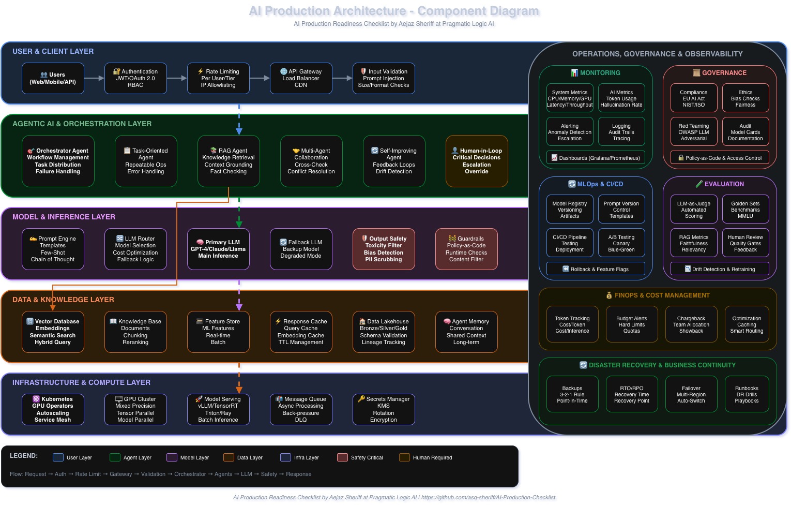

<div align="center">

# 🚀 AI Production Readiness Checklist

### The Ultimate Guide to Enterprise AI Deployment | LLM Operations | MLOps | AI Governance

> **The comprehensive checklist for taking AI from demo to production**

[](CONTRIBUTING.md)
[](LICENSE)
[](https://github.com/asq-sheriff/AI-Production-Checklist/stargazers)

**Keywords:** `AI Production` `LLM Deployment` `MLOps` `AI Governance` `Enterprise AI` `Generative AI` `AI Strategy` `AI Architecture` `Multi-Agent Systems` `RAG` `Prompt Engineering` `AI Security` `LLM Evaluation` `AI FinOps` `Red Teaming` `OWASP LLM` `AI Compliance` `EU AI Act` `Responsible AI`

</div>

---

After 27 years of building enterprise systems and seeing countless AI projects fail in production, I've compiled this checklist of everything you need to consider before deploying AI to real users.

## 📈 The Reality of AI in Production (2025)

| Metric | Value | Source |
|--------|-------|--------|
| ML projects failing to reach production | **87%** | Industry research |
| Companies with full operational AI integration | **1%** | McKinsey |
| Organizations planning to increase AI investment (2025) | **92%** | Gartner |
| Organizations using AI agents in production | **79%** | Industry survey |
| Enterprises with 50+ generative AI use cases in pipeline | **80%** | Enterprise survey |
| Organizations actively managing AI spending (2x from 2024) | **63%** | FinOps Foundation |
| Faster model deployment with comprehensive MLOps | **60%** | MLOps research |
| Reduction in production incidents with proper governance | **40%** | Governance studies |

**Market Growth:**
- AI agents market: $5.4B → $7.6B (2024→2025)
- Enterprise LLM market: $5.9B → $71.1B projected by 2035

## 🏗️ AI Production Architecture



## 📋 Quick Navigation

- [🏗️ Architecture & Design](#-architecture--design)
- [🤖 Agentic AI & Multi-Agent Systems](#-agentic-ai--multi-agent-systems)
- [🔐 Security & Compliance](#-security--compliance)
- [🛡️ Red Teaming & LLM Security](#️-red-teaming--llm-security)
- [⚡ Performance & Scale](#-performance--scale)
- [💰 Cost Management & FinOps](#-cost-management--finops)
- [🛡️ Safety & Ethics](#️-safety--ethics)
- [📊 Monitoring & Observability](#-monitoring--observability)
- [🔄 Operations & Maintenance](#-operations--maintenance)
- [📜 AI Governance](#-ai-governance)
- [🧪 LLM Evaluation & Testing](#-llm-evaluation--testing)
- [✍️ Prompt Engineering](#️-prompt-engineering)
- [📈 AI Strategy & Transformation](#-ai-strategy--transformation)
- [👥 Team & Process](#-team--process)

---

## 🏗️ Architecture & Design

### AI-Native Architecture Blueprint (10 Steps)
- [ ] **Foundation Layer**
  - [ ] Data lakehouse combining flexibility of data lakes with structure of warehouses
  - [ ] Governed data pipelines ensuring quality and compliance
  - [ ] Semantic layers for consistent definitions and access patterns

- [ ] **Model Infrastructure**
  - [ ] Specialized infrastructure for LLMs and prompt management
  - [ ] MLOps integration with CI/CD for models & prompts
  - [ ] Offline and online evaluation pipelines

- [ ] **Responsible AI Automation**
  - [ ] Bias checks and red-teaming processes
  - [ ] Explainability mechanisms
  - [ ] Policy-as-code implementation

- [ ] **Pre-production & Runtime**
  - [ ] Safety/quality gates and runtime guardrails
  - [ ] Prompts and model configs treated as versioned artifacts
  - [ ] Monitoring, drift detection, and outcome KPIs

- [ ] **Scalable Infrastructure**
  - [ ] Kubernetes with GPU operators
  - [ ] Autoscaling configured
  - [ ] Mixed precision training/inference

### Data Architecture
- [ ] **Data Pipeline Design**
  - [ ] Defined data ingestion strategy
  - [ ] Implemented data validation and quality checks
  - [ ] Set up data versioning system
  - [ ] Created data lineage tracking
  - [ ] Established data retention policies

  <details>
  <summary>💡 Implementation Tips</summary>

  - Use tools like Dagster or Airflow for orchestration
  - Implement Great Expectations for data quality
  - Consider using DVC for data versioning
  - Example from [MultiDB-Chatbot](https://github.com/asq-sheriff/MultiDB-Chatbot): Separate databases for different data types
  </details>

- [ ] **AI-Ready Pipeline Components**
  - [ ] Schema validation with real-time checks and evolution planning
  - [ ] Data enrichment (location, user-agent, IDs)
  - [ ] Feature engineering for ML transformations
  - [ ] Tiered storage (bronze/silver/gold)
  - [ ] Data contracts between producers/consumers

  <details>
  <summary>💡 Data Pipeline Patterns</summary>

  | Pattern | Use Case | Trade-offs |
  |---------|----------|------------|
  | Batch Processing | Lower-volume, non-real-time | Simple but delayed |
  | Stream Processing | Real-time decisions, IoT | Complex but immediate |
  | Lambda | Comprehensive view | Dual system complexity |
  | Kappa | Event-driven apps | Simplified, replay-based |
  | Data Lakehouse | Unified analytics + ML | Best of both worlds |
  | Data Mesh | Large enterprises | Autonomy vs. governance |
  </details>

### Model Architecture
- [ ] **Model Selection**
  - [ ] Evaluated multiple model options
  - [ ] Performed cost-benefit analysis
  - [ ] Tested fallback models
  - [ ] Documented model limitations
  - [ ] Created model cards

- [ ] **Retrieval Augmented Generation (RAG)**
  - [ ] Designed chunking strategy
  - [ ] Optimized embedding dimensions
  - [ ] Implemented hybrid search (vector + keyword)
  - [ ] Set up reranking pipeline
  - [ ] Configured context window management

### System Architecture
- [ ] **Modular Design Requirements**
  - [ ] Loose coupling: Agents operate as services/processes
  - [ ] Clear interfaces: APIs, event buses, message queues
  - [ ] Policy-driven control: Guardrails define permissions, escalation, auditing
  - [ ] Observability: All actions monitored and logged
  - [ ] Zero-trust security for agent communications
  - [ ] Versioning & rollback: Tag releases, automate rollbacks on failure

- [ ] **Microservices Design**
  - [ ] Separated inference from business logic
  - [ ] Implemented API gateway
  - [ ] Designed for horizontal scaling
  - [ ] Created service mesh
  - [ ] Established circuit breakers

- [ ] **Database Strategy**
  - [ ] Selected appropriate databases for each workload
  - [ ] Implemented connection pooling
  - [ ] Set up read replicas
  - [ ] Configured automated backups
  - [ ] Tested disaster recovery

  <details>
  <summary>💡 Architecture Patterns Comparison</summary>

  | Pattern | Use Case | Trade-offs |
  |---------|----------|------------|
  | Modular Systems | Independent components | Flexibility vs. coordination overhead |
  | Centralized Platforms | Multiple use cases | Consistency vs. single point of failure |
  | Decentralized | Department-managed AI | Autonomy vs. governance challenges |
  | Federated Learning | Distributed data sources | Privacy vs. communication costs |
  </details>

---

## 🤖 Agentic AI & Multi-Agent Systems

### Agentic AI Design Patterns
- [ ] **Task-Oriented Agents**
  - [ ] Clear success criteria defined
  - [ ] Error handling and retry logic implemented
  - [ ] High reliability for repeatable operations
  - [ ] Best for: Data entry, scheduling, document classification

- [ ] **Multi-Agent Collaboration**
  - [ ] Communication patterns established (sequential, hierarchical, bi-directional)
  - [ ] Cross-check outputs to reduce hallucinations
  - [ ] Conflict resolution mechanisms
  - [ ] Distributed expertise coordination

- [ ] **Self-Improving Agents**
  - [ ] Feedback loops configured
  - [ ] Performance monitoring active
  - [ ] Drift detection implemented
  - [ ] Continuous learning from interactions

- [ ] **RAG Agents**
  - [ ] Knowledge retrieval connected to reasoning
  - [ ] Responses grounded in factual, up-to-date information
  - [ ] Critical for document-heavy domains and compliance

- [ ] **Orchestrator Agents**
  - [ ] End-to-end workflow management
  - [ ] Task distribution across specialized agents
  - [ ] Failure handling with rerouting/fallback strategies
  - [ ] Loose coupling and separation of concerns

  <details>
  <summary>💡 Academic vs Enterprise Patterns</summary>

  | Academic Patterns | Enterprise Patterns |
  |-------------------|---------------------|
  | Reflection | Task-Oriented |
  | Tool Use | Multi-Agent Collaboration |
  | ReAct | Self-Improving |
  | Planning | RAG Agents |
  | Multi-Agent | Orchestrator Agents |

  **Tip:** Start with task-oriented pattern (lowest complexity, fastest time to value), then progress to sequential orchestration, then advanced patterns.
  </details>

### Multi-Agent Systems (MAS) Architecture
- [ ] **Core Components**
  - [ ] Agents with distinct roles, personas, specific contexts
  - [ ] Agent management for collaboration patterns
  - [ ] Human-in-the-loop for reliability in critical scenarios
  - [ ] Specialized tools (web search, document processing, code)
  - [ ] LLM backbone for processing and inference
  - [ ] Context management with prompts enabling intent identification
  - [ ] Memory systems (shared or individual) for context retention

- [ ] **MAS Design Best Practices**
  - [ ] Clearly defined agent roles and responsibilities
  - [ ] Communication protocols for data sharing
  - [ ] Adaptive decision-making capabilities
  - [ ] Scalable architecture from the start
  - [ ] Comprehensive monitoring framework
  - [ ] Strong security (encryption, secure data handling)
  - [ ] Regular audits for bias and fairness
  - [ ] Error propagation prevention through data governance

  <details>
  <summary>💡 MAS vs Single-Agent Comparison</summary>

  | Aspect | Single-Agent | Multi-Agent |
  |--------|--------------|-------------|
  | Architecture | Monolithic | Distributed |
  | Fault Tolerance | Single point of failure | Resilient—others continue |
  | Scalability | Limited | Add agents at runtime |
  | Hallucination | Higher risk | Cross-checking reduces errors |
  | Context Windows | Limited | Distribute across agents |
  </details>

- [ ] **Multi-Agent Frameworks Evaluated**
  - [ ] AutoGen (Microsoft): Dynamic agent interactions
  - [ ] Semantic Kernel (Microsoft): Modular, bridges traditional programming and AI
  - [ ] LlamaIndex: Knowledge-driven applications
  - [ ] LangChain: Comprehensive orchestration
  - [ ] CrewAI: Task-oriented multi-agent coordination

---

## 🔐 Security & Compliance

### Authentication & Authorization
- [ ] **Access Control**
  - [ ] Implemented JWT/OAuth 2.0
  - [ ] Set up API key management
  - [ ] Created role-based access control (RBAC)
  - [ ] Implemented rate limiting per user/tier
  - [ ] Added IP allowlisting capabilities

### Data Security
- [ ] **Encryption**
  - [ ] TLS 1.3+ for data in transit
  - [ ] AES-256 for data at rest
  - [ ] Encrypted model weights storage
  - [ ] Secure key management (KMS)
  - [ ] Implemented secrets rotation

- [ ] **Privacy**
  - [ ] PII detection and masking
  - [ ] GDPR compliance (right to deletion)
  - [ ] Data residency controls
  - [ ] Audit logging for all data access
  - [ ] Consent management system

### Compliance Requirements
- [ ] **Industry Standards**
  - [ ] HIPAA (healthcare)
  - [ ] PCI DSS (payments)
  - [ ] SOC 2 Type II
  - [ ] ISO 27001
  - [ ] FedRAMP (government)

---

## 🛡️ Red Teaming & LLM Security

### OWASP LLM Top 10 (2025)
- [ ] **Vulnerability Assessment**
  - [ ] LLM01: Prompt Injection - tested and mitigated
  - [ ] LLM02: Sensitive Data Leakage - prevention in place
  - [ ] LLM07: System Prompt Leakage - protected
  - [ ] Model theft prevention
  - [ ] Bias detection and mitigation
  - [ ] Data poisoning prevention
  - [ ] RAG exploitation protection
  - [ ] API abuse prevention

### Red Teaming Framework
- [ ] **Planning Phase**
  - [ ] Scope defined
  - [ ] Diverse team assembled (benign and adversarial mindsets)
  - [ ] Domain experts included (healthcare, legal, etc.)
  - [ ] Goals and success criteria set

- [ ] **Attack Design & Execution**
  - [ ] Adversarial inputs created
  - [ ] Attack scenarios designed
  - [ ] Production-like environment testing
  - [ ] Testing at multiple layers (base model, RAG, application)

- [ ] **Analysis & Remediation**
  - [ ] Outputs scored systematically
  - [ ] Vulnerabilities identified and documented
  - [ ] Guardrails implemented
  - [ ] Retraining if needed
  - [ ] Regression testing after fixes
  - [ ] CI/CD integration for continuous testing

### Vulnerability Categories Tested
- [ ] **Content & Behavior**
  - [ ] Harmful content generation (offensive)
  - [ ] Stereotypes and discrimination (bias)
  - [ ] Data leakage (PII exposure)
  - [ ] Non-robust responses (inconsistency)
  - [ ] Prompt injection (user input manipulation)
  - [ ] Jailbreaking (bypassing safety filters)

### LLM Output Security (NVIDIA Findings)
- [ ] **Critical Mitigations**
  - [ ] Sanitize all LLM output (remove markdown, HTML, URLs)
  - [ ] Image content security policies implemented
  - [ ] Display entire links to users before connecting
  - [ ] Active content disabled where appropriate
  - [ ] Secure permissions on RAG data stores
  - [ ] LLM-generated code execution sandboxed

  <details>
  <summary>💡 Red Teaming Tools (2025)</summary>

  - **Promptfoo**: Open-source LLM red teaming framework
  - **DeepTeam**: Built on DeepEval for safety testing
  - **AutoRTAI (HiddenLayer)**: Agent-based automated red teaming
  - **Mindgard DAST-AI**: Dynamic application security testing for AI
  - **Adversa**: Continuous red teaming for LLMs
  </details>

---

## ⚡ Performance & Scale

### Latency Optimization
- [ ] **Response Time Targets**
  - [ ] Time to First Token (TTFT) < 350ms
  - [ ] Time to Incremental Token (TTIT) < 25ms
  - [ ] P50 latency < 200ms
  - [ ] P99 latency < 1s
  - [ ] Implemented caching strategy
  - [ ] Optimized model serving
  - [ ] Set up CDN for static assets

### Scalability
- [ ] **Load Handling**
  - [ ] Tested with expected peak load
  - [ ] Implemented auto-scaling policies
  - [ ] Set up load balancing
  - [ ] Configured queue management
  - [ ] Established back-pressure mechanisms

- [ ] **Concurrency**
  - [ ] Async request handling
  - [ ] Connection pooling
  - [ ] Worker pool management
  - [ ] Batch inference capabilities
  - [ ] Stream processing for real-time

### Resource Optimization
- [ ] **Compute Efficiency**
  - [ ] Model quantization implemented
  - [ ] GPU utilization monitoring (aim for near 100%)
  - [ ] CPU/Memory profiling
  - [ ] Container right-sizing
  - [ ] Spot instance usage

### LLM Parallelism Techniques
- [ ] **Scaling Strategies**
  - [ ] Data parallelism: Replicate model, distribute data
  - [ ] Model parallelism: Split model across devices
  - [ ] Tensor parallelism: Distribute tensor operations
  - [ ] Pipeline parallelism: Sequential stages across devices
  - [ ] Context parallelism: Distribute long context processing

  <details>
  <summary>💡 Deployment Options</summary>

  | Option | Pros | Cons |
  |--------|------|------|
  | Cloud | Flexible, scalable, pay-as-you-go | Data privacy concerns |
  | On-Premises | Data control, security | High upfront cost |
  | Hybrid | Best of both, cost optimization | Complexity |
  | Edge | Low latency, data residency | Limited compute |
  </details>

  <details>
  <summary>💡 Serving Frameworks (2025)</summary>

  - **vLLM**: High-throughput, paged attention
  - **TensorRT-LLM**: NVIDIA optimized inference
  - **Ray Serve**: Distributed serving, LangChain integration
  - **Triton Inference Server**: Multi-model, dynamic batching
  - **llm-d**: Kubernetes-native distributed inference
  </details>

---

## 💰 Cost Management & FinOps

### AI-Specific Cost Drivers
- [ ] **Cost Tracking**
  - [ ] Token usage (input/output tokens processed)
  - [ ] GPU compute (training and inference)
  - [ ] Model training costs (initial and fine-tuning)
  - [ ] Infrastructure (storage, network)
  - [ ] API calls (third-party model usage)

### Key FinOps Metrics
- [ ] **AI Cost Metrics**
  - [ ] Cost Per Token: Total cost / tokens processed
  - [ ] Cost Per Inference: Total cost / inference requests
  - [ ] Cost Per Unit of Work: e.g., cost per 100k words
  - [ ] GPU Utilization: Aim for near 100%
  - [ ] Training Cost Efficiency: Cost / model accuracy

### Usage Tracking
- [ ] **Metering**
  - [ ] Token counting per request
  - [ ] API call tracking
  - [ ] Storage usage monitoring
  - [ ] Compute hour tracking
  - [ ] Bandwidth monitoring

### Cost Controls
- [ ] **Budget Management**
  - [ ] Set spending alerts
  - [ ] Implemented hard limits
  - [ ] Created usage quotas
  - [ ] Automated cost reports
  - [ ] Chargeback/showback system for teams
  - [ ] Weekly/monthly forecasting cadence

### Optimization Strategies
- [ ] **Model Selection**
  - [ ] Choose appropriate model size for task complexity
  - [ ] Use smaller models for simple tasks
  - [ ] Consider fine-tuned smaller models vs. large general models

- [ ] **Infrastructure Optimization**
  - [ ] Autoscaling based on demand
  - [ ] Spot instances for non-critical workloads
  - [ ] Mixed precision training/inference
  - [ ] Edge computing for latency-sensitive applications

- [ ] **Operational Optimization**
  - [ ] Prompt engineering ("be concise" reduces tokens 15-25%)
  - [ ] Response caching for repeated queries
  - [ ] Request batching
  - [ ] Smart LLM routing (route to appropriate model)
  - [ ] Build shared infrastructure (centralized vector stores)

## 🛡️ Safety & Ethics

### Content Safety
- [ ] **Input Validation**
  - [ ] Prompt injection detection
  - [ ] Malicious input filtering
  - [ ] Size limits enforcement
  - [ ] Format validation
  - [ ] Rate limiting by content type

- [ ] **Output Safety**
  - [ ] Toxicity filtering
  - [ ] Bias detection
  - [ ] Factuality checking
  - [ ] Copyright detection
  - [ ] PII scrubbing

### Ethical Considerations
- [ ] **Responsible AI**
  - [ ] Bias testing completed
  - [ ] Fairness metrics defined
  - [ ] Transparency documentation
  - [ ] Human-in-the-loop options
  - [ ] Opt-out mechanisms

## 📊 Monitoring & Observability

### System Monitoring
- [ ] **Infrastructure Metrics**
  - [ ] CPU/Memory/Disk usage
  - [ ] Network latency
  - [ ] Queue depths
  - [ ] Error rates
  - [ ] Service health checks

### Application Monitoring
- [ ] **AI-Specific Metrics**
  - [ ] Model inference time
  - [ ] Token usage per request
  - [ ] Cache hit rates
  - [ ] Embedding generation time
  - [ ] Context retrieval accuracy

### Business Metrics
- [ ] **KPI Tracking**
  - [ ] User satisfaction scores
  - [ ] Task completion rates
  - [ ] Revenue per user
  - [ ] Cost per request
  - [ ] Feature adoption rates

### Alerting
- [ ] **Incident Detection**
  - [ ] Anomaly detection
  - [ ] Threshold-based alerts
  - [ ] Escalation policies
  - [ ] On-call rotation
  - [ ] Incident response runbooks

---

## 🔄 Operations & Maintenance

### Deployment Strategy
- [ ] **Release Management**
  - [ ] Blue-green deployments
  - [ ] Canary releases
  - [ ] Feature flags
  - [ ] Rollback procedures
  - [ ] Database migration strategy

### Model Management
- [ ] **Lifecycle Management**
  - [ ] Model versioning system
  - [ ] A/B testing framework
  - [ ] Model registry
  - [ ] Performance tracking
  - [ ] Retraining pipeline

### Disaster Recovery
- [ ] **Business Continuity**
  - [ ] Backup strategy (3-2-1 rule)
  - [ ] Recovery time objective (RTO)
  - [ ] Recovery point objective (RPO)
  - [ ] Failover procedures
  - [ ] Regular DR drills

---

## 📜 AI Governance

### Major Governance Frameworks
- [ ] **Regulatory Compliance Mapping**
  - [ ] EU AI Act: Risk-based classification, mandatory compliance
  - [ ] NIST AI RMF: Risk management guidelines
  - [ ] ISO 42001: International AI management standards
  - [ ] OECD AI Principles: Ethical/human-centered guidelines
  - [ ] Regional frameworks (UK Pro-Innovation, etc.)

### Governance Implementation (5 Pillars)
- [ ] **AI Organization**
  - [ ] Governance embedded within broader strategy
  - [ ] Cross-functional team assembled
  - [ ] Roles & responsibilities assigned

- [ ] **Legal & Regulatory Compliance**
  - [ ] Risk assessment methodology defined
  - [ ] Regulatory mapping completed
  - [ ] Data protection measures implemented

- [ ] **Ethics & Responsible AI**
  - [ ] Fairness, transparency, accountability documented
  - [ ] Bias mitigation strategies identified
  - [ ] Ethical guidelines published

- [ ] **Technology & Data**
  - [ ] Data governance framework established
  - [ ] Model management policies defined
  - [ ] AI model lifecycle processes mapped

- [ ] **Operations & Monitoring**
  - [ ] Continuous oversight mechanisms
  - [ ] Audit trails implemented
  - [ ] Monitoring & review cadence established

  <details>
  <summary>💡 Governance Maturity Levels (PwC 2025)</summary>

  | Stage | Description | % of Organizations |
  |-------|-------------|-------------------|
  | Early | Building foundational policies | 18% |
  | Training | Developing structures & guidance | 21% |
  | Strategic | AI priorities defined & communicated | 28% |
  | Embedded | Integrated into core operations | 33% |
  </details>

---

## 🧪 LLM Evaluation & Testing

### Evaluation Approaches
- [ ] **Multiple Evaluation Methods**
  - [ ] Multiple Choice: Benchmark-based Q&A (MMLU)
  - [ ] Verifiers: Code/logic verification
  - [ ] Leaderboards: User preference voting (LM Arena)
  - [ ] LLM-as-Judge: Automated evaluation at scale

### Functional Performance Metrics
- [ ] **Quality Metrics**
  - [ ] Accuracy (correctness of responses)
  - [ ] Relevancy (alignment with query intent)
  - [ ] Coherence (logical flow of output)
  - [ ] Faithfulness (grounded in provided context)
  - [ ] Hallucination rate (false/unsupported claims)

### Operational Performance Metrics
- [ ] **System Metrics**
  - [ ] Latency (response time)
  - [ ] Throughput (queries per second)
  - [ ] Token usage (cost tracking)
  - [ ] Error rates

### RAG-Specific Metrics
- [ ] **Retrieval Quality**
  - [ ] Context precision (retrieved chunks actually useful)
  - [ ] Context recall (relevant chunks retrieved)
  - [ ] Faithfulness (output grounded in retrieval)
  - [ ] Answer relevancy (concise, on-topic responses)

### Testing Types
- [ ] **Comprehensive Testing**
  - [ ] Functional testing: Task-specific capabilities (pre-deployment)
  - [ ] Regression testing: Same test cases across iterations
  - [ ] Adversarial testing: Edge cases and attacks (security validation)
  - [ ] A/B testing: Compare model/prompt variants (production)

### Evaluation Best Practices
- [ ] **Quality Assurance**
  - [ ] "Golden" datasets (~200 prompts) as quality checkpoint
  - [ ] Human review for failed or unclear judgments
  - [ ] Combine offline (development) and online (production) evaluation
  - [ ] Track metrics over time for drift detection
  - [ ] CI/CD integration for automated quality gates

  <details>
  <summary>💡 Evaluation Tools (2025)</summary>

  - **DeepEval**: Open-source, CI/CD integration, RAG support
  - **Arize Phoenix**: Production observability and evaluation
  - **Braintrust**: End-to-end evaluation platform
  - **LangSmith**: LangChain's evaluation framework
  - **RAGAS**: RAG-specific evaluation
  - **OpenAI Evals**: Open-source, community-driven
  </details>

---

## ✍️ Prompt Engineering

### Production-Grade Prompt Engineering
- [ ] **Design Principles**
  - [ ] Clear context: Be specific about task and include relevant details
  - [ ] Customized for each task: Tailor prompts to unique use cases
  - [ ] Break tasks into steps: Simplify complex workflows
  - [ ] Output specifications: Format, tone, structure requirements
  - [ ] Input validation: Ensure inputs are clean and standardized

- [ ] **Advanced Techniques**
  - [ ] Set personas and tone: Align with audience and purpose
  - [ ] Few-shot examples: Show patterns for consistent output
  - [ ] Chain of thought: Encourage step-by-step reasoning
  - [ ] Structured output: Specify exact format needed (JSON, tables)

### Prompt Operations
- [ ] **Prompt Lifecycle Management**
  - [ ] Version control: Track changes, enable rollback
  - [ ] CI/CD integration: Automate testing and deployment
  - [ ] Monitor and iterate: Continuous improvement based on feedback
  - [ ] Treat prompts as software artifacts

  <details>
  <summary>💡 Research-Backed Findings (2025)</summary>

  - Structure matters: Most successful prompts follow clear pattern (intro, formatting, modular inputs)
  - Adding "be concise" reduces token usage by 15-25%
  - Different models respond better to different formatting patterns
  - Prompts are repeatable—viral prompts work across thousands of users

  **Tools**: Latitude, LangChain, PromptLayer, Lilypad
  </details>

---

## 📈 AI Strategy & Transformation

### AI Strategy Roadmap (7 Workstreams - Gartner)
- [ ] **Strategy & Governance**
  - [ ] AI vision defined
  - [ ] Principles and governance framework established

- [ ] **Technology & Architecture**
  - [ ] Build/buy decisions made
  - [ ] Sandbox environments available
  - [ ] Design patterns documented

- [ ] **Data Management**
  - [ ] AI-ready data capabilities assessed
  - [ ] Data quality evaluation completed

- [ ] **Talent & Organization**
  - [ ] Resourcing plan created
  - [ ] Community of practice established
  - [ ] Target operating model defined

- [ ] **Use Cases**
  - [ ] Prioritized by impact/feasibility
  - [ ] 3-5 initial use cases selected
  - [ ] Pilot selection criteria defined

- [ ] **Vendor Management**
  - [ ] Vendors selected and evaluated
  - [ ] Cohesive AI vendor strategy evolving

- [ ] **Operations**
  - [ ] ModelOps practice established
  - [ ] Observability implemented
  - [ ] FinOps best practices applied

### Implementation Phases
- [ ] **6-Phase Framework**
  - [ ] Phase 1 - Assessment (2-6 weeks): Evaluate readiness, identify gaps
  - [ ] Phase 2 - Strategy (3-4 weeks): Define objectives, select use cases
  - [ ] Phase 3 - Pilot: Select 1-2 use cases, build POC
  - [ ] Phase 4 - Scale (6-12 months): Expand successful pilots
  - [ ] Phase 5 - Operationalize: MLOps, monitoring, continuous improvement
  - [ ] Phase 6 - Transform (12-24 months): Cultural shift, workforce transformation

  <details>
  <summary>💡 AI Maturity Levels</summary>

  | Level | Description | Characteristics |
  |-------|-------------|-----------------|
  | Early Stage | Building foundations | Policies, frameworks being developed |
  | Training Stage | Developing capabilities | Employee training, governance structures |
  | Strategic Stage | Active integration | AI integrated into operations |
  | Embedded Stage | Full operational integration | AI actively drives decision-making |
  </details>

### Critical Success Factors
- [ ] **Success Enablers**
  - [ ] Active leadership buy-in (single most predictive factor)
  - [ ] Cross-functional teams (IT, business, data science)
  - [ ] Clear business objectives (specific, measurable outcomes)
  - [ ] Data quality foundation
  - [ ] Change management program
  - [ ] Iterative approach (start small, scale gradually)
  - [ ] Governance framework (ethics, compliance, accountability)

### Common Mistakes to Avoid
- [ ] **Anti-Patterns Identified**
  - [ ] Technology-first approach (adopting tool without clear problem)
  - [ ] Underestimating data quality importance
  - [ ] Neglecting governance and ethics
  - [ ] Overreliance on technology (ignoring people/process/culture)
  - [ ] Lack of ongoing monitoring and optimization
  - [ ] Attempting too many simultaneous initiatives

---

## 👥 Team & Process

### Documentation
- [ ] **Technical Documentation**
  - [ ] Architecture diagrams
  - [ ] API documentation
  - [ ] Runbooks
  - [ ] Troubleshooting guides
  - [ ] Decision records (ADRs)

### Team Readiness
- [ ] **Skills & Training**
  - [ ] On-call training completed
  - [ ] Security training
  - [ ] Incident response training
  - [ ] Knowledge transfer sessions
  - [ ] Cross-functional understanding

### AI Transformation Readiness
- [ ] **Organizational Readiness Checklist**
  - [ ] Data: Clean, accessible, API-ready
  - [ ] Talent: Cross-functional group leads AI skill-building
  - [ ] Governance: Documented policies for AI systems
  - [ ] Culture: Employees encouraged to explore/propose AI use cases
  - [ ] Tooling: Can prototype/deploy without IT bottlenecks

- [ ] **Change Management**
  - [ ] Address fears of job displacement openly
  - [ ] Emphasize AI enhances (not replaces) human skills
  - [ ] Build curiosity, flexibility, learning mindset
  - [ ] Provide clear training and development paths
  - [ ] Conduct skills gap analyses

### Process Governance
- [ ] **Process & Compliance**
  - [ ] Change management process
  - [ ] Code review requirements
  - [ ] Security review process
  - [ ] Compliance audits scheduled
  - [ ] Stakeholder sign-offs

---

## 📊 Scoring Your Readiness

Count your checked items:

| Score | Readiness Level | Recommendation |
|-------|----------------|----------------|
| 0-20% | 🔴 **Prototype** | Not ready for any real users |
| 21-40% | 🟠 **Alpha** | Internal testing only |
| 41-60% | 🟡 **Beta** | Limited external users with warnings |
| 61-80% | 🟢 **Production Ready** | Ready for general availability |
| 81-100% | 🏆 **Enterprise Grade** | Ready for mission-critical deployment |

## 🎯 Quick Wins

If you're overwhelmed, start with these high-impact items:

1. **Authentication**: Never deploy without it
2. **Rate Limiting**: Prevent abuse and cost overruns
3. **Error Handling**: Graceful failures save users
4. **Monitoring**: You can't fix what you can't see
5. **Backup Strategy**: Because data loss is unforgivable

## 📥 Downloadable Tools

| Format | Description | Download |
|--------|-------------|----------|
| **Interactive HTML** | Fillable checklist with auto-scoring, progress tracking, local storage, export/import, and comprehensive FAQ | [Download HTML](ai-production-checklist.html) |
| **CSV/Excel Template** | Spreadsheet format with all sections, priority levels, and FAQ - works in Excel, Google Sheets, Numbers | [Download CSV](AI-Production-Checklist-Template.csv) |
| **Architecture Diagram** | Draw.io component diagram showing how all checklist components work together | [Download .drawio](AI-Production-Architecture-Diagram.drawio) |

**Features:**
- **HTML Version**: Works offline, saves progress in browser, export/import JSON, print-friendly
- **CSV Version**: Sortable by section/priority, add custom notes, calculate scores with formulas
- **Diagram**: Editable in [draw.io](https://app.diagrams.net/) - shows 5-layer architecture with data flow

<details>
<summary>📝 Text Version of Architecture</summary>

```
┌─────────────────────────────────────────────────────────────────────────────┐
│  USER & CLIENT LAYER                                                        │
│  Users → Auth (JWT/OAuth) → Rate Limiting → API Gateway → Input Validation  │
└─────────────────────────────────────────────────────────────────────────────┘
                                      ↓
┌─────────────────────────────────────────────────────────────────────────────┐
│  AGENTIC AI & ORCHESTRATION LAYER                                           │
│  Orchestrator → Task Agents → RAG Agents → Multi-Agent → Human-in-Loop      │
└─────────────────────────────────────────────────────────────────────────────┘
                                      ↓
┌─────────────────────────────────────────────────────────────────────────────┐
│  MODEL & INFERENCE LAYER                                                    │
│  Prompt Engine → LLM Router → Primary/Fallback LLM → Output Safety          │
└─────────────────────────────────────────────────────────────────────────────┘
                                      ↓
┌─────────────────────────────────────────────────────────────────────────────┐
│  DATA & KNOWLEDGE LAYER                                                     │
│  Vector DB → Knowledge Base → Feature Store → Cache → Data Lakehouse        │
└─────────────────────────────────────────────────────────────────────────────┘
                                      ↓
┌─────────────────────────────────────────────────────────────────────────────┐
│  INFRASTRUCTURE & COMPUTE LAYER                                             │
│  Kubernetes → GPU Cluster → Model Serving (vLLM) → Queue → Secrets          │
└─────────────────────────────────────────────────────────────────────────────┘

    ┌──────────────────────────────────────────────────────────────────────┐
    │  CROSS-CUTTING: Monitoring │ Governance │ MLOps │ Evaluation │ FinOps │
    └──────────────────────────────────────────────────────────────────────┘
```

</details>

## 📚 Resources

### Tools & Frameworks

**Agent & Orchestration:**
- [LangChain](https://langchain.com/) - RAG and agent framework
- [LlamaIndex](https://www.llamaindex.ai/) - Knowledge-driven AI applications
- [AutoGen](https://microsoft.github.io/autogen/) - Multi-agent conversation framework
- [CrewAI](https://www.crewai.com/) - Task-oriented multi-agent coordination
- [Semantic Kernel](https://github.com/microsoft/semantic-kernel) - Microsoft's modular AI framework

**Evaluation & Testing:**
- [DeepEval](https://github.com/confident-ai/deepeval) - LLM evaluation with CI/CD support
- [RAGAS](https://github.com/explodinggradients/ragas) - RAG evaluation framework
- [Promptfoo](https://promptfoo.dev/) - LLM red teaming and testing
- [Arize Phoenix](https://phoenix.arize.com/) - LLM observability

**Serving & Infrastructure:**
- [vLLM](https://github.com/vllm-project/vllm) - High-throughput LLM serving
- [Ray Serve](https://docs.ray.io/en/latest/serve/) - Scalable model serving
- [Triton Inference Server](https://github.com/triton-inference-server) - Multi-model serving

**MLOps & Monitoring:**
- [Weights & Biases](https://wandb.ai/) - ML experiment tracking
- [MLflow](https://mlflow.org/) - ML lifecycle management
- [Prometheus](https://prometheus.io/) - Monitoring and alerting
- [Grafana](https://grafana.com/) - Observability dashboards

**Infrastructure:**
- [Terraform](https://terraform.io/) - Infrastructure as Code
- [Kubernetes](https://kubernetes.io/) - Container orchestration

### Further Reading
- [The Production ML Handbook](https://www.oreilly.com/library/view/reliable-machine-learning/9781098106218/)
- [Google's ML Best Practices](https://developers.google.com/machine-learning/guides/rules-of-ml)
- [Microsoft's Responsible AI](https://www.microsoft.com/en-us/ai/responsible-ai)
- [NIST AI Risk Management Framework](https://www.nist.gov/itl/ai-risk-management-framework)
- [EU AI Act](https://artificialintelligenceact.eu/)
- [OWASP LLM Top 10](https://owasp.org/www-project-top-10-for-large-language-model-applications/)

## 🤝 Contributing

This checklist is a living document. Please contribute your hard-won lessons:

1. Fork the repository
2. Add your items with practical examples
3. Submit a pull request
4. Share your production horror stories in discussions

## 💫 Please Credit

If you find this checklist helpful, please consider:

- **Star this repo** ⭐ to help others discover it
- **Credit the source** when sharing or adapting:
  > AI Production Readiness Checklist by [Aejaz Sheriff](https://github.com/asq-sheriff) at [Pragmatic Logic AI](https://pragmaticlogic.ai)
- **Link back** to this repository in your documentation, presentations, or articles
- **Share** on LinkedIn, Twitter/X, or your tech community

Your attribution helps support the continued development of open-source AI resources!

## 📄 License

MIT License - Use this checklist to ship better AI products!

```
MIT License

Copyright (c) 2025 Pragmatic Logic AI

Permission is hereby granted, free of charge, to any person obtaining a copy
of this software and associated documentation files (the "Software"), to deal
in the Software without restriction, including without limitation the rights
to use, copy, modify, merge, publish, distribute, sublicense, and/or sell
copies of the Software, and to permit persons to whom the Software is
furnished to do so, subject to the following conditions:

The above copyright notice and this permission notice shall be included in all
copies or substantial portions of the Software.

THE SOFTWARE IS PROVIDED "AS IS", WITHOUT WARRANTY OF ANY KIND, EXPRESS OR
IMPLIED, INCLUDING BUT NOT LIMITED TO THE WARRANTIES OF MERCHANTABILITY,
FITNESS FOR A PARTICULAR PURPOSE AND NONINFRINGEMENT. IN NO EVENT SHALL THE
AUTHORS OR COPYRIGHT HOLDERS BE LIABLE FOR ANY CLAIM, DAMAGES OR OTHER
LIABILITY, WHETHER IN AN ACTION OF CONTRACT, TORT OR OTHERWISE, ARISING FROM,
OUT OF OR IN CONNECTION WITH THE SOFTWARE OR THE USE OR OTHER DEALINGS IN THE
SOFTWARE.
```

## 🙏 Credits

Created by [Aejaz Sheriff](https://github.com/asq-sheriff) at [Pragmatic Logic AI](https://pragmaticlogic.ai) based on:
- 27 years of enterprise system development
- Countless production incidents and lessons learned
- Contributions from the amazing AI community
- Industry research from Gartner, McKinsey, PwC, and NVIDIA

---

<div align="center">

**⭐ Star this repo if it helps you avoid production disasters!**

*"In production, no one can hear your model scream."*

**[pragmaticlogic.ai](https://pragmaticlogic.ai)**

</div>
