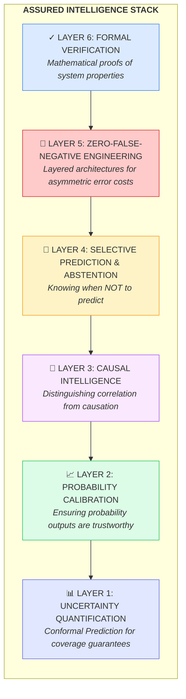
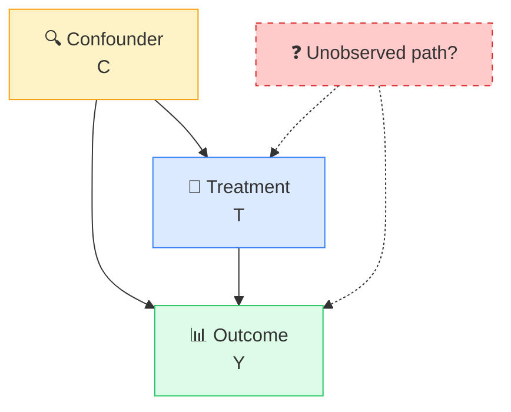
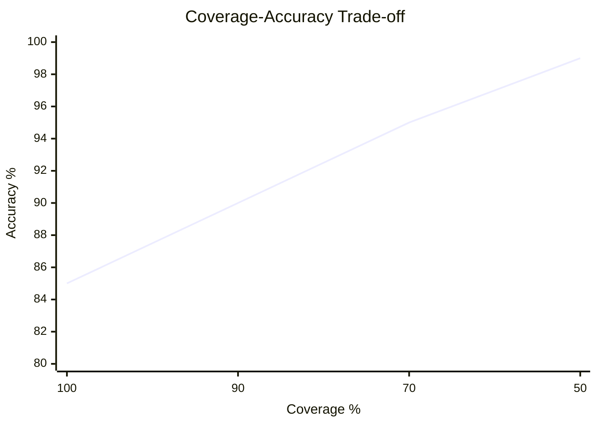
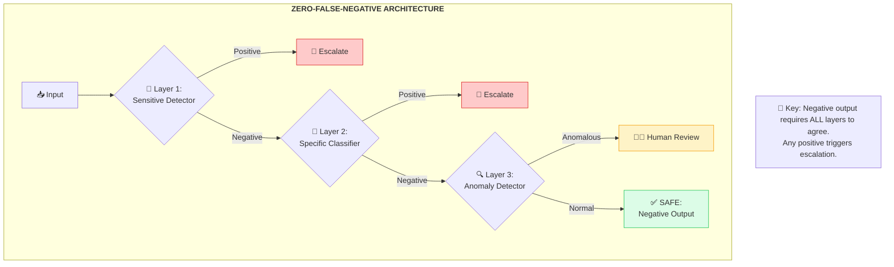

# Assured Intelligence & Quantitative Safety Guide

A comprehensive framework for implementing mathematical guarantees in production AI systems. This guide bridges the gap between "probably works" and "provably works within bounds."

**Authored by:** Dr. ASQ, Forensic AI Engineer
**Philosophy:** *"To build the most reliable systems, one must also be their most ruthless critic."*

---

## Overview

Most AI production checklists address *operational* readiness—can you deploy it, monitor it, scale it? This guide addresses *assurance* readiness—can you *prove* it works within acceptable bounds?

### The Assurance Gap

| Traditional Checklist | Assured Intelligence |
|-----------------------|----------------------|
| "Model has 95% accuracy" | "Model has 95% accuracy with 99% coverage guarantee via Conformal Prediction" |
| "Bias testing completed" | "Causal graph validated; no path from protected attributes to outcome" |
| "Human-in-the-loop available" | "Model abstains when uncertainty exceeds threshold; human triggered automatically" |
| "Safety validation passed" | "Zero-false-negative architecture with layered ensemble achieving 99.9% sensitivity" |
| "Probability outputs generated" | "Calibration ECE < 0.05; reliability diagram validates probability trustworthiness" |

### Why This Matters

**Case Study: The Confident Wrong Prediction**

A sepsis prediction model outputs `probability = 0.92`. The clinician trusts this. The patient dies.

Post-mortem analysis reveals:
- Model's 0.92 probabilities are actually correct only 65% of the time (miscalibration)
- Model had never seen this input pattern before (OOD, no detection)
- Model provided no uncertainty bounds (no conformal prediction)
- Model couldn't abstain on uncertain cases (no selective prediction)

Every item in this guide exists because systems like this have failed catastrophically.

---

## The Assurance Hierarchy



---

## Layer 1: Uncertainty Quantification

### The Problem

Traditional ML outputs point predictions: "The probability is 0.85." But:
- How confident are we in this 0.85?
- What's the valid range?
- Is this prediction reliable?

**Conformal Prediction** provides mathematically valid prediction intervals with guaranteed coverage—regardless of the underlying distribution.

### Conformal Prediction: Core Concepts

**Definition:** Conformal Prediction constructs prediction sets that contain the true label with a user-specified probability (e.g., 90%).

**Key Property:** Distribution-free, finite-sample valid coverage guarantee.

```
P(Y_new ∈ C(X_new)) ≥ 1 - α
```

Where:
- `Y_new` = true label for new input
- `C(X_new)` = prediction set constructed by conformal prediction
- `1 - α` = coverage level (e.g., 0.90 for 90% coverage)
- This holds for ANY distribution, not just Gaussian

### Conformal Prediction Types

| Type | Use Case | Guarantee |
|------|----------|-----------|
| **Split Conformal** | Classification, regression | Exact marginal coverage |
| **Full Conformal** | Small datasets | Strongest guarantees, expensive |
| **Conformalized Quantile Regression** | Regression intervals | Adaptive interval width |
| **Conformal Risk Control** | Loss-based coverage | Generalized loss guarantees |

### Implementation Checklist

**Foundational Requirements:**
- [ ] **Calibration Set Separated**: Hold out data for conformal calibration (minimum 1000 samples recommended)
- [ ] **Non-Conformity Score Defined**: Appropriate score function selected for task
  - Classification: 1 - softmax probability of true class
  - Regression: |y - ŷ| (absolute residual)
  - RAG: 1 - retrieval relevance score
- [ ] **Coverage Level Set**: Target coverage (1 - α) defined based on risk tolerance
  - Healthcare: ≥ 95% coverage typical
  - Financial: ≥ 90% coverage typical
  - Consumer: ≥ 80% coverage may suffice

**Operational Requirements:**
- [ ] **Prediction Intervals Generated**: Every prediction includes conformal interval
- [ ] **Interval Width Monitored**: Track average interval width over time
- [ ] **Coverage Validated**: Empirically verify coverage matches target
- [ ] **Covariate Shift Adaptation**: Implement weighted conformal prediction if distribution shifts expected

**Advanced Requirements:**
- [ ] **Conditional Coverage**: Coverage validated across subgroups (not just marginal)
- [ ] **Mondrian Conformal**: Group-conditional coverage for fairness
- [ ] **Online Conformal**: Streaming updates for calibration set
- [ ] **Conformal + Abstention**: Reject predictions with intervals wider than threshold

### Code Pattern: Split Conformal Prediction

```python
from mapie.classification import MapieClassifier
from mapie.regression import MapieRegressor
import numpy as np

# Classification Example
class ConformalClassifier:
    def __init__(self, base_model, coverage=0.90):
        self.model = MapieClassifier(
            estimator=base_model,
            cv="prefit",  # Use pre-trained model
            method="score"  # LAC (Least Ambiguous set-valued Classifier)
        )
        self.coverage = coverage

    def fit_conformal(self, X_cal, y_cal):
        """Fit conformal predictor on calibration set."""
        self.model.fit(X_cal, y_cal)

    def predict_with_uncertainty(self, X):
        """Return prediction sets with coverage guarantee."""
        y_pred, y_set = self.model.predict(
            X,
            alpha=1 - self.coverage
        )
        return {
            'point_prediction': y_pred,
            'prediction_set': y_set,  # Set of possible classes
            'set_size': y_set.sum(axis=1),  # Ambiguity measure
            'coverage_guarantee': self.coverage
        }

# Regression Example
class ConformalRegressor:
    def __init__(self, base_model, coverage=0.90):
        self.model = MapieRegressor(
            estimator=base_model,
            cv="prefit",
            method="base"  # Standard split conformal
        )
        self.coverage = coverage

    def fit_conformal(self, X_cal, y_cal):
        """Fit conformal predictor on calibration set."""
        self.model.fit(X_cal, y_cal)

    def predict_with_intervals(self, X):
        """Return prediction intervals with coverage guarantee."""
        y_pred, y_interval = self.model.predict(
            X,
            alpha=1 - self.coverage
        )
        return {
            'point_prediction': y_pred,
            'lower_bound': y_interval[:, 0, 0],
            'upper_bound': y_interval[:, 1, 0],
            'interval_width': y_interval[:, 1, 0] - y_interval[:, 0, 0],
            'coverage_guarantee': self.coverage
        }
```

### Conformal Prediction for RAG Systems

**Application:** Provide confidence bounds on retrieval relevance and generation faithfulness.

```python
class ConformalRAG:
    def __init__(self, retriever, generator, coverage=0.90):
        self.retriever = retriever
        self.generator = generator
        self.coverage = coverage
        self.calibration_scores = []

    def calibrate(self, cal_queries, cal_docs, cal_relevance):
        """Calibrate on held-out query-document pairs with known relevance."""
        for query, doc, relevance in zip(cal_queries, cal_docs, cal_relevance):
            score = self.retriever.score(query, doc)
            # Non-conformity score: how "wrong" was our relevance prediction
            nonconf_score = 1 - score if relevance else score
            self.calibration_scores.append(nonconf_score)

        # Compute quantile threshold
        n = len(self.calibration_scores)
        self.threshold = np.quantile(
            self.calibration_scores,
            np.ceil((n + 1) * self.coverage) / n
        )

    def retrieve_with_confidence(self, query, k=5):
        """Retrieve documents with conformal confidence bounds."""
        docs = self.retriever.retrieve(query, k=k)
        results = []
        for doc in docs:
            score = self.retriever.score(query, doc)
            # Prediction set: include doc if nonconformity score ≤ threshold
            in_prediction_set = (1 - score) <= self.threshold
            results.append({
                'document': doc,
                'relevance_score': score,
                'conformal_confident': in_prediction_set,
                'coverage_guarantee': self.coverage
            })
        return results
```

### Metrics & Monitoring

| Metric | Definition | Target |
|--------|------------|--------|
| **Empirical Coverage** | % of true labels in prediction set | ≥ target coverage |
| **Average Set Size** | Mean size of prediction sets | Minimize (smaller = more informative) |
| **Conditional Coverage** | Coverage per subgroup | Equal across groups |
| **Interval Width (Regression)** | Mean prediction interval width | Minimize while maintaining coverage |

### Research References

- [Conformal Prediction Tutorial (Angelopoulos & Bates, 2022)](https://arxiv.org/abs/2107.07511)
- [Distribution-Free Predictive Inference (Lei et al., 2018)](https://arxiv.org/abs/1604.04173)
- [Conformal Prediction Under Covariate Shift (Tibshirani et al., 2019)](https://arxiv.org/abs/1904.06019)
- [MAPIE: Python Library for Conformal Prediction](https://github.com/scikit-learn-contrib/MAPIE)

---

## Layer 2: Probability Calibration

### The Problem

A model outputs `P(sepsis) = 0.80`. What does this mean?

**Ideal (Calibrated):** Of all patients where the model outputs 0.80, exactly 80% actually have sepsis.

**Reality (Miscalibrated):** Modern neural networks are often *overconfident*—0.80 predictions may correspond to only 50% actual occurrence.

### Calibration Concepts

**Perfect Calibration:**
```
P(Y = 1 | P̂(Y = 1) = p) = p, for all p ∈ [0, 1]
```

**Expected Calibration Error (ECE):**
```
ECE = Σ (|B_m| / n) × |acc(B_m) - conf(B_m)|
```
Where:
- B_m = samples in bin m
- acc(B_m) = accuracy in bin m
- conf(B_m) = average confidence in bin m

### Implementation Checklist

**Measurement Requirements:**
- [ ] **ECE Computed**: Expected Calibration Error measured (target: < 0.05)
- [ ] **Reliability Diagram Generated**: Visual calibration assessment
- [ ] **MCE Computed**: Maximum Calibration Error for worst-case bin
- [ ] **Brier Score Tracked**: Combined accuracy + calibration metric
- [ ] **Calibration Per Subgroup**: ECE computed across demographic groups

**Calibration Methods:**
- [ ] **Post-Hoc Calibration Applied**: If ECE > threshold
  - Temperature Scaling (single parameter, simplest)
  - Platt Scaling (logistic regression)
  - Isotonic Regression (non-parametric)
  - Histogram Binning
- [ ] **Calibration Validation Set**: Separate held-out data for calibration
- [ ] **Recalibration Triggers**: Automated recalibration when drift detected

**Advanced Requirements:**
- [ ] **Focal Loss Training**: Calibration-aware training objective
- [ ] **Ensemble Calibration**: Calibrate ensemble predictions, not individuals
- [ ] **Multi-Class ECE**: Appropriate extension for > 2 classes

### Code Pattern: Calibration Assessment & Correction

```python
from sklearn.calibration import calibration_curve, CalibratedClassifierCV
import numpy as np
import matplotlib.pyplot as plt

class CalibrationAssessor:
    def __init__(self, n_bins=10):
        self.n_bins = n_bins

    def expected_calibration_error(self, y_true, y_prob):
        """Compute Expected Calibration Error."""
        bins = np.linspace(0, 1, self.n_bins + 1)
        ece = 0.0

        for i in range(self.n_bins):
            mask = (y_prob >= bins[i]) & (y_prob < bins[i + 1])
            if mask.sum() > 0:
                bin_acc = y_true[mask].mean()
                bin_conf = y_prob[mask].mean()
                bin_weight = mask.sum() / len(y_true)
                ece += bin_weight * abs(bin_acc - bin_conf)

        return ece

    def reliability_diagram(self, y_true, y_prob, save_path=None):
        """Generate reliability diagram."""
        fraction_positives, mean_predicted = calibration_curve(
            y_true, y_prob, n_bins=self.n_bins
        )

        fig, (ax1, ax2) = plt.subplots(1, 2, figsize=(12, 5))

        # Reliability diagram
        ax1.plot([0, 1], [0, 1], 'k--', label='Perfect calibration')
        ax1.plot(mean_predicted, fraction_positives, 's-', label='Model')
        ax1.set_xlabel('Mean Predicted Probability')
        ax1.set_ylabel('Fraction of Positives')
        ax1.set_title(f'Reliability Diagram (ECE={self.expected_calibration_error(y_true, y_prob):.3f})')
        ax1.legend()

        # Confidence histogram
        ax2.hist(y_prob, bins=self.n_bins, edgecolor='black')
        ax2.set_xlabel('Predicted Probability')
        ax2.set_ylabel('Count')
        ax2.set_title('Confidence Distribution')

        if save_path:
            plt.savefig(save_path)
        return fig

class TemperatureScaling:
    """Post-hoc calibration via temperature scaling."""

    def __init__(self):
        self.temperature = 1.0

    def fit(self, logits, y_true):
        """Find optimal temperature on validation set."""
        from scipy.optimize import minimize_scalar

        def nll_loss(T):
            scaled = logits / T
            probs = 1 / (1 + np.exp(-scaled))  # sigmoid
            eps = 1e-10
            return -np.mean(y_true * np.log(probs + eps) +
                          (1 - y_true) * np.log(1 - probs + eps))

        result = minimize_scalar(nll_loss, bounds=(0.1, 10), method='bounded')
        self.temperature = result.x
        return self

    def calibrate(self, logits):
        """Apply temperature scaling to logits."""
        scaled = logits / self.temperature
        return 1 / (1 + np.exp(-scaled))  # sigmoid
```

### Calibration Requirements by Domain

| Domain | ECE Target | Rationale |
|--------|------------|-----------|
| Healthcare (High-Risk) | < 0.02 | Decisions based directly on probabilities |
| Healthcare (Low-Risk) | < 0.05 | Clinical context provides additional judgment |
| Financial | < 0.05 | Risk models must be trustworthy |
| Consumer | < 0.10 | User experience less probability-dependent |
| Internal Tools | < 0.15 | Operators can adjust for miscalibration |

### Research References

- [On Calibration of Modern Neural Networks (Guo et al., 2017)](https://arxiv.org/abs/1706.04599)
- [Calibration of Deep Probabilistic Models (Kuleshov et al., 2018)](https://arxiv.org/abs/1807.00263)
- [Beyond Temperature Scaling (Rahimi et al., 2020)](https://arxiv.org/abs/2006.11988)

---

## Layer 3: Causal Intelligence

### The Problem

**Correlation ≠ Causation**

The Amazon recruiting AI learned:
- "Women's chess club" on resume → lower scores
- Women's college name → lower scores

These are *correlations* in historical data reflecting past bias. The model didn't learn "lack of skill causes rejection"—it learned "being female correlates with rejection."

Removing "gender" doesn't fix this. The model reconstructs gender from proxies.

### Causal Concepts

**Causal Graph (DAG):** Directed Acyclic Graph representing causal relationships.



**Do-Calculus (Pearl):** Rules for computing causal effects from observational data.

- **Do-operator:** P(Y | do(X = x)) ≠ P(Y | X = x)
- **Intervention:** Setting X to x, not observing X = x
- **Backdoor Criterion:** Condition for identifying causal effect

### Implementation Checklist

**Causal Graph Requirements:**
- [ ] **Causal DAG Documented**: Explicit causal graph for the domain
- [ ] **Domain Expert Validation**: Causal assumptions reviewed by experts
- [ ] **Confounder Identification**: All confounders identified and documented
- [ ] **Mediator Identification**: Mediating variables mapped
- [ ] **Collider Identification**: Colliders identified to avoid bad conditioning

**Causal Validation:**
- [ ] **Backdoor Paths Blocked**: Confounders adjusted for or controlled
- [ ] **No Proxy Discrimination**: Protected attributes cannot be reconstructed
- [ ] **Counterfactual Fairness Tested**: Y(A=a) = Y(A=a') for protected A
- [ ] **Sensitivity Analysis**: Robustness to unmeasured confounding assessed

**Advanced Requirements:**
- [ ] **Instrumental Variables**: Used when confounding cannot be controlled
- [ ] **Difference-in-Differences**: For natural experiments
- [ ] **Causal Discovery**: Algorithmic causal structure learning validated
- [ ] **Causal Bounds**: Partial identification when point identification fails

### Code Pattern: Causal Fairness Analysis

```python
import networkx as nx
from dowhy import CausalModel
import pandas as pd

class CausalFairnessAnalyzer:
    """Analyze causal pathways for fairness."""

    def __init__(self, data: pd.DataFrame):
        self.data = data
        self.graph = nx.DiGraph()

    def define_causal_graph(self, edges: list):
        """
        Define causal graph.

        Example edges:
        [('gender', 'college'), ('gender', 'experience'),
         ('college', 'skills'), ('experience', 'skills'),
         ('skills', 'outcome'), ('gender', 'outcome')]  # Direct discrimination!
        """
        self.graph.add_edges_from(edges)
        return self

    def check_backdoor_criterion(self, treatment: str, outcome: str,
                                  adjustment_set: set) -> bool:
        """Check if adjustment set satisfies backdoor criterion."""
        # Remove edges from treatment
        graph_removed = self.graph.copy()
        for successor in list(self.graph.successors(treatment)):
            graph_removed.remove_edge(treatment, successor)

        # Check: adjustment set blocks all backdoor paths
        # (Simplified - use DoWhy for full implementation)
        return True  # Placeholder

    def detect_proxy_discrimination(self, protected: str,
                                     features: list,
                                     threshold: float = 0.5) -> dict:
        """
        Detect if protected attribute can be reconstructed from features.

        This is correlation analysis - true causal analysis requires
        checking if there's a causal path from protected → features → outcome.
        """
        from sklearn.linear_model import LogisticRegression
        from sklearn.model_selection import cross_val_score

        X = self.data[features]
        y = self.data[protected]

        clf = LogisticRegression(max_iter=1000)
        scores = cross_val_score(clf, X, y, cv=5, scoring='roc_auc')

        reconstructable = scores.mean() > threshold

        return {
            'protected_attribute': protected,
            'reconstruction_auc': scores.mean(),
            'reconstruction_std': scores.std(),
            'is_reconstructable': reconstructable,
            'recommendation': (
                "RISK: Protected attribute reconstructable from features. "
                "Check causal graph for paths from protected → features → outcome."
                if reconstructable else
                "OK: Protected attribute not easily reconstructable."
            )
        }

    def counterfactual_fairness_test(self, protected: str,
                                      protected_values: tuple,
                                      model,
                                      n_samples: int = 1000) -> dict:
        """
        Test counterfactual fairness:
        Would the prediction change if ONLY the protected attribute changed?

        True counterfactual fairness requires causal inference;
        this is a simplified test.
        """
        # Sample data points
        samples = self.data.sample(n=min(n_samples, len(self.data)))

        # Predictions with actual protected values
        pred_actual = model.predict_proba(samples)[:, 1]

        # Create counterfactual (flip protected attribute)
        samples_cf = samples.copy()
        samples_cf[protected] = samples_cf[protected].map(
            {protected_values[0]: protected_values[1],
             protected_values[1]: protected_values[0]}
        )

        # Predictions with counterfactual
        pred_cf = model.predict_proba(samples_cf)[:, 1]

        # Counterfactual unfairness = |pred_actual - pred_cf|
        unfairness = abs(pred_actual - pred_cf).mean()

        return {
            'mean_counterfactual_difference': unfairness,
            'max_counterfactual_difference': abs(pred_actual - pred_cf).max(),
            'counterfactually_fair': unfairness < 0.05,
            'recommendation': (
                f"CONCERN: Mean prediction change of {unfairness:.3f} when "
                f"flipping {protected}. Investigate causal pathway."
                if unfairness >= 0.05 else
                f"OK: Predictions relatively stable ({unfairness:.3f}) under "
                f"counterfactual intervention on {protected}."
            )
        }

# Using DoWhy for formal causal analysis
def dowhy_causal_analysis(data, treatment, outcome, graph_str):
    """
    Formal causal effect estimation using DoWhy.

    graph_str example:
    '''
    digraph {
        gender -> college;
        gender -> experience;
        college -> skills;
        experience -> skills;
        skills -> outcome;
    }
    '''
    """
    model = CausalModel(
        data=data,
        treatment=treatment,
        outcome=outcome,
        graph=graph_str
    )

    # Identify causal effect
    identified = model.identify_effect()

    # Estimate using various methods
    estimate = model.estimate_effect(
        identified,
        method_name="backdoor.linear_regression"
    )

    # Refutation tests
    refutation_placebo = model.refute_estimate(
        identified, estimate,
        method_name="placebo_treatment_refuter"
    )

    refutation_subset = model.refute_estimate(
        identified, estimate,
        method_name="data_subset_refuter"
    )

    return {
        'causal_estimate': estimate.value,
        'confidence_interval': estimate.get_confidence_intervals(),
        'placebo_refutation': refutation_placebo.new_effect,
        'subset_refutation': refutation_subset.new_effect
    }
```

### Causal Checklist by Stage

| Stage | Causal Requirements |
|-------|---------------------|
| **Discovery** | Draft causal DAG with domain experts |
| **POC** | Validate DAG against data patterns |
| **MVP** | Implement proxy discrimination detection |
| **Pilot** | Full causal fairness analysis |
| **Production** | Continuous causal monitoring |

### Research References

- [Causality (Pearl, 2009)](https://doi.org/10.1017/CBO9780511803161)
- [The Book of Why (Pearl & Mackenzie, 2018)](https://www.basicbooks.com/titles/judea-pearl/the-book-of-why/9780465097616/)
- [Fairness Through Causal Awareness (Kilbertus et al., 2017)](https://arxiv.org/abs/1702.02536)
- [DoWhy: An End-to-End Library for Causal Inference](https://github.com/py-why/dowhy)

---

## Layer 4: Selective Prediction & Abstention

### The Problem

A model is presented with an input it has never seen before—completely out-of-distribution. What should it do?

**Current Behavior:** Output a confident prediction (often wrong).

**Desired Behavior:** Recognize uncertainty and abstain, escalating to human review.

### Selective Prediction Concepts

**Coverage-Accuracy Trade-off:**



> **Insight:** By abstaining on uncertain cases (reducing coverage), accuracy improves. This is the fundamental trade-off in selective prediction.

**Selective Risk:** Risk computed only on non-abstained predictions.

**Risk-Coverage Curve:** Trade-off visualization.

### Implementation Checklist

**Abstention Mechanism:**
- [ ] **Uncertainty Threshold Defined**: Threshold above which model abstains
- [ ] **Abstention Action Defined**: What happens on abstention (human review, fallback model, error message)
- [ ] **Coverage Target Set**: Minimum coverage requirement (e.g., 85% of inputs must get predictions)
- [ ] **Accuracy Target at Coverage**: Required accuracy at target coverage

**Uncertainty Sources:**
- [ ] **Aleatoric Uncertainty**: Inherent data noise (irreducible)
- [ ] **Epistemic Uncertainty**: Model uncertainty (reducible with more data)
- [ ] **Distributional Uncertainty**: Input differs from training distribution

**OOD Detection:**
- [ ] **OOD Detector Implemented**: Detect out-of-distribution inputs
- [ ] **OOD Threshold Calibrated**: Threshold tuned on calibration set
- [ ] **OOD Action Defined**: Response to OOD detection
- [ ] **Near-OOD vs Far-OOD**: Different handling for severity

**Monitoring:**
- [ ] **Abstention Rate Tracked**: Monitor % of abstentions over time
- [ ] **Accuracy on Predictions**: Track accuracy excluding abstentions
- [ ] **Human Review Load**: Measure human escalation volume
- [ ] **Abstention Drift**: Alert if abstention rate changes significantly

### Code Pattern: Selective Prediction with OOD Detection

```python
import numpy as np
from sklearn.ensemble import IsolationForest
from scipy.special import softmax

class SelectivePredictor:
    """Selective prediction with abstention capability."""

    def __init__(self, base_model, uncertainty_threshold=0.3,
                 ood_threshold=0.1, min_coverage=0.85):
        self.base_model = base_model
        self.uncertainty_threshold = uncertainty_threshold
        self.ood_threshold = ood_threshold
        self.min_coverage = min_coverage
        self.ood_detector = IsolationForest(contamination=ood_threshold)

    def fit(self, X_train, y_train):
        """Fit base model and OOD detector."""
        self.base_model.fit(X_train, y_train)
        self.ood_detector.fit(X_train)
        return self

    def compute_uncertainty(self, X):
        """
        Compute prediction uncertainty.

        For classification: entropy of predicted probabilities
        For ensembles: disagreement between members
        """
        probs = self.base_model.predict_proba(X)

        # Entropy-based uncertainty
        entropy = -np.sum(probs * np.log(probs + 1e-10), axis=1)
        max_entropy = np.log(probs.shape[1])  # Maximum possible entropy
        normalized_uncertainty = entropy / max_entropy

        return normalized_uncertainty

    def detect_ood(self, X):
        """Detect out-of-distribution samples."""
        # Isolation Forest: -1 = outlier, 1 = inlier
        ood_scores = self.ood_detector.decision_function(X)
        # Convert to [0, 1] where higher = more likely OOD
        ood_probability = 1 / (1 + np.exp(ood_scores))
        return ood_probability

    def predict_with_abstention(self, X):
        """
        Make predictions with abstention capability.

        Returns:
            predictions: Predicted classes (or -1 for abstention)
            confidences: Confidence scores
            abstained: Boolean mask of abstained samples
            reasons: Reason for abstention
        """
        n_samples = len(X)

        # Get base predictions and probabilities
        probs = self.base_model.predict_proba(X)
        predictions = np.argmax(probs, axis=1)
        confidences = np.max(probs, axis=1)

        # Compute uncertainty
        uncertainty = self.compute_uncertainty(X)

        # Detect OOD
        ood_probability = self.detect_ood(X)

        # Determine abstention
        abstain_uncertainty = uncertainty > self.uncertainty_threshold
        abstain_ood = ood_probability > self.ood_threshold
        abstained = abstain_uncertainty | abstain_ood

        # Determine reasons
        reasons = np.array(['predict'] * n_samples, dtype=object)
        reasons[abstain_uncertainty & ~abstain_ood] = 'high_uncertainty'
        reasons[abstain_ood & ~abstain_uncertainty] = 'out_of_distribution'
        reasons[abstain_uncertainty & abstain_ood] = 'uncertainty_and_ood'

        # Mark abstained predictions
        predictions_with_abstention = predictions.copy()
        predictions_with_abstention[abstained] = -1

        return {
            'predictions': predictions_with_abstention,
            'confidences': confidences,
            'uncertainties': uncertainty,
            'ood_probabilities': ood_probability,
            'abstained': abstained,
            'reasons': reasons,
            'coverage': 1 - abstained.mean(),
            'accuracy_on_predicted': None  # Computed when labels available
        }

    def evaluate_selective(self, X, y_true):
        """Evaluate selective prediction performance."""
        results = self.predict_with_abstention(X)

        # Accuracy on non-abstained
        predicted_mask = ~results['abstained']
        if predicted_mask.sum() > 0:
            accuracy = (results['predictions'][predicted_mask] ==
                       y_true[predicted_mask]).mean()
        else:
            accuracy = 0.0

        results['accuracy_on_predicted'] = accuracy
        results['selective_risk'] = 1 - accuracy

        # Risk-coverage analysis
        results['risk_coverage_analysis'] = {
            'coverage': results['coverage'],
            'accuracy': accuracy,
            'abstention_rate': results['abstained'].mean(),
            'ood_abstention_rate': (results['reasons'] == 'out_of_distribution').mean(),
            'uncertainty_abstention_rate': (results['reasons'] == 'high_uncertainty').mean()
        }

        return results

class MCDropoutUncertainty:
    """Monte Carlo Dropout for epistemic uncertainty."""

    def __init__(self, model, n_samples=30):
        self.model = model
        self.n_samples = n_samples

    def predict_with_uncertainty(self, X):
        """
        Use MC Dropout to estimate uncertainty.

        Requires model with dropout layers that stay active during inference.
        """
        predictions = []

        # Enable dropout during inference
        self.model.train()  # Keeps dropout active

        for _ in range(self.n_samples):
            with torch.no_grad():
                pred = self.model(X)
                predictions.append(pred)

        predictions = torch.stack(predictions)

        # Mean prediction
        mean_prediction = predictions.mean(dim=0)

        # Epistemic uncertainty = variance across samples
        epistemic_uncertainty = predictions.var(dim=0)

        # Aleatoric uncertainty = mean of predicted variances (if model outputs variance)
        # For classification: entropy of mean probabilities

        return {
            'mean_prediction': mean_prediction,
            'epistemic_uncertainty': epistemic_uncertainty,
            'prediction_std': predictions.std(dim=0)
        }
```

### Abstention Thresholds by Domain

| Domain | Coverage Target | Accuracy at Coverage | Abstention Action |
|--------|----------------|---------------------|-------------------|
| Healthcare (Diagnosis) | 70-80% | 99%+ | Clinician review |
| Healthcare (Triage) | 90%+ | 95%+ | Human override available |
| Financial (Trading) | 60-70% | 98%+ | No trade |
| Financial (Credit) | 85%+ | 90%+ | Manual review |
| Consumer | 95%+ | 85%+ | Fallback response |

### Research References

- [Selective Prediction (Geifman & El-Yaniv, 2017)](https://arxiv.org/abs/1705.08500)
- [Deep Ensembles for Uncertainty (Lakshminarayanan et al., 2017)](https://arxiv.org/abs/1612.01474)
- [A Baseline for Detecting OOD (Hendrycks & Gimpel, 2017)](https://arxiv.org/abs/1610.02136)
- [Can You Trust Your Model's Uncertainty? (Ovadia et al., 2019)](https://arxiv.org/abs/1906.02530)

---

## Layer 5: Zero-False-Negative Engineering

### The Problem

In many domains, false negatives are catastrophically worse than false positives:

| Domain | False Negative | False Positive |
|--------|----------------|----------------|
| Cancer Screening | Missed cancer → death | Unnecessary biopsy → anxiety, cost |
| Fraud Detection | Undetected fraud → loss | Blocked legitimate transaction → inconvenience |
| Safety System | Undetected hazard → injury | False alarm → nuisance |

**The goal is not balanced accuracy, but asymmetric optimization for sensitivity.**

### Zero-False-Negative Architecture

**Principle:** Achieving ~0 false negatives requires a *system architecture*, not just model tuning.



### Implementation Checklist

**Asymmetric Cost Framework:**
- [ ] **Error Costs Quantified**: FN cost and FP cost explicitly quantified
- [ ] **Cost Ratio Documented**: FN_cost / FP_cost ratio calculated
- [ ] **Operating Point Selected**: Threshold chosen based on cost ratio
- [ ] **Stakeholder Sign-Off**: Business/clinical approval of trade-off

**Layered Architecture:**
- [ ] **High-Sensitivity Layer**: First layer tuned for recall ≥ 99.9%
- [ ] **High-Specificity Layer**: Second layer tuned for precision
- [ ] **Anomaly Detection Layer**: Catches novel/unexpected cases
- [ ] **Human Escalation Layer**: Final review for uncertain cases
- [ ] **Layer Independence**: Layers use different approaches/features

**Sensitivity Guarantees:**
- [ ] **Sensitivity Floor**: Minimum sensitivity documented (e.g., 99.9%)
- [ ] **Confidence Interval**: Sensitivity CI calculated (need sufficient n)
- [ ] **Subgroup Sensitivity**: Sensitivity validated per demographic group
- [ ] **Edge Case Sensitivity**: Tested on known difficult cases

**Monitoring:**
- [ ] **False Negative Tracking**: Every FN investigated
- [ ] **Root Cause Analysis**: Process for understanding FN causes
- [ ] **Continuous Validation**: Sensitivity monitored over time
- [ ] **Threshold Drift Detection**: Alert if operating point shifts

### Code Pattern: Layered Zero-False-Negative System

```python
import numpy as np
from sklearn.ensemble import IsolationForest, RandomForestClassifier
from sklearn.linear_model import LogisticRegression

class ZeroFalseNegativeSystem:
    """
    Multi-layer system designed for near-zero false negatives.

    Architecture:
    1. Sensitive Detector (high recall, low precision)
    2. Specific Classifier (balances precision/recall on positives from L1)
    3. Anomaly Detector (catches OOD cases)
    4. Human Review Queue (final escalation)
    """

    def __init__(self, sensitivity_target=0.999, max_human_review_rate=0.1):
        self.sensitivity_target = sensitivity_target
        self.max_human_review_rate = max_human_review_rate

        # Layer 1: High-sensitivity detector
        self.sensitive_detector = LogisticRegression(class_weight='balanced')
        self.sensitive_threshold = 0.01  # Will be calibrated

        # Layer 2: Specific classifier
        self.specific_classifier = RandomForestClassifier(n_estimators=100)

        # Layer 3: Anomaly detector
        self.anomaly_detector = IsolationForest(contamination=0.05)

    def fit(self, X_train, y_train, X_cal, y_cal):
        """Fit all layers and calibrate thresholds."""

        # Fit Layer 1 (sensitive detector)
        self.sensitive_detector.fit(X_train, y_train)

        # Calibrate threshold for target sensitivity
        probs_cal = self.sensitive_detector.predict_proba(X_cal)[:, 1]
        self._calibrate_sensitive_threshold(probs_cal, y_cal)

        # Fit Layer 2 on positives from Layer 1
        layer1_preds = probs_cal >= self.sensitive_threshold
        X_layer2 = X_cal[layer1_preds]
        y_layer2 = y_cal[layer1_preds]
        if len(X_layer2) > 0 and y_layer2.sum() > 0:
            self.specific_classifier.fit(X_layer2, y_layer2)

        # Fit Layer 3 (anomaly detector)
        self.anomaly_detector.fit(X_train)

        return self

    def _calibrate_sensitive_threshold(self, probs, y_true):
        """Find threshold achieving target sensitivity."""
        positives = y_true == 1
        if positives.sum() == 0:
            self.sensitive_threshold = 0.5
            return

        # Sort thresholds
        thresholds = np.sort(probs[positives])

        # Find threshold achieving target sensitivity
        for thresh in thresholds:
            sensitivity = (probs[positives] >= thresh).mean()
            if sensitivity >= self.sensitivity_target:
                self.sensitive_threshold = thresh
                return

        # If can't achieve target, use minimum threshold
        self.sensitive_threshold = thresholds[0] if len(thresholds) > 0 else 0.01

    def predict(self, X):
        """
        Multi-layer prediction with escalation.

        Returns:
            predictions: 0 (negative), 1 (positive), or 2 (human_review)
            layer_decisions: Which layer made the decision
            confidence: Confidence in the prediction
        """
        n_samples = len(X)
        predictions = np.zeros(n_samples, dtype=int)
        layer_decisions = np.array(['none'] * n_samples, dtype=object)
        confidences = np.zeros(n_samples)

        # Layer 1: Sensitive Detector
        probs_layer1 = self.sensitive_detector.predict_proba(X)[:, 1]
        layer1_positive = probs_layer1 >= self.sensitive_threshold
        layer1_negative = ~layer1_positive

        # Layer 3 on Layer 1 negatives: Anomaly check
        if layer1_negative.sum() > 0:
            anomaly_scores = self.anomaly_detector.decision_function(X[layer1_negative])
            is_anomaly = anomaly_scores < 0  # Isolation Forest: negative = anomaly

            # Anomalies go to human review
            negative_indices = np.where(layer1_negative)[0]
            anomaly_indices = negative_indices[is_anomaly]
            safe_indices = negative_indices[~is_anomaly]

            predictions[anomaly_indices] = 2  # Human review
            layer_decisions[anomaly_indices] = 'anomaly_detection'
            confidences[anomaly_indices] = 0.5

            predictions[safe_indices] = 0  # True negative
            layer_decisions[safe_indices] = 'layer1_negative_safe'
            confidences[safe_indices] = 1 - probs_layer1[safe_indices]

        # Layer 2 on Layer 1 positives: Specific classification
        if layer1_positive.sum() > 0:
            positive_indices = np.where(layer1_positive)[0]
            X_positive = X[layer1_positive]

            probs_layer2 = self.specific_classifier.predict_proba(X_positive)[:, 1]
            layer2_positive = probs_layer2 >= 0.5
            layer2_negative = ~layer2_positive

            # Layer 2 positives are final positives
            final_positive_indices = positive_indices[layer2_positive]
            predictions[final_positive_indices] = 1
            layer_decisions[final_positive_indices] = 'layer2_positive'
            confidences[final_positive_indices] = probs_layer2[layer2_positive]

            # Layer 2 negatives go to human review (we don't trust negative after L1 positive)
            review_indices = positive_indices[layer2_negative]
            predictions[review_indices] = 2  # Human review
            layer_decisions[review_indices] = 'layer1_pos_layer2_neg_review'
            confidences[review_indices] = 0.5

        return {
            'predictions': predictions,
            'layer_decisions': layer_decisions,
            'confidences': confidences,
            'positive_rate': (predictions == 1).mean(),
            'negative_rate': (predictions == 0).mean(),
            'human_review_rate': (predictions == 2).mean()
        }

    def evaluate(self, X, y_true):
        """Evaluate with focus on false negative rate."""
        results = self.predict(X)

        # Compute metrics
        positives = y_true == 1
        negatives = y_true == 0

        pred_positive = results['predictions'] == 1
        pred_negative = results['predictions'] == 0
        pred_review = results['predictions'] == 2

        # False negatives: true positive predicted as negative
        false_negatives = (positives & pred_negative).sum()

        # Sensitivity on non-review predictions
        non_review = ~pred_review
        if (positives & non_review).sum() > 0:
            sensitivity = (positives & pred_positive).sum() / positives.sum()
        else:
            sensitivity = 0.0

        # Specificity on non-review predictions
        if (negatives & non_review).sum() > 0:
            true_negatives = (negatives & pred_negative).sum()
            specificity = true_negatives / (negatives & non_review).sum()
        else:
            specificity = 0.0

        return {
            'sensitivity': sensitivity,
            'specificity': specificity,
            'false_negative_count': false_negatives,
            'false_negative_rate': false_negatives / positives.sum() if positives.sum() > 0 else 0,
            'human_review_rate': pred_review.mean(),
            'coverage': 1 - pred_review.mean(),
            'meets_sensitivity_target': sensitivity >= self.sensitivity_target
        }
```

### Sensitivity Requirements by Domain

| Domain | Sensitivity Target | Acceptable FN Rate | Validation Required |
|--------|-------------------|-------------------|---------------------|
| Cancer Screening | ≥ 99.5% | < 0.5% | External clinical validation |
| Sepsis Detection | ≥ 99.0% | < 1.0% | Multi-site validation |
| Fraud Detection | ≥ 95.0% | < 5.0% | Continuous monitoring |
| Safety Alerts | ≥ 99.9% | < 0.1% | Formal verification |

### Research References

- [Asymmetric Loss Functions (Zhang & Oles, 2001)](https://www.ncbi.nlm.nih.gov/pmc/articles/PMC2699395/)
- [Clinical Decision Support Systems Design](https://doi.org/10.1007/s10916-016-0565-z)
- [Ensemble Methods for Medical Decision Support](https://doi.org/10.1016/j.artmed.2008.09.001)

---

## Layer 6: Formal Verification (Advanced)

### The Problem

Empirical testing can only cover a finite set of inputs. For safety-critical systems, we need mathematical proofs that properties hold across *all* possible inputs.

### Formal Verification Concepts

**Property Specification:**
```
∀x ∈ Input Space: P(model(x)) = True
```

Example properties:
- **Robustness:** Small input perturbations don't change output
- **Monotonicity:** Feature increase always increases (or decreases) output
- **Fairness:** Protected attributes don't influence output

**Verification Approaches:**

| Approach | Guarantee | Scalability | Use Case |
|----------|-----------|-------------|----------|
| **Exhaustive Testing** | None (sampling) | High | General |
| **Interval Bound Propagation** | Sound | Medium | Small networks |
| **Abstract Interpretation** | Sound | Medium | Specific properties |
| **SMT Solving** | Complete | Low | Critical paths |
| **Certified Training** | Training-time | High | Robustness |

### Implementation Checklist (High-Risk Systems Only)

**Property Specification:**
- [ ] **Critical Properties Defined**: List of properties that must hold
- [ ] **Input Domain Specified**: Valid input ranges documented
- [ ] **Output Constraints Documented**: Required output properties

**Verification Methods:**
- [ ] **Robustness Certificates**: Certified radius for adversarial robustness
- [ ] **Monotonicity Verification**: For applicable features
- [ ] **Boundary Condition Testing**: Systematic edge case coverage

**Certified Training (Optional):**
- [ ] **Certified Robust Training**: Training method provides robustness guarantee
- [ ] **Verified Networks**: Architecture constrained for verifiability

### Research References

- [Certified Defenses for Adversarial Examples (Raghunathan et al., 2018)](https://arxiv.org/abs/1801.09344)
- [Formal Verification of Neural Networks (Katz et al., 2017)](https://arxiv.org/abs/1702.01135)
- [AI2: Safety and Robustness Certification (Gehr et al., 2018)](https://ieeexplore.ieee.org/document/8418593)

---

## Assured Intelligence Checklist Summary

### Mandatory Items (All Production AI)

| Category | Checklist Item | Stage | Gate |
|----------|---------------|-------|------|
| **Uncertainty** | Conformal prediction intervals implemented | Pilot | Mandatory |
| **Uncertainty** | Coverage guarantee validated empirically | Pilot | Mandatory |
| **Calibration** | ECE < 0.10 (0.05 for healthcare) | Pilot | Mandatory |
| **Calibration** | Reliability diagram reviewed | Pilot | Advisory |
| **Selective** | Abstention mechanism implemented | MVP | Mandatory |
| **Selective** | OOD detection operational | Pilot | Mandatory |
| **Causal** | Proxy discrimination tested | Pilot | Mandatory |
| **Causal** | Counterfactual fairness evaluated | Pilot | Advisory |

### Mandatory Items (Healthcare / High-Risk)

| Category | Checklist Item | Stage | Gate |
|----------|---------------|-------|------|
| **Zero-FN** | Asymmetric error costs documented | POC | Mandatory |
| **Zero-FN** | Sensitivity floor defined | MVP | Mandatory |
| **Zero-FN** | Layered ensemble architecture | MVP | Mandatory |
| **Zero-FN** | FN root cause analysis process | Production | Mandatory |
| **Causal** | Causal DAG documented | Discovery | Mandatory |
| **Causal** | Domain expert DAG validation | POC | Mandatory |
| **Formal** | Critical property specifications | Pilot | Advisory |

### Metrics Dashboard

| Metric | Target (General) | Target (Healthcare) | Monitoring Frequency |
|--------|-----------------|--------------------|--------------------|
| Conformal Coverage | ≥ 90% | ≥ 95% | Daily |
| ECE | < 0.10 | < 0.05 | Weekly |
| Abstention Rate | < 20% | < 30% | Daily |
| OOD Detection Rate | > 90% | > 95% | Daily |
| Sensitivity (if applicable) | ≥ 95% | ≥ 99% | Daily |
| False Negative Count | Track | 0 target | Every prediction |

---

## Implementation Roadmap

### Phase 1: Foundation (Week 1-2)
- [ ] Implement conformal prediction wrapper
- [ ] Add calibration assessment to evaluation pipeline
- [ ] Document current proxy discrimination status

### Phase 2: Operational (Week 3-4)
- [ ] Deploy selective prediction with abstention
- [ ] Implement OOD detection
- [ ] Create causal DAG draft

### Phase 3: Validation (Week 5-6)
- [ ] Validate conformal coverage empirically
- [ ] Tune calibration (temperature scaling if needed)
- [ ] Expert review of causal assumptions

### Phase 4: Monitoring (Week 7+)
- [ ] Deploy continuous calibration monitoring
- [ ] Implement FN tracking and root cause process
- [ ] Regular causal fairness audits

---

## Tools & Libraries

**Uncertainty Quantification:**
- [MAPIE](https://github.com/scikit-learn-contrib/MAPIE) - Conformal prediction for scikit-learn
- [TorchUQ](https://github.com/TorchUQ/torchuq) - Uncertainty quantification for PyTorch
- [Uncertainty Toolbox](https://github.com/uncertainty-toolbox/uncertainty-toolbox) - Comprehensive UQ library

**Calibration:**
- [Netcal](https://github.com/fabiankueppers/calibration-framework) - Calibration framework
- [scikit-learn calibration](https://scikit-learn.org/stable/modules/calibration.html) - Built-in calibration

**Causal Inference:**
- [DoWhy](https://github.com/py-why/dowhy) - End-to-end causal inference
- [EconML](https://github.com/py-why/EconML) - Causal machine learning
- [CausalML](https://github.com/uber/causalml) - Uber's causal ML library

**Selective Prediction:**
- [Abstaining Classifiers](https://github.com/geifmany/abstaining-classifiers) - Reference implementation

**Formal Verification:**
- [auto_LiRPA](https://github.com/Verified-Intelligence/auto_LiRPA) - Automatic linear relaxation
- [ERAN](https://github.com/eth-sri/eran) - ETH Robustness Analyzer

---

## References

### Foundational Papers

1. Angelopoulos, A. N., & Bates, S. (2022). A Gentle Introduction to Conformal Prediction. [arXiv:2107.07511](https://arxiv.org/abs/2107.07511)

2. Pearl, J. (2009). Causality: Models, Reasoning, and Inference. Cambridge University Press.

3. Guo, C., et al. (2017). On Calibration of Modern Neural Networks. ICML. [arXiv:1706.04599](https://arxiv.org/abs/1706.04599)

4. Geifman, Y., & El-Yaniv, R. (2017). Selective Classification for Deep Neural Networks. NeurIPS. [arXiv:1705.08500](https://arxiv.org/abs/1705.08500)

5. Kilbertus, N., et al. (2017). Avoiding Discrimination through Causal Reasoning. NeurIPS. [arXiv:1702.02536](https://arxiv.org/abs/1702.02536)

### Applied Research

6. Kompa, B., et al. (2021). Second Opinion Needed: Communicating Uncertainty in Medical Machine Learning. npj Digital Medicine.

7. Ovadia, Y., et al. (2019). Can You Trust Your Model's Uncertainty? NeurIPS. [arXiv:1906.02530](https://arxiv.org/abs/1906.02530)

8. Tibshirani, R. J., et al. (2019). Conformal Prediction Under Covariate Shift. NeurIPS. [arXiv:1904.06019](https://arxiv.org/abs/1904.06019)

---

*Part of the [AI Production Readiness Checklist](../README.md) by [Pragmatic Logic AI](https://pragmaticlogic.ai)*

*Assured Intelligence framework authored by Dr. ASQ, Forensic AI Engineer*
