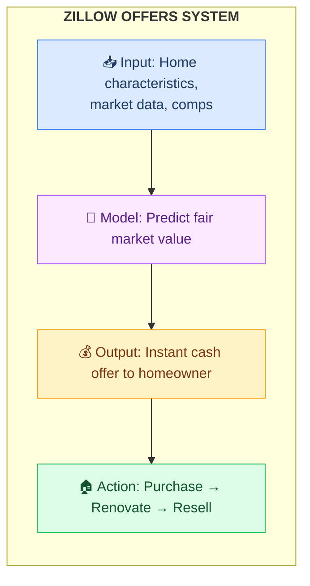
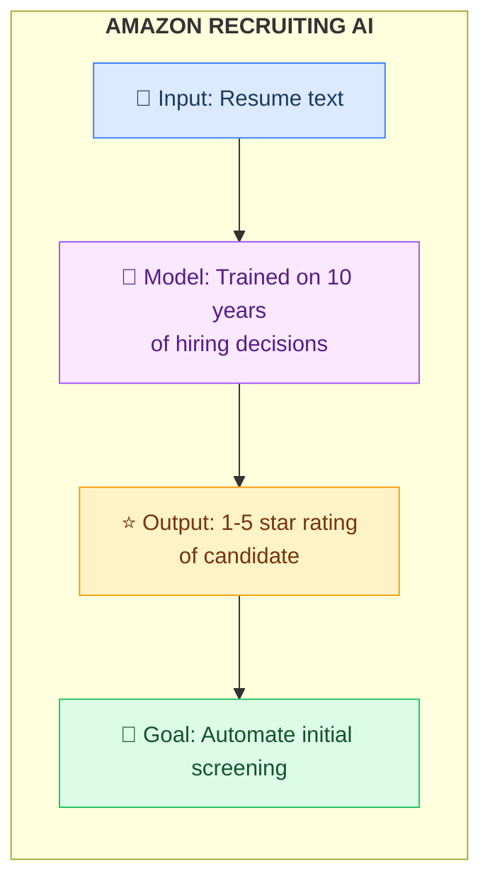
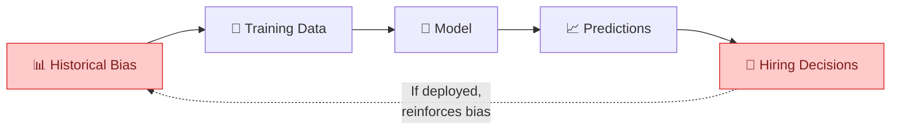
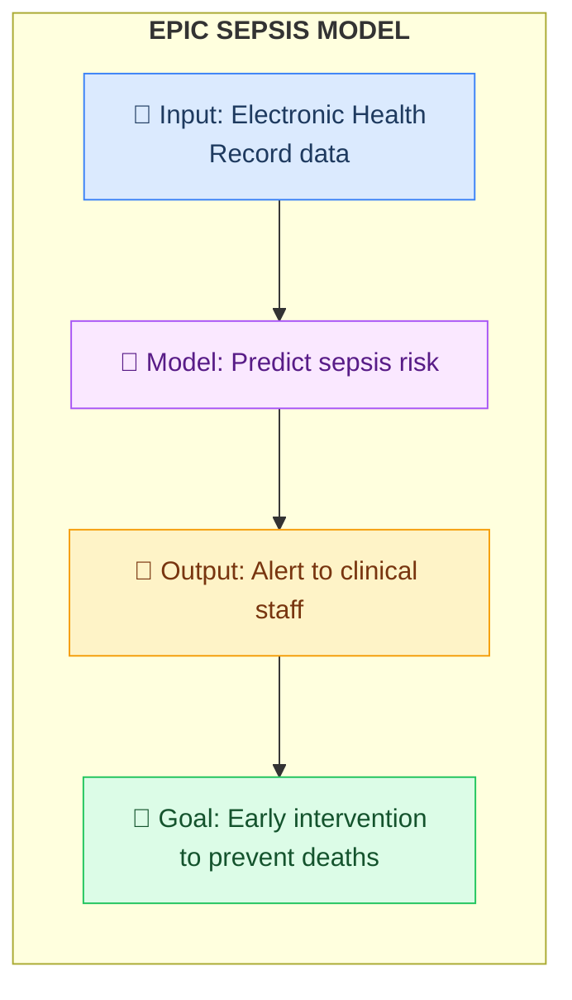
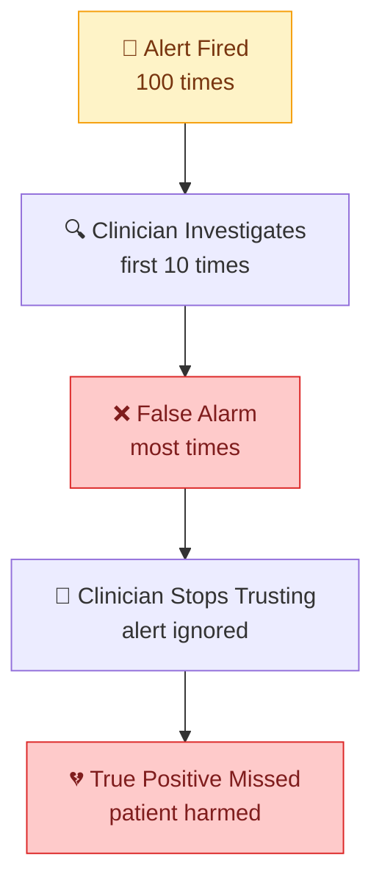
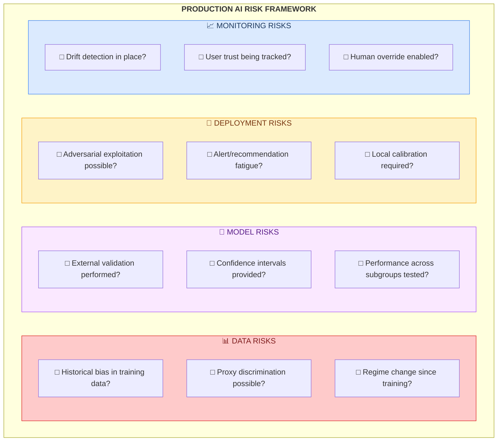

# AI Production Failure Case Studies

Detailed forensic analysis of high-profile AI failures with actionable lessons.

## Case Study Index

| Company | Year | Loss | Primary Failure Mode | Industry |
|---------|------|------|---------------------|----------|
| Zillow | 2021 | $500M+ | Adverse Selection + Drift | Real Estate |
| Amazon | 2018 | Reputational | Proxy Discrimination | HR Tech |
| Epic | 2021 | Clinical Harm | Generalization Failure | Healthcare |

---

## Case Study 1: Zillow Offers

### The $500M+ Algorithmic Trading Collapse

**Timeline**:
- 2018: Zillow launches iBuying program "Zillow Offers"
- 2021 Q3: Program acquiring homes faster than it can sell them
- November 2021: Division shut down, 25% workforce reduction
- Write-down: $500M+

### What Was the System?

Zillow's iBuying algorithm provided instant cash offers on homes:



### Root Cause Analysis

#### 1. Adverse Selection (The Lemon Problem)

**The Mechanism**:
- Model errors weren't random—they were systematically exploited
- Homeowners accepted overvalued offers
- Homeowners rejected undervalued offers
- Zillow systematically acquired "lemons"

**Economic Reality**:
```
When Model Overvalues:
  Seller thinks: "This is more than I expected! Accept immediately!"
  Result: Zillow buys at inflated price

When Model Undervalues:
  Seller thinks: "I can get more on the open market"
  Result: Zillow misses good deals
```

**Key Insight**: In two-sided markets, model errors are not symmetric. Counterparties exploit your mistakes.

#### 2. Regime Change Blindness

**Pre-COVID Training Data**:
- Stable, predictable market appreciation
- Historical patterns of supply and demand
- Seasonal adjustments well-understood

**Post-COVID Reality**:
- Unprecedented volatility
- Supply chain disruptions
- Remote work migration patterns
- Interest rate fluctuations

The model was optimized for a world that no longer existed.

#### 3. Algorithmic Hubris

**What Went Wrong**:
- Point estimates treated as truth
- No confidence intervals on predictions
- Tail risk ignored
- Human override insufficiently empowered

### Technical Failures

| Category | Failure | What Should Have Been Done |
|----------|---------|---------------------------|
| **Uncertainty** | Single price prediction | Prediction intervals with confidence levels |
| **Adversarial** | No game theory consideration | Model counterparty behavior |
| **Drift** | Static model in volatile market | Continuous retraining with drift detection |
| **Override** | Algorithms > human judgment | Clear escalation for edge cases |

### Prevention Checklist

- [ ] **Adversarial analysis**: How can counterparties exploit model errors?
- [ ] **Asymmetric costs**: Over-prediction vs. under-prediction have different consequences
- [ ] **Confidence intervals**: Never make high-stakes decisions on point estimates
- [ ] **Regime change detection**: Monitor for distribution shifts that invalidate assumptions
- [ ] **Human override protocols**: Clear path to override algorithmic decisions
- [ ] **Position limits**: Cap exposure to model-driven decisions

---

## Case Study 2: Amazon Recruiting AI

### Bias Amplification in Hiring

**Timeline**:
- 2014: Amazon begins developing AI recruiting tool
- 2015: Team realizes model penalizes women
- 2017: Project disbanded
- 2018: Reuters reports story publicly

### What Was the System?



### Root Cause Analysis

#### 1. Historical Bias in Training Data

**The Data Reflected Reality—A Biased Reality**:
- Training data: 10 years of Amazon hiring decisions
- Tech industry: Historically male-dominated
- The model learned: "Successful hires look like previous successful hires"
- Previous successful hires: Predominantly male

**The Feedback Loop**:


#### 2. Proxy Discrimination

**The Fix That Didn't Fix**:
- Team removed explicit gender indicators
- Model still discriminated
- Why? Proxy variables

**Proxy Variables Identified**:
| Removed | Proxy Variables Found | How They Correlate |
|---------|----------------------|-------------------|
| Gender | "women's chess club" | Activities with "women's" in name |
| Gender | College names | Women's colleges (Smith, Wellesley) |
| Gender | Writing style | Gendered language patterns |
| Gender | Extracurricular patterns | Different activity distributions |

**Key Insight**: In high-dimensional data, protected attributes can ALWAYS be reconstructed from other features.

### Technical Failures

| Category | Failure | What Should Have Been Done |
|----------|---------|---------------------------|
| **Data Audit** | Trained on biased historical data | Evaluate training data for historical bias |
| **Proxy Testing** | Assumed removing gender was sufficient | Test if protected attributes reconstructable |
| **Fairness Metrics** | No disparate impact analysis | Measure demographic parity, equalized odds |
| **Diverse Team** | No affected groups in development | Include people from evaluated groups |

### Prevention Checklist

- [ ] **Historical bias assessment**: Does training data reflect biased historical patterns?
- [ ] **Proxy variable audit**: Can protected attributes be reconstructed from allowed features?
- [ ] **Disparate impact testing**: Test for statistical disparities across demographic groups
- [ ] **Bias reconstruction testing**: Explicitly try to predict protected attributes
- [ ] **Diverse evaluation team**: Include affected groups in testing
- [ ] **Regular fairness audits**: Ongoing monitoring, not just pre-launch

---

## Case Study 3: Epic Sepsis Model

### When Clinical AI Fails Patients

**Timeline**:
- Epic develops sepsis prediction model
- Deployed widely across US hospitals
- 2021: External validation study published
- Finding: Model missed 67% of sepsis cases

### What Was the System?



### Root Cause Analysis

#### 1. Alert Fatigue

**The Numbers**:
- ~8 false alarms for every true positive
- Positive Predictive Value: ~12%
- Result: Clinicians learned to ignore the alerts

**The Psychology**:


#### 2. Overfitting to Source

**Internal Validation**:
- AUC: 0.76-0.83 (reported by Epic)
- Appeared to perform well

**External Validation**:
- AUC: As low as 0.63
- Different hospitals, different results

**Why?**:
- Model overfit to specific hospitals' coding practices
- Workflow differences between health systems
- Documentation patterns vary by institution
- EHR configuration differs by site

#### 3. COVID Regime Shift

**Pre-COVID Performance**:
- Model trained on historical sepsis patterns
- Certain symptoms → sepsis indicators

**During COVID**:
- Fever, respiratory distress, elevated inflammatory markers
- Same symptoms, different cause
- Model: 43% increase in sepsis alerts
- Reality: COVID, not sepsis

### Technical Failures

| Category | Failure | What Should Have Been Done |
|----------|---------|---------------------------|
| **Validation** | Internal only | External validation mandatory before deployment |
| **Metrics** | Sensitivity/Specificity | PPV in deployment context |
| **Workload** | Not considered | Alert fatigue assessment |
| **Calibration** | One-size-fits-all | Local site calibration |
| **Drift** | Static model | Regime change detection |

### Prevention Checklist

- [ ] **External validation mandatory**: Test outside development environment
- [ ] **PPV in context**: Calculate for actual deployment prevalence
- [ ] **Alert fatigue assessment**: Evaluate false positive burden on users
- [ ] **User trust tracking**: Monitor if recommendations are followed
- [ ] **Local calibration**: Adapt model to each deployment site
- [ ] **Regime change detection**: Monitor for environmental shifts

---

## Pattern Summary: Cross-Case Analysis

### Common Threads

| Pattern | Zillow | Amazon | Epic |
|---------|--------|--------|------|
| **Assumed IID Data** | ✓ | ✓ | ✓ |
| **No External Validation** | | | ✓ |
| **Historical Bias** | | ✓ | ✓ |
| **Regime Change** | ✓ | | ✓ |
| **Adversarial Dynamics** | ✓ | | |
| **Proxy Issues** | | ✓ | |
| **Alert/Recommendation Fatigue** | | | ✓ |
| **No Uncertainty Quantification** | ✓ | | |

### Universal Prevention Framework



---

## References

1. Parker, W., et al. "External validation of the Epic sepsis prediction model." JAMA Internal Medicine, 2021.
2. Dastin, J. "Amazon scraps secret AI recruiting tool that showed bias against women." Reuters, 2018.
3. Zillow Group Q3 2021 Earnings Report.
4. "Everyone wants to do the model work, not the data work." CHI 2021.

---

*Part of the [AI Production Readiness Checklist](../README.md) by [Pragmatic Logic AI](https://pragmaticlogic.ai)*
