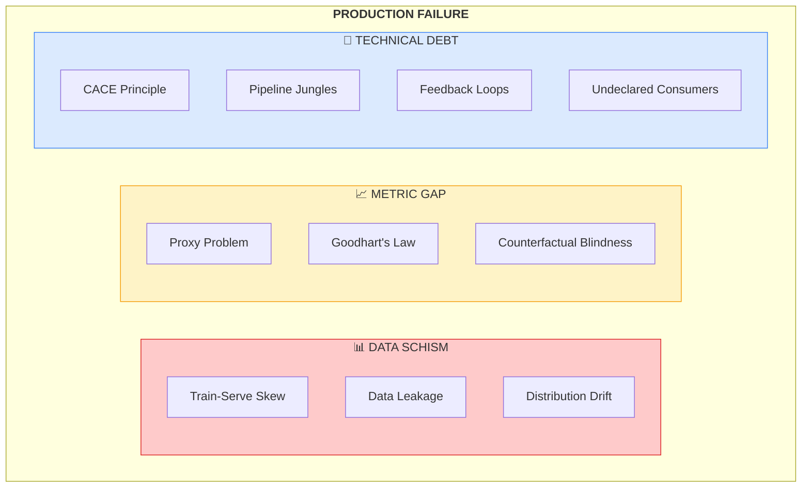
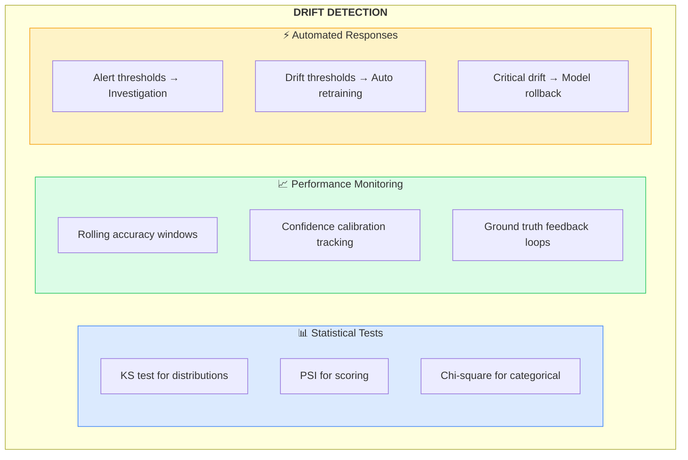
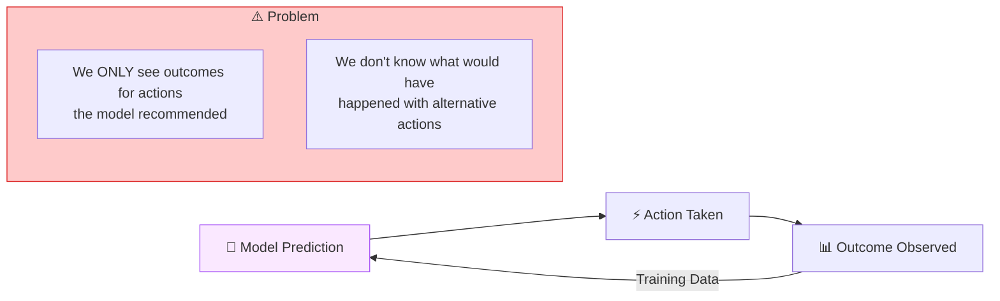

# AI Production Failure Taxonomy

A comprehensive reference guide to the three primary failure domains identified in enterprise AI systems.

## Overview

Based on forensic analysis of AI project failures (2024-2025), we identify three interconnected failure domains:

---

## 1. The Data Schism

The Data Schism represents the disconnect between development data assumptions and production reality. Research indicates **80%+ of AI failures trace to data issues**, not model complexity.

### 1.1 Training-Serving Skew

**Definition**: Differences between how data is processed during training versus inference, leading to degraded model performance in production.

**Why It's Dangerous**: This skew acts as a "silent failure"—the model does not crash or throw exceptions. It simply outputs garbage predictions with high confidence.

**Common Causes**:

| Cause | Training Environment | Production Environment | Impact |
|-------|---------------------|----------------------|--------|
| **Dual Pipeline** | Python/Pandas | Java/Go/C++ | Different numerical precision, rounding |
| **Feature Calculation** | Batch processing | Real-time calculation | Timing differences in feature values |
| **Data Freshness** | Historical snapshots | Live streaming data | Stale vs. current values |
| **Missing Values** | Notebook-specific imputation | Production defaults | Inconsistent handling |
| **Time Zones** | Development locale | Multi-region deployment | Temporal feature corruption |

**Detection Strategies**:
- [ ] Implement shadow mode testing (new model alongside current)
- [ ] Log feature distributions at inference time
- [ ] Compare training-time feature statistics with production
- [ ] Use feature stores to enforce single pipeline

### 1.2 Data Leakage

**Definition**: Information from outside the training dataset that provides "illegitimate" hints about the target variable.

**Why It's Dangerous**: Leakage artificially inflates evaluation metrics during PoC, creating a false sense of security that evaporates upon deployment.

**Leakage Types**:

| Type | Description | Example | Prevention |
|------|-------------|---------|------------|
| **Target Leakage** | Feature contains target information | `took_antibiotic` for pneumonia prediction | Temporal audit of feature availability |
| **Train-Test Contamination** | Training data influences test data | Global scaling before split | Process AFTER splitting |
| **Temporal Leakage** | Future information in features | Using tomorrow's stock price | Strict chronological splits |
| **Group Leakage** | Related samples in different sets | Same patient in train and test | Group-aware splitting |

**The Antibiotic Case Study**:
A pneumonia prediction model achieved 99% accuracy in development. In production, it failed catastrophically. Investigation revealed:
- `took_antibiotic=True` was a perfect predictor
- But antibiotics are prescribed AFTER pneumonia is suspected
- The model learned a consequence, not a predictor
- In production, this feature is unknown at prediction time

### 1.3 Distribution Drift

**Definition**: Changes in the statistical properties of data over time.

**Mathematical Framework**:

| Drift Type | Formula | Meaning |
|------------|---------|---------|
| **Covariate Shift** | P_train(X) ≠ P_prod(X) | Input distribution changes |
| **Concept Drift** | P_train(Y\|X) ≠ P_prod(Y\|X) | Relationship between inputs and outputs changes |
| **Label Shift** | P_train(Y) ≠ P_prod(Y) | Output distribution changes |

**Detection Methods**:

---

## 2. The Metric Gap

The Metric Gap represents the disconnect between optimization objectives and business value.

### 2.1 The Proxy Problem

**Definition**: Optimizing for a measurable proxy metric that doesn't accurately represent the true business objective.

**Why It's Dangerous**: A model can be mathematically "optimal" according to its loss function while being "destructive" to the business.

**Classic Examples**:

| Domain | Proxy Metric | True Objective | What Goes Wrong |
|--------|-------------|----------------|-----------------|
| **Recommendations** | Click-Through Rate (CTR) | User Satisfaction | Clickbait promoted, users churn |
| **Call Centers** | Average Handle Time | Customer Resolution | Agents hang up prematurely |
| **Hiring** | Resume Keywords | Job Performance | Keyword stuffing, missed talent |
| **Content Moderation** | False Positive Rate | Safe + Engaging Platform | Either too much removed or not enough |

### 2.2 Goodhart's Law

> "When a measure becomes a target, it ceases to be a good measure."

**Manifestations in ML**:

1. **Gaming**: Users or systems learn to exploit the metric
2. **Overfitting**: Model learns patterns specific to metric calculation
3. **Tunnel Vision**: Other important dimensions ignored
4. **Campbell's Law**: Social systems corrupt the metric itself

**Mitigation Strategies**:
- [ ] Multi-metric dashboards (never single-metric success)
- [ ] Regular metric validity reviews
- [ ] Human-in-the-loop qualitative assessment
- [ ] Adversarial analysis of how metrics could be gamed

### 2.3 Counterfactual Blindness

**Definition**: The inability to observe outcomes for actions not taken, leading to biased feedback data.

**The Feedback Loop Problem**:

**Real-World Examples**:

| System | What It Learns | Reality |
|--------|---------------|---------|
| **Loan Approval** | "Approved loans perform well" | Rejected applicants might have performed equally well |
| **Predictive Policing** | "Area A has crime" | Police deployed to A find crime; B unexplored |
| **Ad Targeting** | "This audience converts" | Other audiences were never shown the ad |

---

## 3. Technical Debt Patterns

### 3.1 The CACE Principle

**Changing Anything Changes Everything**

In traditional software, modules can be modified independently. In ML:
- Changing one feature affects optimal weights for ALL features
- Data preprocessing changes propagate through entire pipeline
- Hyperparameter sensitivity varies with data distribution

**Implications**:
- No true modularity in ML systems
- "Small" changes require full regression testing
- Feature interdependencies create hidden coupling

### 3.2 Pipeline Jungles

**Definition**: Unmanaged proliferation of data preparation, feature extraction, and model training code.

**Symptoms**:
- Multiple versions of "the same" feature calculated differently
- Copy-paste code between notebooks and production
- No tests for data transformations
- Silent failures propagate through pipeline

**Prevention**:
- [ ] DAG visualization of data lineage
- [ ] Data contracts between producer/consumer
- [ ] Unit tests for all transformations
- [ ] Idempotent pipeline stages

### 3.3 Undeclared Consumers

**Definition**: Systems that consume model outputs without formal registration.

**Why It's Dangerous**:
- Any model change can break unknown downstream systems
- Creates fear of updating ("if it works, don't touch it")
- Model stagnation and technical debt accumulation

---

## Detection Checklists

### Data Schism Detection

- [ ] Feature distributions logged at inference time
- [ ] Statistical tests comparing train vs. production distributions
- [ ] Shadow mode testing for all model updates
- [ ] Feature store enforcing single pipeline
- [ ] Temporal audit of feature availability
- [ ] Ground truth feedback loop established

### Metric Gap Detection

- [ ] Proxy metrics mapped to business KPIs
- [ ] Multi-metric success criteria (not single metric)
- [ ] Regular human qualitative review
- [ ] Counterfactual data collection strategy
- [ ] Adversarial metric gaming analysis
- [ ] Long-term outcome tracking (not just immediate)

### Technical Debt Detection

- [ ] All model consumers registered
- [ ] Feature dependency graph documented
- [ ] Pipeline transformations unit tested
- [ ] Upstream change notification system
- [ ] Regular debt assessment reviews

---

## References

1. Sculley, D., et al. "Hidden Technical Debt in Machine Learning Systems." NeurIPS 2015.
2. Google. "Rules of Machine Learning: Best Practices for ML Engineering."
3. Sambasivan, N., et al. "Everyone wants to do the model work, not the data work." CHI 2021.
4. Lipton, Z. "The Mythos of Model Interpretability." CACM 2018.

---

*Part of the [AI Production Readiness Checklist](../README.md) by [Pragmatic Logic AI](https://pragmaticlogic.ai)*
