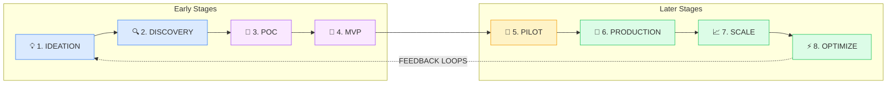

# AI Production Lifecycle Stages Guide

A comprehensive guide to the 8-stage AI production lifecycle with gate requirements, checklists, and FDA regulatory overlay for healthcare AI.

## Overview

Based on industry frameworks (CRISP-DM, Google MLOps, Microsoft TDSP, Gartner AI Maturity) and production experience, this guide defines a structured stage-gate approach for AI projects.

**Key Statistics:**
- Only 54% of AI projects transition from pilot to production (Gartner)
- Only 11% of companies truly unlock significant AI value (BCG)
- Only 1 in 5 AI initiatives achieve ROI (Gartner)

A structured stage-gate approach dramatically improves these odds.

---

## The 8-Stage Model

---

## Stage 1: Ideation

**Purpose:** Define the opportunity and align stakeholders

**Duration:** 1-2 weeks

**Key Activities:**
- [ ] Identify business problem or opportunity
- [ ] Define use case scope and boundaries
- [ ] Establish success metrics and KPIs
- [ ] Identify stakeholders and get buy-in
- [ ] Initial resource estimate
- [ ] Risk identification (high-level)

**Gate 1 Requirements:**

| Type | Item | Rationale |
|------|------|-----------|
| 🔴 Mandatory | Business case documented | Can't proceed without clear purpose |
| 🔴 Mandatory | Executive sponsor identified | Need decision-making authority |
| 🟡 Advisory | Success metrics defined | Important but can refine later |
| 🟢 Configurable | Competitive analysis | Depends on market context |

**Exit Criteria:** Business approval to proceed

---

## Stage 2: Discovery

**Purpose:** Assess technical and business feasibility

**Duration:** 2-4 weeks

**Key Activities:**
- [ ] Data availability assessment
- [ ] Data quality evaluation
- [ ] Technical feasibility analysis
- [ ] Risk assessment (detailed)
- [ ] Resource planning (team, compute, budget)
- [ ] Vendor/build evaluation
- [ ] Regulatory requirements identification

**Gate 2 Requirements:**

| Type | Item | Rationale |
|------|------|-----------|
| 🔴 Mandatory | Data availability confirmed | Can't build AI without data |
| 🔴 Mandatory | Privacy/compliance requirements identified | Legal risk if missed |
| 🟡 Advisory | Technical feasibility assessed | May need POC to fully evaluate |
| 🟡 Advisory | Risk assessment documented | Reduces surprises later |
| 🟢 Configurable | Third-party vendor evaluation | Depends on build vs. buy decision |

**Exit Criteria:** Go/No-Go decision made

---

## Stage 3: POC (Proof of Concept)

**Purpose:** Prove technical viability

**Duration:** 2-6 weeks

**Key Activities:**
- [ ] Core algorithm development
- [ ] Initial model training
- [ ] Basic validation against requirements
- [ ] Performance benchmarking
- [ ] Architecture decisions
- [ ] Initial cost estimation

**Gate 3 Requirements:**

| Type | Item | Rationale |
|------|------|-----------|
| 🔴 Mandatory | Core algorithm validated | Technical proof required |
| 🟡 Advisory | Accuracy targets achievable | Can refine in MVP |
| 🟡 Advisory | Architecture documented | Important for MVP planning |
| 🟢 Configurable | Benchmark comparison | Depends on competitive context |

**Exit Criteria:** Technical viability proven

---

## Stage 4: MVP (Minimum Viable Product)

**Purpose:** Build working prototype with basic functionality

**Duration:** 4-8 weeks

**Key Activities:**
- [ ] Functional prototype development
- [ ] Basic UI/UX implementation
- [ ] Integration with data sources
- [ ] Internal testing and validation
- [ ] Documentation (initial)
- [ ] Demo preparation

**Gate 4 Requirements:**

| Type | Item | Rationale |
|------|------|-----------|
| 🔴 Mandatory | Functional prototype complete | Need working product |
| 🔴 Mandatory | Basic safety checks passed | Can't deploy unsafe product |
| 🟡 Advisory | Integration tested | Reduce pilot issues |
| 🟢 Configurable | UI/UX polish | Depends on pilot context |

**Exit Criteria:** Demo-ready prototype

---

## Stage 5: Pilot

**Purpose:** Validate in real-world conditions with limited users

**Duration:** 4-12 weeks

**Key Activities:**
- [ ] Limited user deployment
- [ ] Feedback collection and analysis
- [ ] Safety validation (extensive)
- [ ] Performance monitoring
- [ ] Iteration based on feedback
- [ ] User acceptance testing

**Gate 5 Requirements (CRITICAL GATE):**

| Type | Item | Rationale |
|------|------|-----------|
| 🔴 Mandatory | Safety validation complete | User safety is non-negotiable |
| 🔴 Mandatory | Security review passed | Legal liability |
| 🔴 Mandatory | Data privacy compliance verified | GDPR/HIPAA fines |
| 🔴 Mandatory | Crisis detection tested (Healthcare) | Potential for fatal harm |
| 🟡 Advisory | User feedback incorporated | Improves adoption |
| 🟡 Advisory | Performance meets requirements | May need optimization in production |
| 🟢 Configurable | A/B testing complete | Critical for consumer, optional for enterprise |

**Exit Criteria:** Safe and effective for users

---

## Stage 6: Production

**Purpose:** Deploy to all users with full operational support

**Duration:** 2-4 weeks

**Key Activities:**
- [ ] Full deployment
- [ ] MLOps pipeline implementation
- [ ] Monitoring setup
- [ ] Alerting configuration
- [ ] Governance implementation
- [ ] Team training
- [ ] Runbook creation

**Gate 6 Requirements:**

| Type | Item | Rationale |
|------|------|-----------|
| 🔴 Mandatory | Monitoring operational | Can't fix what you can't see |
| 🔴 Mandatory | Rollback procedure tested | Need escape hatch |
| 🔴 Mandatory | On-call rotation established | 24/7 support needed |
| 🟡 Advisory | Runbooks complete | Important for incident response |
| 🟢 Configurable | Blue-green deployment | Depends on infrastructure |

**Exit Criteria:** Live and stable

---

## Stage 7: Scale

**Purpose:** Expand reach and optimize capacity

**Duration:** Ongoing

**Key Activities:**
- [ ] Multi-region deployment (if needed)
- [ ] Performance optimization
- [ ] Cost optimization
- [ ] Team scaling
- [ ] Process refinement

**Gate 7 Requirements:**

| Type | Item | Rationale |
|------|------|-----------|
| 🔴 Mandatory | SLAs defined and met | Customer commitments |
| 🟡 Advisory | Cost optimization reviewed | Important for ROI |
| 🟢 Configurable | Multi-region deployment | Depends on user distribution |

**Exit Criteria:** Meeting SLAs at scale

---

## Stage 8: Optimize

**Purpose:** Continuous improvement and innovation

**Duration:** Ongoing

**Key Activities:**
- [ ] Model retraining (scheduled or triggered)
- [ ] Drift monitoring and response
- [ ] Feature enhancement
- [ ] Technical debt reduction
- [ ] Innovation exploration

**Gate 8 Requirements:**

| Type | Item | Rationale |
|------|------|-----------|
| 🔴 Mandatory | Drift detection operational | Model degradation prevention |
| 🟡 Advisory | Retraining pipeline automated | Efficiency improvement |
| 🟢 Configurable | Innovation budget allocated | Depends on strategy |

**Exit Criteria:** Sustained ROI achieved

---

## Healthcare AI: FDA Regulatory Overlay

When building Healthcare AI (SaMD - Software as Medical Device), enable this overlay to add FDA-specific requirements at each stage.

### Overlay Stages

| Standard Stage | FDA Addition | Additional Requirements |
|----------------|--------------|------------------------|
| Stage 2: Discovery | + Regulatory Pathway Assessment | Determine 510(k), De Novo, or PMA |
| Stage 3: POC | + Pre-Submission Meeting | FDA feedback on approach |
| Stage 4: MVP | + Analytical Validation | Technical performance verification |
| Stage 5: Pilot | + Clinical Validation | Real-world clinical testing |
| Stage 5→6 Gate | + Regulatory Submission | Submit to FDA |
| Stage 6: Production | + Market Authorization | FDA clearance/approval |
| Stage 8: Optimize | + Post-Market Surveillance | Ongoing safety monitoring |

### FDA-Specific Gate Requirements (All Mandatory)

**Gate 2 (Discovery):**
- [ ] Intended use clearly defined
- [ ] Risk classification determined (Class I, II, or III)
- [ ] Regulatory pathway identified (510(k), De Novo, PMA)
- [ ] Predicate device identified (for 510(k))

**Gate 4 (MVP):**
- [ ] Analytical validation complete
- [ ] Technical performance documented
- [ ] Software documentation per FDA guidance

**Gate 5 (Pilot):**
- [ ] Clinical validation complete
- [ ] Clinical evidence sufficient for risk level
- [ ] Human factors testing complete
- [ ] Labeling and IFU drafted

**Gate 5→6 (Pre-Production):**
- [ ] Regulatory submission prepared
- [ ] Quality Management System (QMS) established
- [ ] Design history file complete
- [ ] Risk management file complete

**Gate 6 (Production):**
- [ ] FDA clearance/approval received
- [ ] Post-market surveillance plan documented
- [ ] Adverse event reporting system in place
- [ ] Complaint handling process established

---

## Checklist Items by Stage

### Stage Distribution Guidelines

| Section | Stage 1-2 | Stage 3-4 | Stage 5 | Stage 6 | Stage 7-8 |
|---------|-----------|-----------|---------|---------|-----------|
| Architecture & Design | 30% | 50% | 10% | 10% | - |
| Data Quality | 20% | 40% | 20% | 10% | 10% |
| Security & Compliance | 10% | 20% | 30% | 30% | 10% |
| Safety & Ethics | 10% | 20% | 40% | 20% | 10% |
| Monitoring | - | 20% | 30% | 30% | 20% |
| Operations | - | 10% | 20% | 40% | 30% |
| Governance | 20% | 20% | 20% | 30% | 10% |
| Healthcare AI | 10% | 20% | 40% | 20% | 10% |

---

## Timeline Recommendations

| Scenario | Total Duration | Notes |
|----------|---------------|-------|
| Simple internal tool | 3-6 months | POC to Production |
| Consumer AI application | 6-12 months | Requires extensive pilot |
| Enterprise AI platform | 9-18 months | Complex integration |
| Healthcare AI (FDA regulated) | 18-36 months | Regulatory pathway adds time |
| Mental health AI | 12-24 months | Extra safety validation |

---

## Anti-Patterns to Avoid

### Skipping Stages

**Problem:** Rushing from Ideation to Production
**Consequence:** 87% failure rate, wasted investment
**Solution:** Follow the stage-gate process

### Gate-Crashing

**Problem:** Proceeding without meeting mandatory gate requirements
**Consequence:** Safety incidents, regulatory fines, lawsuits
**Solution:** Enforce mandatory gates, document exceptions

### Pilot Fatigue

**Problem:** Too many pilots, none reaching production
**Consequence:** Wasted resources, organizational cynicism
**Solution:** Clear criteria for pilot success, committed path to production

### Premature Scaling

**Problem:** Scaling before stability in production
**Consequence:** Cascading failures, support overwhelm
**Solution:** 30+ day stability requirement before scaling

---

## References

- [Google MLOps: Continuous delivery and automation pipelines](https://cloud.google.com/architecture/mlops-continuous-delivery-and-automation-pipelines-in-machine-learning)
- [Microsoft MLOps Maturity Model](https://learn.microsoft.com/en-us/azure/architecture/ai-ml/guide/mlops-maturity-model)
- [Gartner AI Roadmap](https://www.gartner.com/en/articles/ai-roadmap)
- [CRISP-DM Framework](https://www.datascience-pm.com/crisp-dm-2/)
- [FDA AI/ML SaMD Guidance](https://www.fda.gov/medical-devices/software-medical-device-samd/artificial-intelligence-software-medical-device)

---

*Part of the [AI Production Readiness Checklist](../README.md) by [Pragmatic Logic AI](https://pragmaticlogic.ai)*
