# AI Technology Selection Guide

A comprehensive guide to selecting RAG patterns, agent architectures, protocols, frameworks, and models for production AI systems. Based on Google's 76-page AI Agents whitepaper, Anthropic's MCP documentation, and production engineer comparisons from 2024-2025.

## Overview

Technology selection is one of the highest-impact decisions in AI projects. Poor choices lead to:
- 2-3x cost overruns
- 6-12 month delays from re-architecture
- Technical debt that blocks scaling
- Lock-in that limits future options

This guide provides decision frameworks to make informed choices at each layer of your AI stack.

---

## RAG Pattern Selection

### Decision Tree

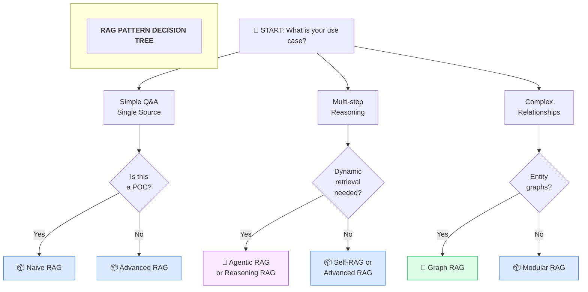

### Pattern Details

#### 1. Naive RAG

**When to Use:**
- Prototypes and POCs
- Single document source
- Simple factual Q&A
- Budget-constrained projects
- Timeline < 2 weeks

**When NOT to Use:**
- Multi-step reasoning required
- Complex or ambiguous queries
- Multiple conflicting sources
- High accuracy requirements

**Architecture:**
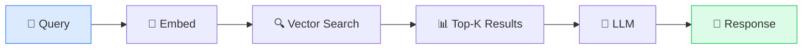

**Cost Profile:** $
- Simple to implement
- Minimal infrastructure
- Single embedding model

**Case Study: Internal Documentation Bot**
> A startup built a Naive RAG system for their 50-page product documentation. It worked well for "What are the pricing tiers?" but failed on "How does feature X compare to competitor Y?" due to inability to synthesize across sections.

---

#### 2. Advanced RAG

**When to Use:**
- Production systems needing better accuracy
- Multiple document sources
- Need for reranking results
- Hybrid search (semantic + keyword)
- Stage: MVP/Pilot

**When NOT to Use:**
- Simple use cases (overkill)
- Very low latency requirements (<100ms)
- Budget doesn't allow for reranker costs

**Architecture:**
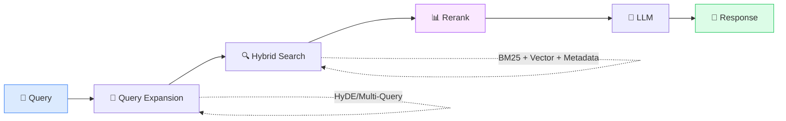

**Key Components:**
- [ ] Query preprocessing (expansion, clarification)
- [ ] Hybrid search (vector + BM25 + metadata filters)
- [ ] Reranker model (Cohere, ColBERT, BGE)
- [ ] Context window optimization

**Cost Profile:** $$
- Reranker adds latency and cost
- Better ROI from improved accuracy

---

#### 3. Self-RAG

**When to Use:**
- Model should decide when to retrieve
- Variable retrieval needs per query
- Self-correction on retrieved context
- Stage: Pilot

**When NOT to Use:**
- Static retrieval patterns are sufficient
- Predictable query types
- Latency-sensitive applications

**Architecture:**
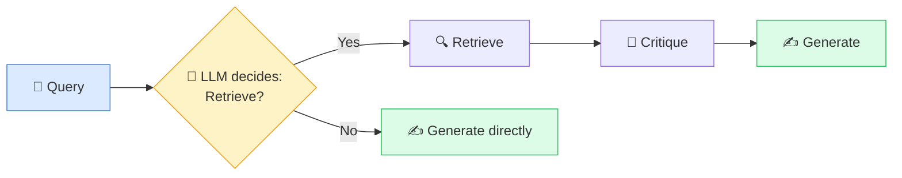

**Key Innovation:** Model learns to:
1. Decide IF retrieval is needed
2. Critique retrieved documents
3. Self-correct generations

**Research:** Based on [2024 Self-RAG paper](https://arxiv.org/abs/2310.11511)

**Cost Profile:** $$$
- Fine-tuning required
- Multiple LLM calls per query

---

#### 4. Modular RAG

**When to Use:**
- Custom pipelines needed
- Domain-specific requirements
- Complex preprocessing
- Stage: Production

**When NOT to Use:**
- Quick prototypes
- Standard use cases
- Small teams

**Architecture:**
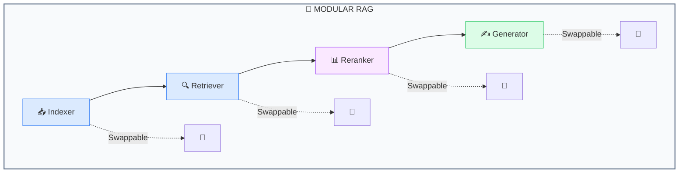

**Benefits:**
- Each component independently optimizable
- Easy A/B testing
- Vendor flexibility
- Incremental upgrades

**Cost Profile:** $$-$$$
- Higher engineering investment
- Lower long-term maintenance

---

#### 5. Graph RAG

**When to Use:**
- Knowledge graphs available
- Entity relationships matter
- Complex reasoning chains
- Compliance/audit trails needed
- Stage: Production

**When NOT to Use:**
- Unstructured text only
- Simple retrieval sufficient
- No graph expertise on team

**Architecture:**
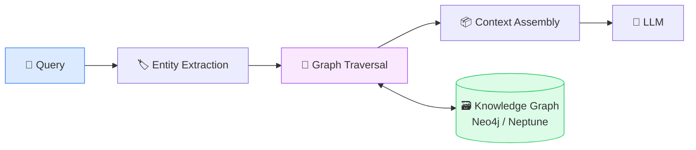

**Use Cases:**
- Legal document analysis (entity relationships)
- Medical diagnosis (symptom-condition graphs)
- Financial compliance (transaction networks)

**Case Study: Microsoft Research Graph RAG**
> Microsoft's Graph RAG approach improved summarization quality by 30% on complex documents by first building a hierarchical community structure, then using this structure for query-focused summarization.

**Cost Profile:** $$$$
- Graph database infrastructure
- Entity extraction pipeline
- Graph maintenance

---

#### 6. Agentic RAG

**When to Use:**
- Dynamic retrieval decisions
- Tool use required
- Multi-step reasoning
- Complex workflows
- Stage: Production/Scale

**When NOT to Use:**
- Static Q&A sufficient
- Simple lookups
- Latency-critical (<500ms)

**Architecture:**
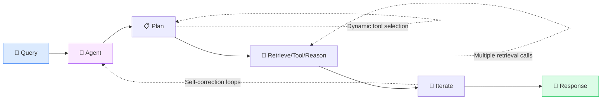

**Key Patterns (from Google Whitepaper):**
1. **ReAct Pattern:** Reasoning + Acting interleaved
2. **Plan-and-Execute:** Generate plan, then execute steps
3. **Reflection:** Critique and improve outputs

**Cost Profile:** $$$$
- Multiple LLM calls per query
- Tool infrastructure
- Orchestration complexity

---

#### 7. Reasoning RAG

**When to Use:**
- System 2 thinking required
- Complex industry challenges
- Chain-of-thought needed
- Stage: Scale

**When NOT to Use:**
- Simple factual queries
- Speed is priority
- Budget constraints

**Architecture:**
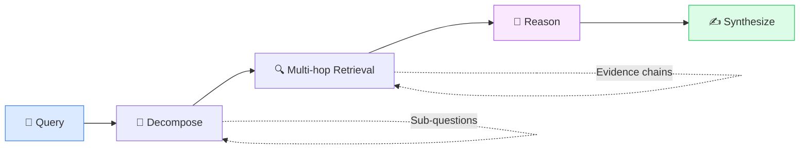

**Research:** Based on [2025 Reasoning RAG Survey](https://arxiv.org/html/2506.10408v1)

**Cost Profile:** $$$$$
- Highest latency
- Most expensive per query
- Best for high-value decisions

---

### RAG Pattern Comparison Matrix

| Pattern | Accuracy | Latency | Cost | Complexity | Best Stage |
|---------|----------|---------|------|------------|------------|
| Naive RAG | Low-Med | Low | $ | Low | POC |
| Advanced RAG | Medium | Medium | $$ | Medium | MVP/Pilot |
| Self-RAG | Med-High | High | $$$ | High | Pilot |
| Modular RAG | High | Medium | $$-$$$ | High | Production |
| Graph RAG | High | Medium | $$$$ | Very High | Production |
| Agentic RAG | Very High | High | $$$$ | Very High | Production/Scale |
| Reasoning RAG | Highest | Very High | $$$$$ | Highest | Scale |

---

### Production RAG Best Practices

Based on Google ICLR 2025 research:

**Critical Finding:** RAG paradoxically reduces a model's ability to abstain when appropriate—additional context increases confidence and can lead to more hallucination.

**Mitigation Checklist:**
- [ ] Implement sufficiency check before generation
- [ ] Tune abstention threshold with confidence signals
- [ ] Add "I don't know" as valid retrieval outcome
- [ ] Monitor hallucination rate vs. retrieval volume
- [ ] Test with adversarial queries (questions with no good answer in corpus)

**Additional Best Practices:**
- [ ] Hybrid search (vector + keyword) implemented
- [ ] Streaming data ingestion for real-time updates
- [ ] Chunk size optimized for your domain
- [ ] Metadata filters for improved relevance
- [ ] Evaluation pipeline with human-in-the-loop

---

## Agent Architecture Selection

### Google Whitepaper Patterns

From Google's 76-page AI Agents whitepaper, these patterns represent production-tested architectures.

### Decision Tree

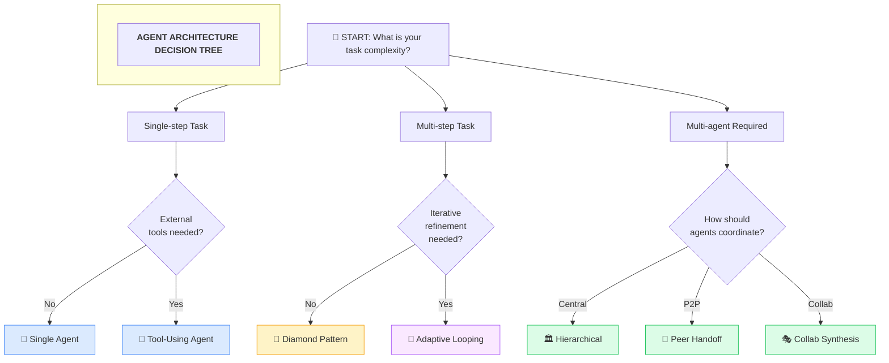

### Pattern Details

#### 1. Single Agent

**Complexity:** Low

**When to Use:**
- Simple, well-defined tasks
- Clear success criteria
- No external dependencies
- Conversational assistants

**Architecture:**
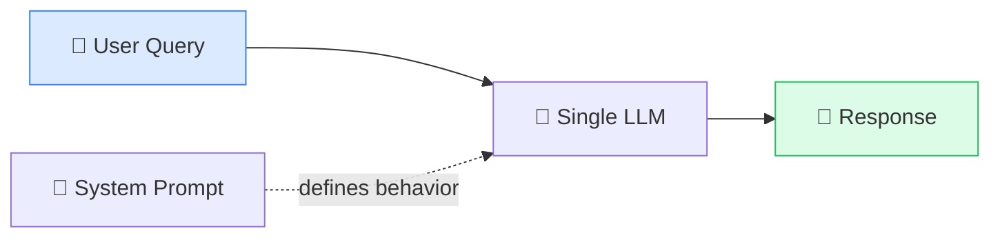

**Cost:** $
**Latency:** Low

---

#### 2. Tool-Using Agent

**Complexity:** Medium

**When to Use:**
- External API calls required
- Calculations or data lookup
- Web search integration
- Database queries

**Architecture:**
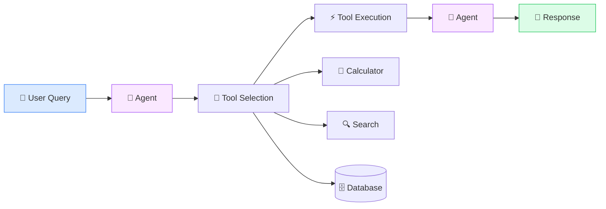

**Google Use Case:** Navigation, search, structured data retrieval

**Cost:** $$
**Latency:** Medium

---

#### 3. Hierarchical Orchestration

**Complexity:** High

**When to Use:**
- Central routing to domain experts
- Clear domain boundaries
- Predictable routing logic
- Enterprise systems

**Architecture:**
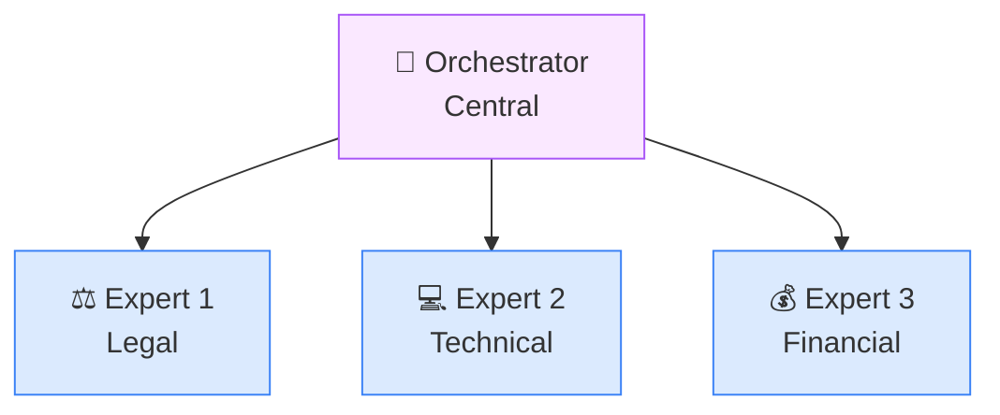

**Google Use Case:** Connected vehicle system with separate agents for navigation, entertainment, climate control.

**Cost:** $$$
**Latency:** Medium-High

---

#### 4. Diamond Pattern

**Complexity:** High

**When to Use:**
- Post-hoc moderation required
- Content safety critical
- Compliance verification
- High-risk outputs

**Architecture:**
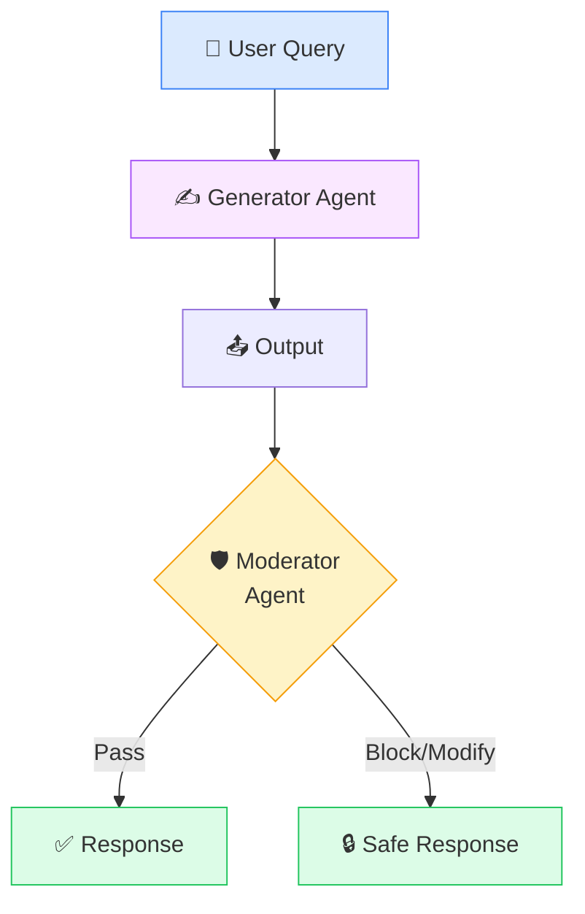

**Google Use Case:** Content safety, preventing harmful outputs

**Cost:** $$$
**Latency:** High (double LLM calls)

---

#### 5. Peer-to-Peer Handoff

**Complexity:** High

**When to Use:**
- Autonomous query rerouting
- User support flows
- Conversation requires context transfer
- No central controller

**Architecture:**
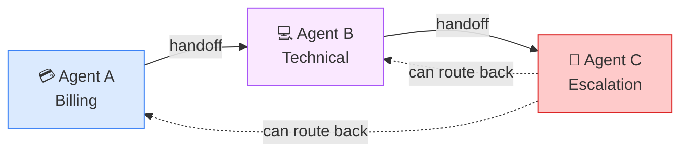

**Google Use Case:** User support flows with seamless topic transitions

**Cost:** $$-$$$
**Latency:** Variable

---

#### 6. Collaborative Synthesis

**Complexity:** Very High

**When to Use:**
- Multiple agents contribute to single response
- Diverse perspectives needed
- Response mixing/merging
- Research synthesis

**Architecture:**
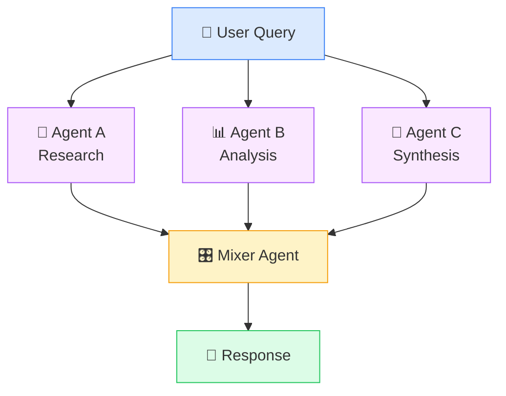

**Google Use Case:** Response mixer pattern for comprehensive answers

**Cost:** $$$$
**Latency:** High

---

#### 7. Adaptive Looping

**Complexity:** Very High

**When to Use:**
- Iterative refinement needed
- Quality thresholds must be met
- Complex reasoning chains
- Self-improvement required

**Architecture:**
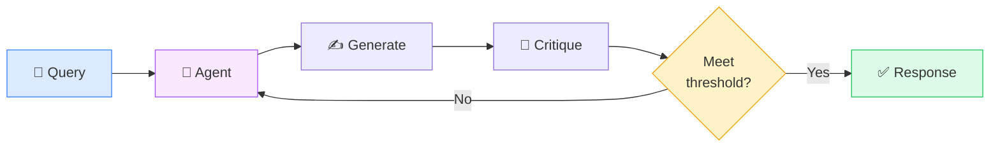

**Google Use Case:** Complex reasoning tasks requiring iteration

**Cost:** $$$$ (multiple iterations)
**Latency:** Very High

---

### Agent Decision Checklist

Before selecting an architecture:

- [ ] Task complexity assessed (single-step vs. multi-step)
- [ ] Human-in-the-loop requirements documented
- [ ] Error tolerance and fallback strategy defined
- [ ] Coordination overhead budget set
- [ ] Latency requirements determined
- [ ] Safety pattern selected (Diamond for moderation)
- [ ] Observability requirements defined
- [ ] Testing strategy planned

---

## Protocol Selection

### The MCP Era (2025)

MCP (Model Context Protocol) has emerged as the industry standard for AI tool integration.

**Adoption Timeline:**
- Nov 2024: Anthropic releases MCP
- Mar 2025: OpenAI adopts MCP
- Apr 2025: Google DeepMind adopts MCP
- Apr 2025: Microsoft Azure integrates MCP

### Protocol Comparison

| Protocol | Best For | Adoption | Security Notes |
|----------|----------|----------|----------------|
| **MCP** | Tool integration, data connectors | Industry standard (2025) | Review prompt injection risks |
| **A2A** | Multi-agent communication | Google standard | Enterprise MAS |
| **OpenAI Agents SDK** | OpenAI ecosystem | Growing | Native tool use |
| **Custom REST/gRPC** | Full control, legacy systems | Stable | Existing infrastructure |

### MCP Deep Dive

**Production Benefits (Anthropic 2025):**
- Code execution: **98.7% token reduction** in complex workflows
- API handles connection management, tool discovery, error handling
- Pre-built servers: Google Drive, Slack, GitHub, Postgres, Puppeteer

**When to Use MCP:**
- Greenfield projects
- Multi-tool integration
- Cross-vendor AI systems
- Rapid prototyping

**When to Use Custom:**
- Legacy system integration
- Proprietary protocols
- Ultra-low latency requirements
- Regulated environments with custom security

**MCP Security Checklist:**
- [ ] Prompt injection risks assessed
- [ ] Tool permissions scoped minimally
- [ ] Input validation on tool parameters
- [ ] Output sanitization implemented
- [ ] Audit logging enabled
- [ ] Rate limiting configured

---

## Framework Selection

### Production Engineer Comparison

Based on real-world production deployments and engineer feedback.

### Decision Matrix

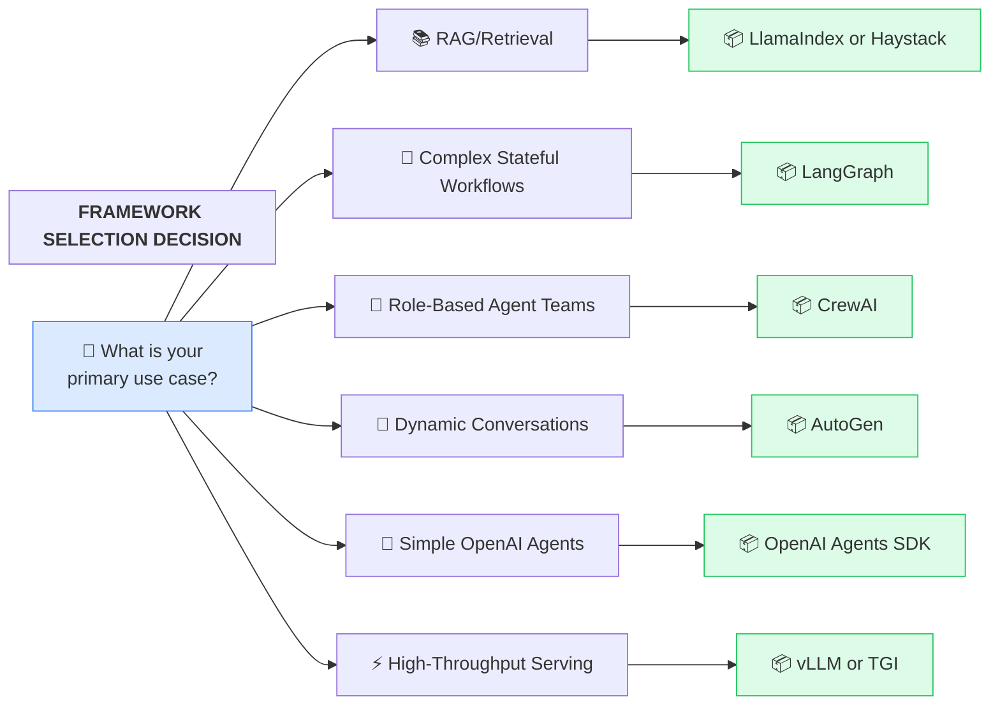

### Framework Details

#### LangGraph

**Best For:** Stateful workflows, complex graphs, replay/rollback

**Learning Curve:** Steep

**Production Readiness:** High

**Strengths:**
- Powerful state machine abstraction
- Visual debugging tools
- Checkpoint and replay
- Branching logic

**Weaknesses:**
- Steep learning curve
- Verbose for simple cases
- LangChain ecosystem dependency

**Use When:**
- Complex multi-step workflows
- Need for visual debugging
- State persistence required
- Conditional branching heavy

---

#### CrewAI

**Best For:** Role-based teams, rapid prototyping

**Learning Curve:** Easy

**Production Readiness:** Medium

**Strengths:**
- Intuitive role-based model
- Fastest time to prototype
- Good documentation
- Active community

**Weaknesses:**
- Less control over execution
- Limited customization
- Scaling challenges

**Use When:**
- Defined role delegation
- Quick prototypes
- Team simulation
- Clear task division

---

#### AutoGen

**Best For:** Dynamic conversations, Azure ecosystem

**Learning Curve:** Medium

**Production Readiness:** High

**Strengths:**
- Microsoft backing
- Azure integration
- Conversation-first design
- Enterprise features

**Weaknesses:**
- Opinionated architecture
- Microsoft ecosystem bias

**Use When:**
- Enterprise environments
- Microsoft/Azure stack
- Dynamic conversations
- Need corporate support

---

#### LlamaIndex

**Best For:** RAG, document Q&A

**Learning Curve:** Easy

**Production Readiness:** High

**Strengths:**
- Best-in-class RAG
- Data connector ecosystem
- Easy to start
- Good abstractions

**Weaknesses:**
- RAG-focused (less general)
- Agent features less mature

**Use When:**
- RAG is primary use case
- Document ingestion focus
- Knowledge bases

---

#### Haystack

**Best For:** Production RAG pipelines

**Learning Curve:** Medium

**Production Readiness:** Very High

**Strengths:**
- Production-focused
- Self-hosted friendly
- Pipeline abstraction
- Enterprise features

**Weaknesses:**
- Less flexible than LangGraph
- Smaller community

**Use When:**
- Enterprise RAG
- Self-hosted requirements
- Production-first mindset

---

#### vLLM

**Best For:** High-throughput inference

**Learning Curve:** Medium

**Production Readiness:** Very High

**Strengths:**
- PagedAttention for efficiency
- Continuous batching
- High throughput
- Memory efficient

**Weaknesses:**
- Serving-focused only
- Limited model support

**Use When:**
- Serving at scale
- Throughput critical
- Cost optimization needed

---

### Framework Comparison Matrix

| Framework | Learning Curve | Production Ready | RAG | Agents | Serving |
|-----------|---------------|------------------|-----|--------|---------|
| LangGraph | Steep | High | ✓ | ✓✓✓ | - |
| CrewAI | Easy | Medium | ✓ | ✓✓ | - |
| AutoGen | Medium | High | ✓ | ✓✓ | - |
| LlamaIndex | Easy | High | ✓✓✓ | ✓ | - |
| Haystack | Medium | Very High | ✓✓✓ | ✓ | - |
| vLLM | Medium | Very High | - | - | ✓✓✓ |
| TGI | Easy | High | - | - | ✓✓ |

---

## Model Selection Guide

### 2025 Landscape

The model landscape has shifted dramatically:
- **Commoditization:** GPT-4 class capabilities now available from multiple providers
- **Small-but-mighty:** Efficient models matching large model quality
- **Open source parity:** DeepSeek-V3, Qwen3 matching proprietary models
- **Multimodal:** Vision capabilities becoming standard

### Selection Decision Tree

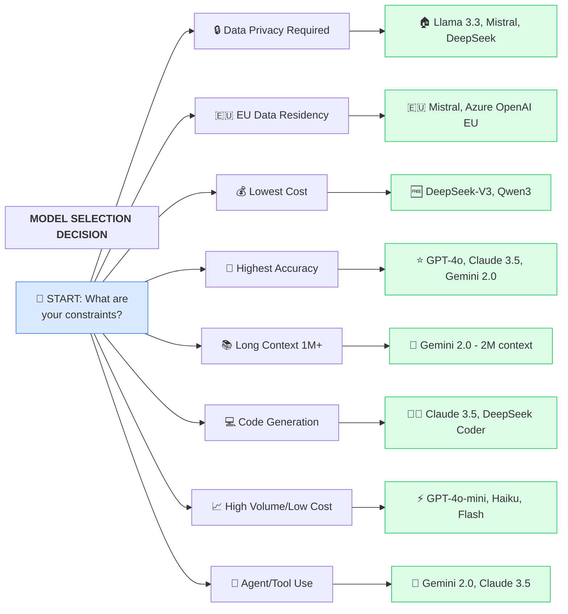

### Model Comparison by Use Case

| Use Case | Top Models (2025) | Open-Source Alternative | Notes |
|----------|-------------------|------------------------|-------|
| **Complex reasoning** | GPT-4o, Claude 3.5 Sonnet, Gemini 2.0 | DeepSeek-V3 (671B MoE, 37B active) | DeepSeek matches GPT-4 at fraction of cost |
| **High volume** | GPT-4o-mini, Claude Haiku, Gemini Flash | Qwen3 (0.6B-235B range) | Qwen3 excellent quality/cost ratio |
| **On-premise/Privacy** | Llama 3.3 70B, Mistral Large 2 | DeepSeek-V3, Qwen3 | Check licenses for commercial use |
| **Long context (1M+)** | Gemini 2.0 (2M), Claude 3.5 (200K) | Qwen3 (128K native) | Gemini leads on context length |
| **Code generation** | Claude 3.5 Sonnet, GPT-4o | DeepSeek Coder, Codestral | Claude excels at code understanding |
| **Multimodal** | GPT-4o, Gemini 2.0, Claude 3.5 | SmolVLM, LLaVA | 2025 trend: efficient VLMs |
| **Agents/Tool use** | Gemini 2.0, Claude 3.5 | Qwen3-Agent | Gemini 2.0 native tool use |
| **EU data residency** | Mistral (EU), Azure OpenAI (EU) | Mistral Large 2 | Mistral HQ in Paris |

### Model Economics Calculator

**Formula:**
```
Monthly Cost = (Input Tokens × Input Price) + (Output Tokens × Output Price)
             + Inference Compute + Fine-tuning (if applicable)
```

**Example Comparison (1M requests/month, avg 1K input, 500 output tokens):**

| Model | Input $/1K | Output $/1K | Monthly Cost |
|-------|-----------|-------------|--------------|
| GPT-4o | $0.005 | $0.015 | $12,500 |
| GPT-4o-mini | $0.00015 | $0.0006 | $450 |
| Claude 3.5 Sonnet | $0.003 | $0.015 | $10,500 |
| Claude Haiku | $0.00025 | $0.00125 | $875 |
| DeepSeek-V3 | $0.0014 | $0.0028 | $2,800 |

*Prices as of late 2024/early 2025, subject to change*

### Model Decision Checklist

- [ ] Accuracy requirements benchmarked against leaderboards
- [ ] Token economics calculated (input/output pricing)
- [ ] Context window requirements assessed
- [ ] Latency SLA vs. model size trade-off evaluated
- [ ] Data privacy/residency requirements documented
- [ ] Fine-tuning vs. RAG vs. prompt engineering decision made
- [ ] Open-source license compatibility verified
- [ ] Fallback model strategy defined
- [ ] Multi-model routing considered

---

## Case Studies

### Case Study 1: E-commerce Search

**Challenge:** Product search across 10M items with natural language queries

**Decision Process:**
1. RAG Pattern: Advanced RAG → Hybrid search needed for product attributes
2. Agent: Tool-Using Agent → Need to query inventory, pricing APIs
3. Framework: LlamaIndex → RAG-first, good data connectors
4. Model: GPT-4o-mini → High volume, cost-sensitive

**Outcome:** 45% improvement in search relevance, 70% cost reduction vs. GPT-4

---

### Case Study 2: Legal Document Analysis

**Challenge:** Contract analysis requiring entity relationships and compliance checking

**Decision Process:**
1. RAG Pattern: Graph RAG → Entity relationships critical (parties, obligations, dates)
2. Agent: Diamond Pattern → Compliance verification as moderation
3. Framework: LangGraph → Complex workflows with branching
4. Model: Claude 3.5 Sonnet → Best at complex document understanding

**Outcome:** 80% reduction in manual review time, 99.2% accuracy on key terms extraction

---

### Case Study 3: Customer Support Bot

**Challenge:** 24/7 support across billing, technical, and general inquiries

**Decision Process:**
1. RAG Pattern: Agentic RAG → Need to fetch customer data, create tickets
2. Agent: Peer-to-Peer Handoff → Seamless topic transitions
3. Framework: AutoGen → Conversation-first design
4. Model: GPT-4o-mini with fallback to GPT-4o for complex cases

**Outcome:** 60% of tickets resolved without human intervention, CSAT improved 15%

---

## Anti-Patterns to Avoid

### Over-Engineering

**Problem:** Choosing Agentic RAG for simple FAQ bot
**Solution:** Match pattern complexity to use case complexity

### Framework Hopping

**Problem:** Switching frameworks mid-project due to FOMO
**Solution:** Commit to a framework after proper evaluation; most differences are minor

### Model Worship

**Problem:** Always using the largest/newest model
**Solution:** Benchmark your specific use case; smaller models often suffice

### Ignoring Total Cost

**Problem:** Focusing only on per-token pricing
**Solution:** Include development, maintenance, and operational costs

### Premature Optimization

**Problem:** Building for 1M users when you have 100
**Solution:** Start with simpler patterns, evolve as needed

---

## References

- [Google AI Agents Whitepaper (76 pages)](https://arxiv.org/abs/2501.09136)
- [Anthropic MCP Documentation](https://docs.anthropic.com/en/docs/agents-and-tools/mcp)
- [Production Engineer Framework Comparison](https://python.plainenglish.io/autogen-vs-langgraph-vs-crewai-a-production-engineers-honest-comparison-d557b3b9262c)
- [DataCamp Framework Analysis](https://www.datacamp.com/tutorial/crewai-vs-langgraph-vs-autogen)
- [Self-RAG Paper](https://arxiv.org/abs/2310.11511)
- [Reasoning RAG Survey 2025](https://arxiv.org/html/2506.10408v1)
- [Hugging Face Open LLM Trends](https://huggingface.co/blog/daya-shankar/open-source-llms)
- [LLM Leaderboards](https://dextralabs.com/blog/best-llm-leaderboard/)

---

*Part of the [AI Production Readiness Checklist](../README.md) by [Pragmatic Logic AI](https://pragmaticlogic.ai)*
